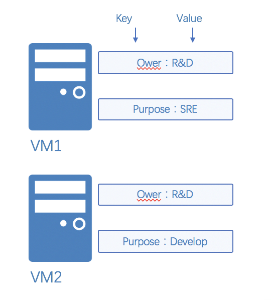

# Tag Overview

Tag provides a method for resource classification conforming to multiple classification specifications (e.g., the Owner, Purpose, etc.), allowing users to quickly locate specific resources based on tags in case of a large number of similar resources. A tag consists of a pair of key-value, both defined by users. For example, users can identify their VM resources based on the owner of VM. In addition, it is more convenient for users to manage resources on JD Cloud by using the same batch of tags for different types of resources, such as VM and cloud databases.

The figure above shows the implementation of the tag. For both instance 1 and instance 2, two tags are bound, which are the owner and the purpose. The owners of instance 1 and instance 2 are product development, the purpose of instance 1 is test, and the purpose of instance 2 is development.

## Function Supported

* [Edit Tag](Edit-Tag.md)
* [Filter VMs by Tag](Filter-by-Tag.md)

## Usage Restrictions

* 10 tags can be bound at most for each Virtual Machine.
* The maximum length of the tag key (Key) is 127 characters.
* The maximum length of the tag value (Value) is 255 characters.
* The tag key/value cannot be used with the prefix "jrn: ". it only supports Chinese, numbers, capital and lowercase letters, spaces and special symbols, such as _.:/=+-@, and it is case sensitive and cannot begin with a space.
* When an instance is bound with a tag, only one corresponding tag value (Value) is allowed for the same tag key. The value recently bound to the same tag key will replace the previously bound value.
* During tag unbinding, if the tag has no bound resources after unbinding, the tag will be automatically deleted.

## Related Reference

[Edit Tag](Edit-Tag.md)

[Filter VMs by Tag](Filter-by-Tag.md)

