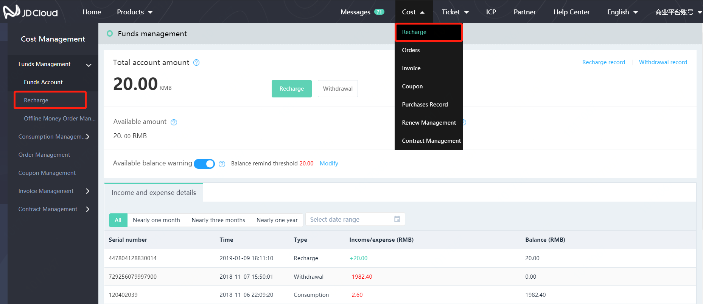
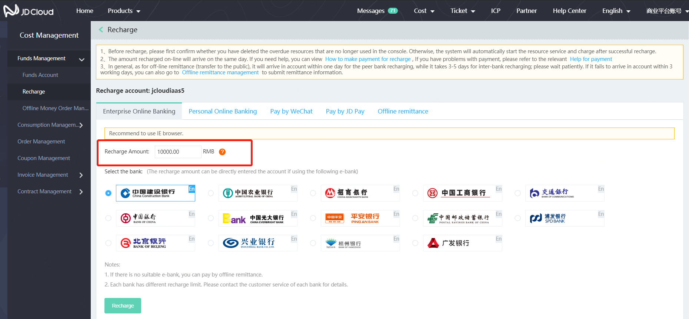
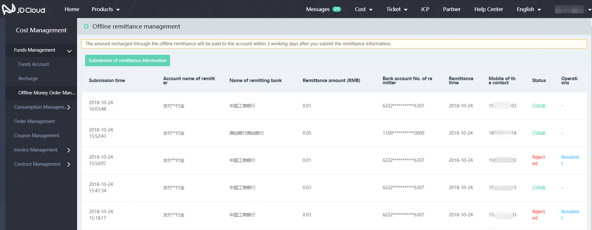

## How to Recharge and Pay
1. Please login [Console](https://console.jdcloud.com/) - enter Cost Management - [Fund Account](https://uc.jdcloud.com/cost/capital/capital-overview) page, click [recharge](https://uc.jdcloud.com/cost/capital/recharge) to start recharge.

2. Enter the amount you need, select the recharge method, pay according to the notification on the page.

 

Recharge methods: **No credit card recharge is supported by JD Cloud in any way**

JD Pay recharge (recommended): for the purpose of convenience, we recommend you use JD Pay to carry out online recharge, the system will automatically jump to JD Pay cashier desk interface, select relevant payment method and enter JD Pay password to pay. JD Pay supports JD Wallet balance and express card for payment.

Online banking: if you need to recharge by online banking, you can select Online Recharge, select Personal Online Banking or Enterprise Online Banking, after successful recharge, the fund will be recharged into your cloud account in real time.

Pay by WeChat: if you need to pay by WeChat, select Pay by WeChat, click "Recharge", then the system will automatically jump to Pay by WeChat page, you can complete payment by the method of scanning QR code via WeChat. The period of validity of QR code is two hours, after expiry, it needs to refresh to generate new QR code.

Offline remittance: if you need to pay by bank wire transfer to our corporate account, you can click "Offline remittance". The offline remittance is directly transferred to the exclusive account of JD Cloud, and the system will directly match the remittance to your JD Cloud account. The account entry time in such method is generally 1-2 days for China Merchants Bank and 3-5 days for inter-bank transfer (the specific account entry time shall be subject to the actual account entry time of the bank);

**Notes: **

1. When you adopt offline remittance for recharge, the system will generate an exclusive remittance identification code for the corresponding recharge order, you need to fill it in the fields of [Remittance Purpose], [Postscript], and [Summary] in the certificate of telegraphic transfer when you carry out remittance. For enterprise online banking transfer, you must fill the remittance identification code in the fields of Postscript, Summary and Note (Reminder: for the note field of different banks is different, it is better to fill the remittance identification code in all places that can fill in note. ;
2. For offline company transfer remittance, please fill up the remittance identification number as the note so as to ensure timely verification of the recharge slip; please confirm to fill up correctly; do not add other explanatory notes privately;
3. One identification code is corresponding to one recharge order and corresponding amount, please transfer with the correct amount.

**Our Current Corporate Account is: **

Account Name: JD Cloud Computing Co., Ltd.

Collection opening bank: China Merchants Bank Co., Ltd. Beijing Asian Games Village Subbranch

Account No.: 110938841310106

When you transfer by remittance identification code, you need not submit the remittance slip information if the remittance identification code has been filled in correctly. After transfer is successful, the remittance will be automatically recharged to your JD Cloud account.

If you transfer by non-remittance identification code method or the system fails to write off money for recharge within the validity period automatically, you can write off money for recharge through submitting bank swift on the page of [Offline Money Order Management] after you completed your bank transfer.

