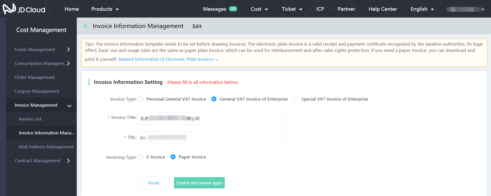
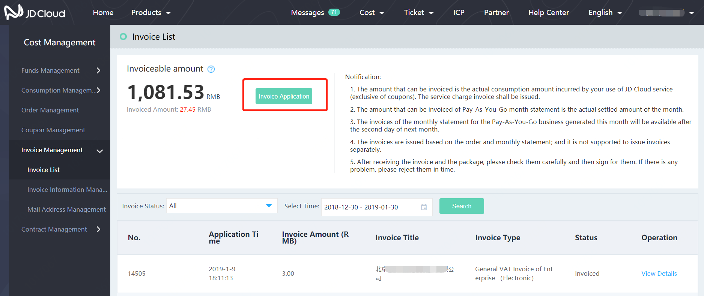
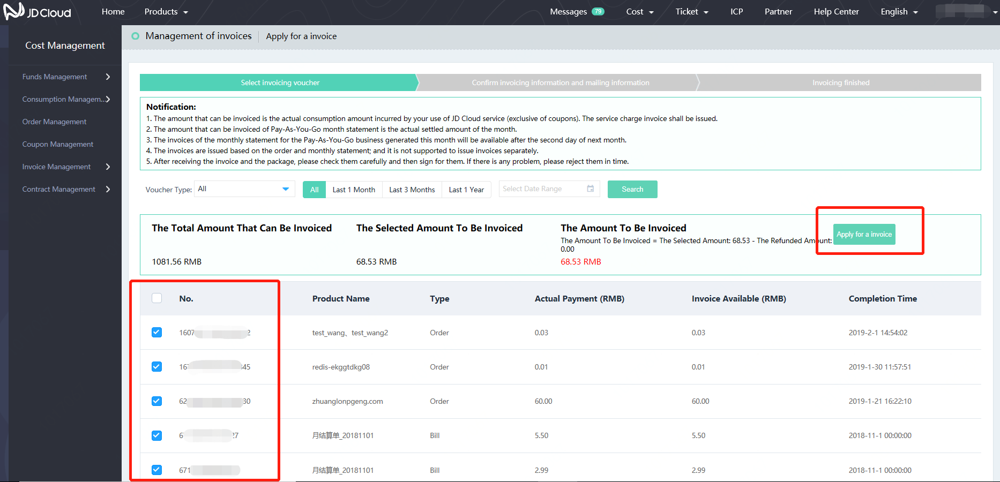
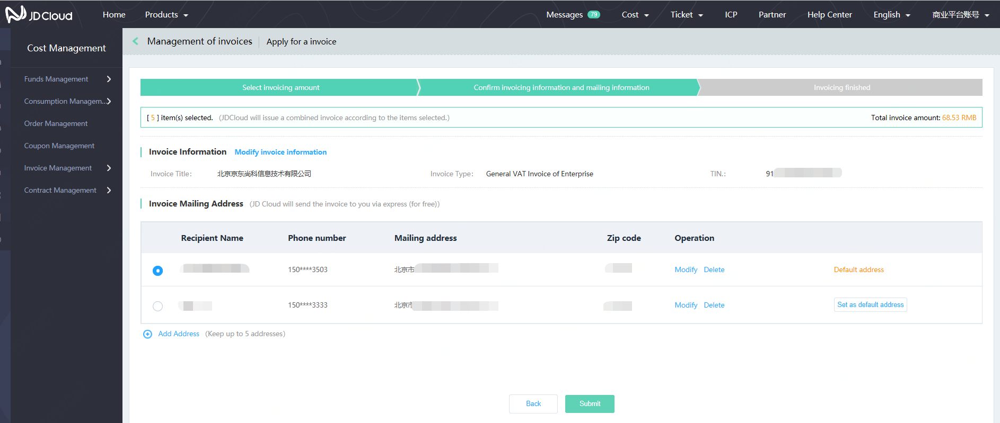
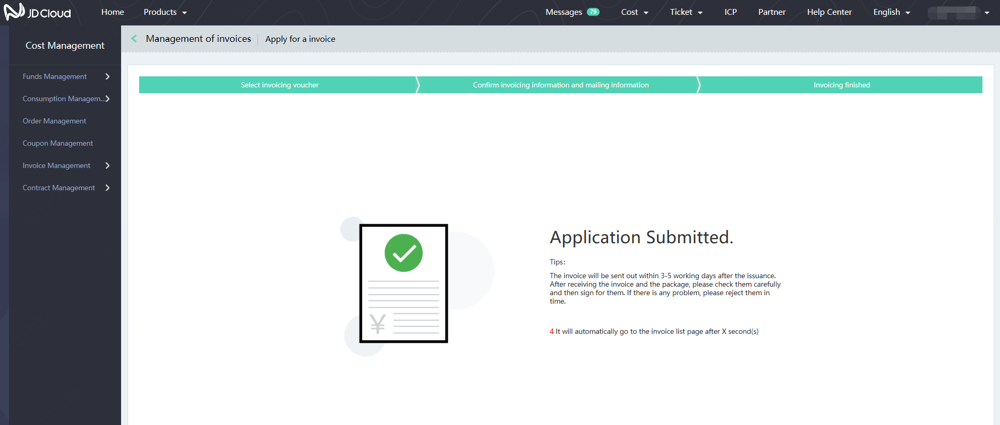

# Invoice application process
Only three steps are required to obtain an invoice: (1) fill in or enable invoice information, (2) select the invoicing documents, and (3) select the mailing address

1. Please log in the console-enter into **Cost Management**-**Invoice Management**-**Invoice Information Management** page to fill in or enable invoice information;
1) If you have saved enterprise invoice templates, you are required to enable one during the system initialization; if you want to create a new invoice template, you may click “Add New Invoice Information”, and special VAT invoice takes 1-2 working days for audit
2) If you haven’t set invoice information, you are required to set it under invoice information management function; enterprise special VAT invoice information takes 1-2 working days for audit, and if there is any invoice in audit, no other invoice template is allowed to be created.

Currently, invoices are divided into three types: individual general VAT invoice, enterprise general VAT invoice, and enterprise special VAT invoice.

## Description
Individual general VAT invoice and enterprise general VAT invoice may be directly saved after invoice title modification for your application for invoice issuance.

Invoice information of enterprise special VAT invoice shall be filled in after passing the qualification audit, and shall be audited accordingly after being filled in. We will complete the audit on enterprise special VAT invoice information within 1-2 working days.

Enterprise special VAT invoices are issued to general taxpayers. Information related to special invoice (taxpayer identification number, account information opened with bank of deposit, registered address and phone number, etc.) shall be provided for application, and deductions for input tax are allowed for invoices issued. If general taxpayer qualification is not obtained, please select “individual/enterprise general VAT invoice”.

Individual/enterprise general VAT invoices are issued to small-scale taxpayers, and deductions for input tax are not allowed for such invoices issued. If general taxpayer qualification is obtained, and deductions for input tax is needed, please select “enterprise special VAT invoice”, and apply for invoice after filling in your invoice information and mailing information. (If you need to apply for enterprise special VAT invoice, you must confirm that the invoice information has passed the audit.)

Special VAT invoices have a 180-day limit for deduction period, and invoice will not be reissued after 180 days from the invoice date.

2. Enter into **Cost Management**-**Invoice Management**-Invoice List, and click “Apply for Invoice” to enter into application page for invoice issuance;

Check the document of which an invoice is to be issued on the invoice issuance page, and single click the Obtain Invoice button. Select the invoice information based on order type and purchase channel

The invoice will be sent out within 3-5 working days after the issuance. After receiving the invoice and the package, please check them carefully and then sign for them. If there is any problem, please reject them in time.

## View history information
History of applied invoices may be viewed in the invoice list, the issuance of invoices may be confirmed, and the detailed information of the current invoice may be viewed in details.

