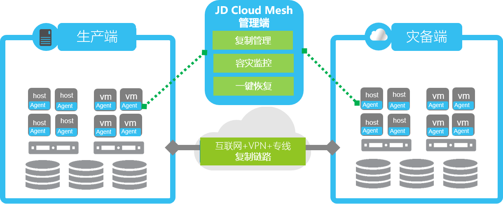

# Basic Architecture

  Database Disaster Recovery is to set up a disaster recovery center for remote data backup in the same or a different city, so as to protect data against loss or destruction in case that a disaster occurs. Under the database level disaster recovery method, the established remote disaster recovery center can be simply interpreted as a remote data backup center.
  The Cloud Disaster Recovery service comprises three parts: a Worknode, a Backupnode and a Management Node. Worknode refers to the user’s production machine, i.e. the Source; Backupnode refers to the remote server used for disaster recovery data storage, i.e. Target; and ctrcenter refers to the server where the control platform of disaster recovery software system is located. After the disaster recovery control module is deployed on the control machine, as the disaster recovery software control module is configured and managed via the Web interface, relevant management work can be made if any machine can be connected to the control machine via a browser.
  Interaction between the Cloud Disaster Recovery and the user is mainly made via the Console interface, where:
 - Agent is not required for two disaster recovery databases (MySQL and SQL Server)
 - Agent shall be installed and replicated respectively at two disaster recovery machines (including the Virtual Machines and the physical machine), to monitor machine status and replicate data
 - The disaster recovery platform management node and the disaster recovery service instance at the Backupnode, so as to realize two-way communication between the Worknode and the Backupnode with the disaster recovery service instance
 - At first, full data are replicated and incremental data are synchronized with logs, therefore influence to production environment performance can be ignored
 - At the Backupnode, data are stored in database instance in real time and RPO is close to 0
 - The Worknode and the Backupnode shall be connected with stable network

# Related References
- [Core Concepts](Core-Concepts.md)
- [Application Scenarios](Application-Scenarios.md)
- [Features](Features.md)
