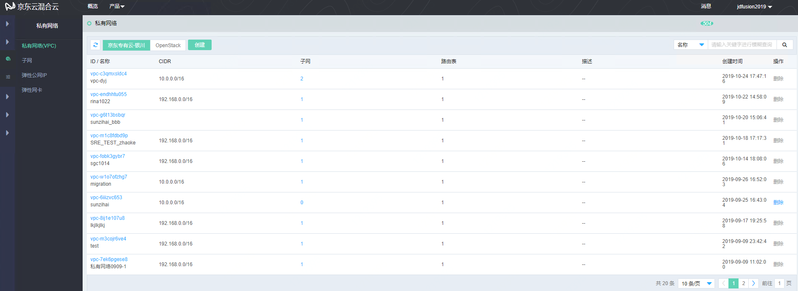
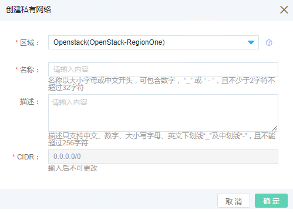
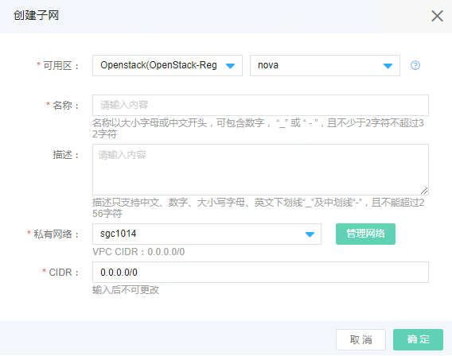
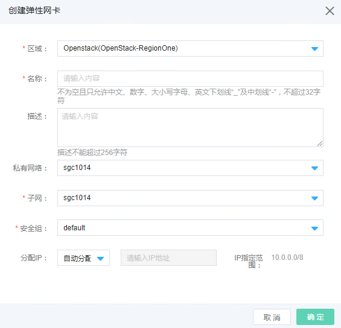
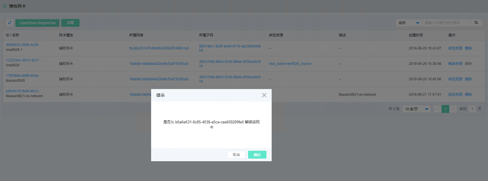

# Networking

## Create Security Group

Access the navigation bar on the left side and click **Elastic Compute**>**Virtual Machines**>**Security Group** menus to enter the security group list page, as shown in Figure: Security Group List page.

Figure: Security Group List page

On this page, click **Create** button to pop up the create Security Group page, as shown in Figure: Create Security Group page.

Figure: Create Security Group page

On this page, enter the Security Group Name, select an available domain click **OK** button; after the "Creation Succeeded" notification pops up, you can see the security group created on the Security Group List Page; and click the security group to enter the Security Group Details, as shown in Figure: Security Group Details.

Figure: Security Group Details

On this page, you can click **Inbound Rules** and **Outbound Rules** in the operation item to achieve the management functions for Security Group.

## Create VPC

Access the navigation bar on the left side and click **Network**>**VPC** to enter the VPC List Page, as shown in Figure: VPC List Page.

Figure: VPC List Page

On this page, click the **Create** button to pop up the VPC Creation Page, as shown in Figure: OpenStack VPC Creation Page.

Figure: VPC Creation Page

## Create Subnet

After VPC is created, the next step is to create a subnet under VPC.

Access the navigation bar on the left side and click **Network**>**VPC**>**Subnet** to enter the Subnet List Page, as shown in Figure: Subnet List Page.

Figure: Subnet List Page

On this page, click the **Create** button to pop up the subnet creation page, as shown in Figure: OpenStack Subnet Creation Page.

Figure: Subnet Creation Page

## Create Elastic Network Interface

Elastic Network Interface is a kind of virtual network interface, which can be connected on the Virtual Machines so that the Virtual Machines are connected to different network interfaces. Elastic Network Interface is applicable in building application scenarios such as business traffic separation, multiply businesses hosting and network high availability. Each of the Virtual Machines can be connected to multiple Elastic Network Interfaces.

Access the navigation bar on the left side and click **Basic Cloud**>**Network Resource**>**Elastic Network Interface** menu to enter the Elastic Network Interface list page, as shown in Figure: Elastic Network Interface List page.

Figure: Elastic Network Interface List page

On this page, click **Create** button to pop up the Create Elastic Network Interface page, as shown in Figure: Create Elastic Network Interface page.

Figure: Create Elastic Network Interface page

On this page, enter the name and select a region, VPC, subnet, security group, assigned IP and then click the **OK** button; after the "Creation Succeeded" notification pops up, you can see the Elastic Network Interface created on the Elastic Network Interface List Page, as shown in Figure: Elastic Network Interface List Page.

Click corresponding buttons on the list page to carry out operations such as association with Virtual Machines, disassociation from Virtual Machines and deletion.

## Elastic Network Interface Association

On the Elastic Network Interface List Page, click the operation item **Associate Resource** on the operation bar to pop up the page of Associating with Virtual Machines, as shown in Figure: Resource Association Page.

Figure: Resource Association Page

Select the Virtual Machines to be associated on this page and click the **OK** button. After the "Successful Association" notification is popped up, you can see information of the Virtual Machines associated by you on the Elastic Network Interface List Page.

## Elastic Network Interface Disassociation

On the Elastic Network Interface List Page, click the operation item **Dissociate Resource** on the operation bar to pop up the page of Disassociating from Virtual Machines, as shown in Figure: Resource Disassociation Page.

Figure: Resource Disassociation Page

Select the Virtual Machines to be disassociated on this page and click the **OK** button. After the "Successful Disassociation" notification is popped up, you can see information of the Virtual Machines associated by you on the Elastic Network Interface List Page.
