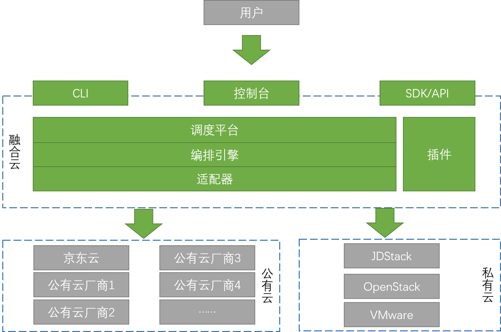

# Basic Architecture
The basic architecture is as shown below:

   The main interactive method between JDFusion and the user includes the console interface, CLI and API, wherein:
 - Console: It is the main interaction method provided by JDFusion, providing visual and concise operation experiences to the user.
 - CLI tool: Based on the command line tool under the Bash environment, it can access the JDFusion via scripts.
 - API: Refer to the standard RestfulAPI interfaces based on HTTP protocol and other systems can be integrated with the JDFusion via API. Functions realized via the console can also be realized via API by the user.
 - Scheduling platform: The scheduling platform shall be responsible for distributing tasks submitted by the users and submitting different tasks for processing different orchestration engines.
 - Orchestration engine: Corresponding execution plans are generated based on different request types initiated by the user and then different adapters are dispatched for linking and accessing corresponding cloud vendors.
 - Adapter: The adapter is used for undertaking the execution plans provided by the orchestration engines and converting the same to the API calling commands or other commands recognizable by corresponding cloud vendors. Different adapters shall be provided to different cloud vendors.
 - Plug-in: The plug-in is used for accessing services provided by a partner or a third party, and for enriching and expanding capacities provided by the existing JDFusion platform. 

# Related References
- [Core Concepts](Core-Concepts.md)
- [Application Scenarios](Application-Scenarios.md)
- [Features](Features.md)

