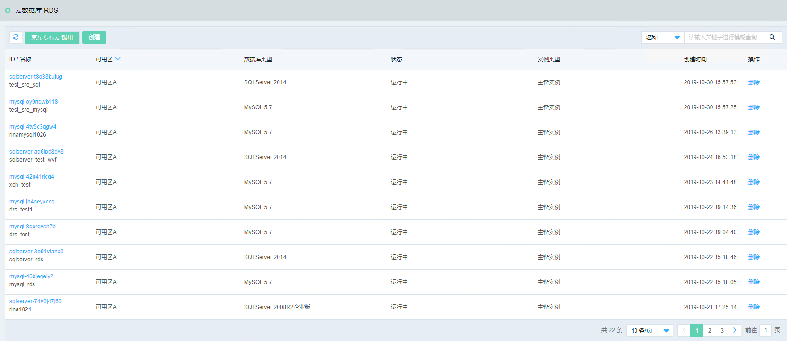
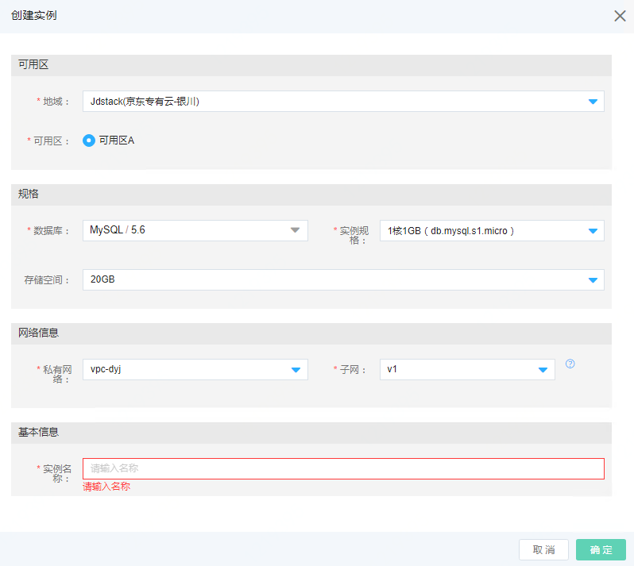
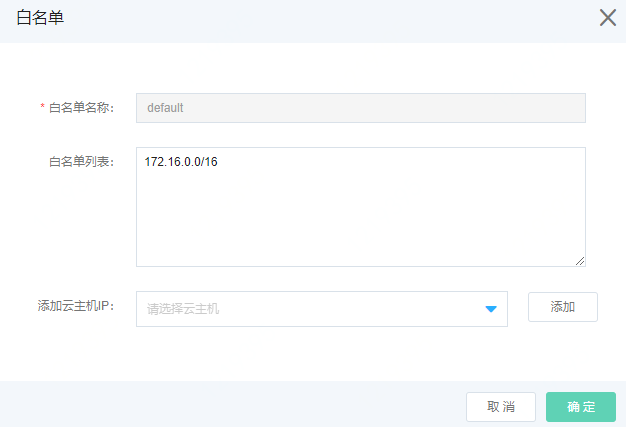

# Database Correlation

## Create cloud database RDS instance

Access the navigation bar on the left side and click the **Database**>**RDS**>**Instance** menus to enter the Database List Page, as shown in Figure: RDS List Page.

Figure: RDS List Page

On this page, click the **Create** button to pop up the RDS Creation Page, as shown in Figure: RDS Creation Page.

Figure: RDS Creation Page

Select region, availability zone, database type and version, instance type, bucket, VPC, subnet and instance name on this page and click the **OK** button. After the creation succeeded notification is popped up, you can find the database created by you in database RDS list page.

## Account Management

Enter the cloud database instance details, click **Account Management** tag and enter the account management page. It is as shown in Figure: Account List Page.

Figure: Account Management Page

On this page, click the **Create Account** button to pop up the account creation page and enter account name and password, as shown in Figure: Account Creation Page.

Figure: Account Creation Page

Click the **OK** button to complete account creation. Upon creation, the created account will be displayed in the account list.

## Library Management

Enter the cloud database instance details, click **Database Management** tag and enter the database management page. It is as shown in Figure: Database Management List Page.

Figure: Database Management List Page

On this page, click the **Create Snapshot** button on the operation bar to pop up the "Create Snapshot" page, as shown in Figure: Database Creation Page.

Figure: Database Creation Page

On this page, enter the database name and the character set and click the **OK** button to finish database creation. Upon completion, the information of created database will be displayed in the database list page.

## White List Setting

Enter the cloud database instance details, click **White List Setting** tag and enter the white list setting page. It is as shown in Figure: White List Setting List Page.

Figure: White List Setting List Page

On this page, click the **Modify** button on the operation bar of the default white list record, to pop up the "White List Setting" page, as shown in Figure: White List Setting Page.

Figure: White List Setting Page

Enter white list IP address on this page and click the **OK** button to finish white list setting. Then, you can find the added IP information in the white list page.
