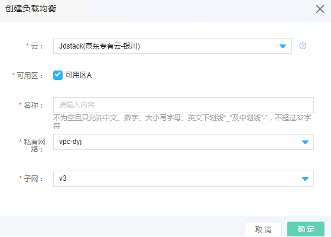
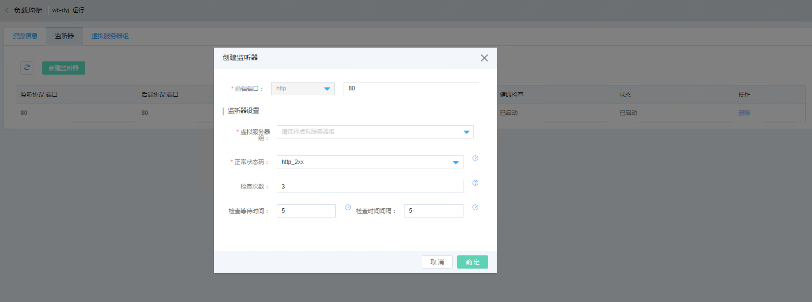
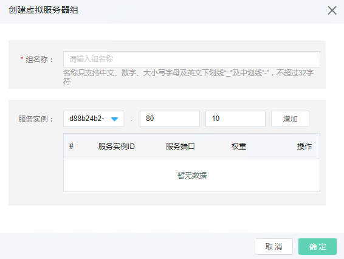

# Load Balancer

You are suggested to build services based on Load Balancer by the following way to quickly get familiar with the Load Balancer functions of the platform.

The specific steps to create a group of Virtual Machines attaching Load Balancer services are as follows:

Step 1, create Load Balancer

Step 2: Associate EIP

Step 3: Add virtual server group

Step 4: Add listener

## Create Load Balancer

The Load Balancer can distribute large concurrent traffic to multiple backend instances, adjust resource utilization, eliminate influence to systems by fault of single device, improve system availability and expand system serviceability.

Access the navigation bar on the left side and click the **Network**>**Load Balancer** menus to enter the Load Balancer list page, as shown in Figure: Load Balancer List Page.

Figure: Load Balancer List page

On this page, click **Create** button to pop up the Create Load Balancer page, as shown in Figure: Create Load Balancer page.

Figure: Create Load Balancer page

On this page, enter the name, select the network and subnet and click the **OK** button; after the "Creation Succeeded" notification pops up, you can see the information of Load Balancer created on the Load Balancer List Page.

Click corresponding operation buttons in the list page to carry out operations such listener creation, EIP association and deletion.

## Associate EIP

On the Load Balancer list page, click the **Associate EIP** button on the right operation bar to pop up the EIP Association Page, as shown in Figure: EIP Association Page.

Figure: EIP Association Page

On this page, select the EIP address and click the **OK** button. After the "Creation Succeeded" notification pops up, you can see the information of associated EIP on the Load Balancer Details, as shown in Figure: Load Balancer List Page.

Figure: Load Balancer Details

## Add listener

Listening rules: At present, the protocol types and port number information to be monitored only cover three protocol types, including HTTPS/HTTP/TCP. Users can define multiple listeners in the same Application Load Balancer. Different protocol types or the same protocol type and different port number definition can be selected by the listener.

On the Load Balancer list page, click the **Add Listener** button on the right operation bar to pop up the page of adding listener, as shown in Figure: Listener Adding Page.

Figure: Listener Addition Page

On this page, enter the name, select the protocol, connection restriction and input port number and then click **OK** button; after the "Creation Succeeded" notification pops up, you can see the information of listener created on the Load Balancer Details, as shown in Figure: Load Balancer Listener Details.

Figure: Load Balancer Listener Details

Note: The listening port under the same Load Balancer cannot be duplicated, after creating the listener, the listening protocol and port are not allowed to modify;

## Create virtual server group

On the Load Balancer Details, select the "Virtual Server Group" tag, click the **Create Virtual Server Group** button, to pop up the Virtual Server Group Creation Page, as shown in Figure: Virtual Server Group Creation Page.

Figure: Virtual Server Group Creation Page

On this page, enter the group name, select an instance, enter the port number and weight and click the **OK** button; after the "Creation Succeeded" notification pops up, you can see the information of Virtual Server Group created on the Load Balancer Details, as shown in Figure: Details of Virtual Server Group of Load Balancer.

Figure: Details of Virtual Server Group of Load Balancer

