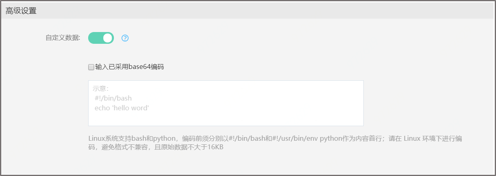

# Customized Data

When creating a Cloud Physical Server instance, you can configure the instance by specifying customized data. When Cloud Physical Server is started for the first time, the user can pass on the executable script to the instance in the specified data format, and implement the text. If you purchase multiple Cloud Physical Server instances at a time, customized data will execute the text when all instances are first started.

### Supporting Scope

Basic Network Instance: cn-north-1 Availability Zone B doesn’t support the function of setting customized data. The remaining optional regional availability zones all support the function. 
Virtual Private Cloud instance: The optional regional availability zones all support the function of customized data.

### Format Requirement

1. The instance customized data needs to be imported after the Base64 encoding, and the data before encoding cannot exceed 16 KB (not greater than 21848Byte after encoding). 
2. If the instance is created through the Console, the data may not be encoded by Base64; select the corresponding tooltip and the system will complete the encoding. If it is created through the API, you must complete the encoding yourself. 
3. Linux system supports bash and python both. Before encoding, be sure to use #!/bin/bash and #!/usr/bin/env python in the first line. 
4. Please encode under the Linux environment to avoid incompatible formats and keep the original data not greater than 16KB;  
5. Supported image: CentOS 7.5 64-bit, CentOS 7.2 64-bit, CentOS 7.1 64-bit, CentOS 6.6 64-bit, CentOS 7.5 64-bit, TD enhanced edition, Ubuntu 18.04 64-bit, Ubuntu 16.04 64-bit, Ubuntu 14.04 64-bit. 

### Operation Steps
Enter the Create Cloud Physical Server page, select the Advanced Configuration section, default customized data as in closed status, and select the enabling operation. The details are as follows: 

Note: 
1. It is only limited to command execution through text passing when the Cloud Physical Server is first started or the system is reinstalled. 
2. If the customized data does not execute as expected, go to the specified directory to view the execution log for causes. Log path of Linux system: /root/launch-script.log; also, the customized script executed can also be viewed. See the path: /root/launch-script for details.

