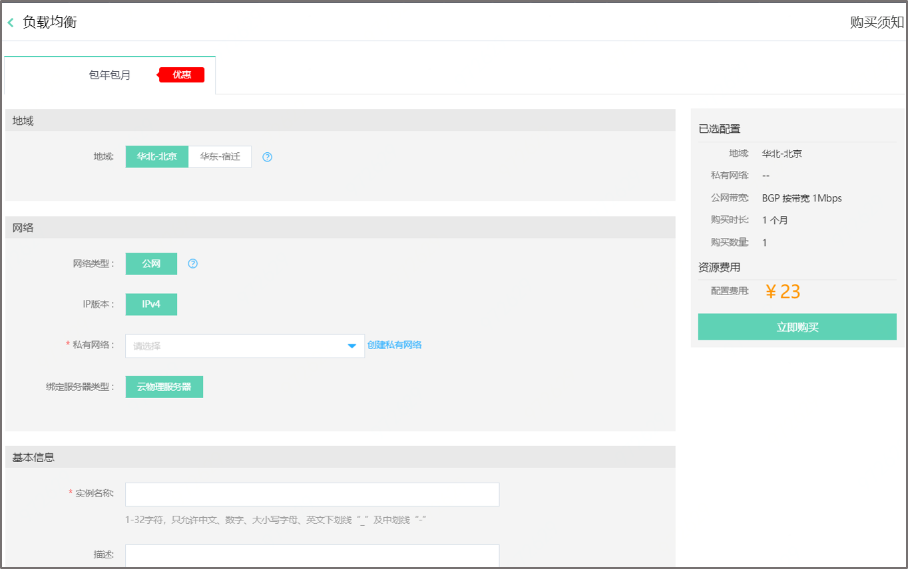
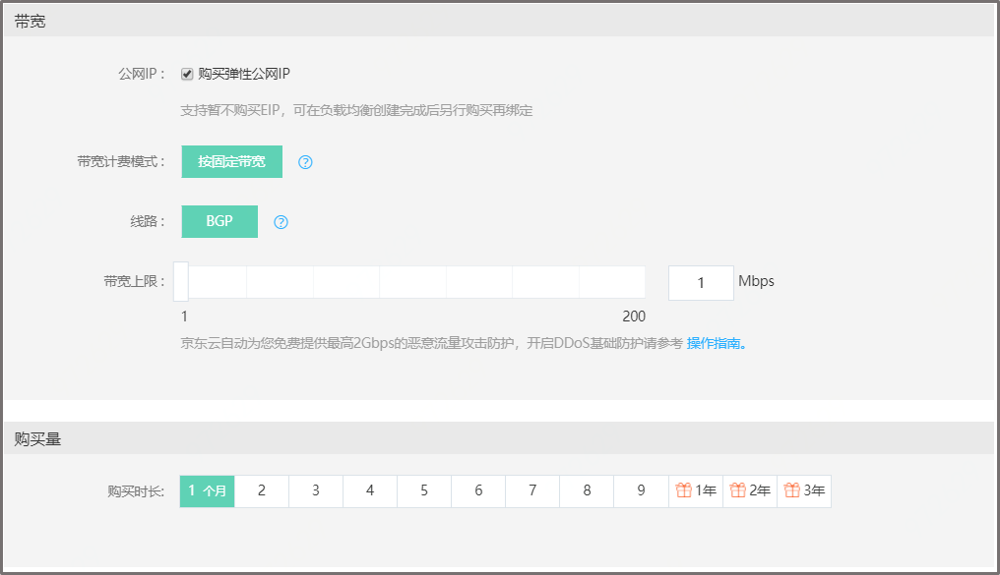
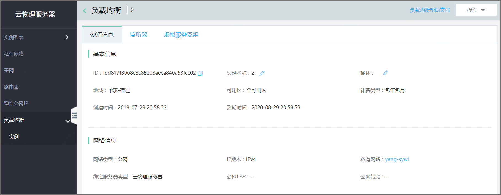
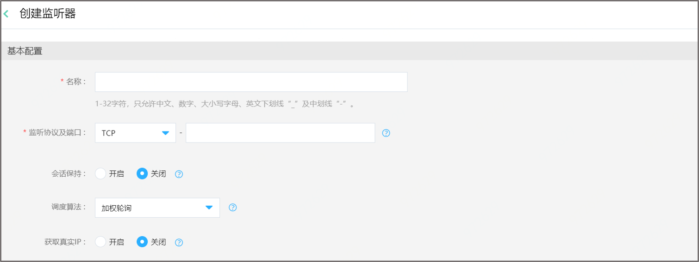
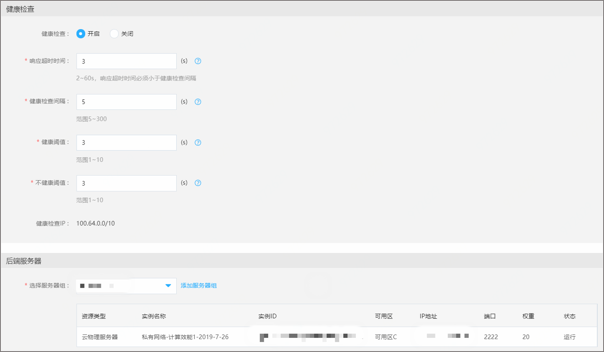
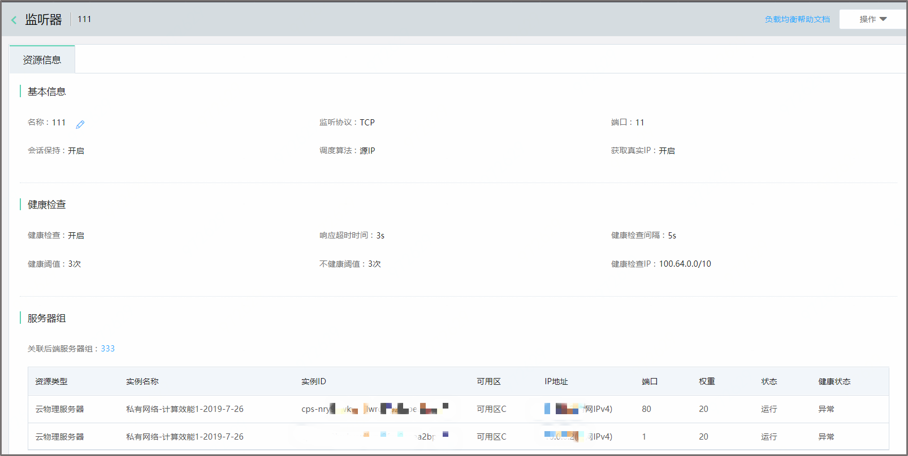

# Load Balancer

## Product Overview

The Load Balancer can distribute large concurrent traffic to several backend instances (specifically the Cloud Physical Server), adjust resource utilization, eliminate influence to systems by fault of a single device, improve system availability and expand system serviceability. Now, the traffic listening and forward service based on 4 layers (TCP and UDP) is provided. The Load Balancer is called as "Physical Cloud Load Balancer".

## Use Restrictions

Please note the following use restrictions during use of the Load Balancer.

1. Now, JD Cloud supports that at most 10 Load Balancer are applied for each account per region. If more quotas are required, please open a ticket for application. At present, the product is only opened for use in cn-east-1. The open in cn-north-1 is coming soon. 

2. The Load Balancer supports the 1:1 association with the Elastic IP. 

3. One Load Balancer instance can be equipped with several listeners and the cap is 50. 

4. One Load Balancer instance can be equipped with several virtual server groups and the cap is 20. 

5. One virtual server group can be equipped with at most 100 instances. 

6. Now, monthly package resources are not allowed to be deleted. 

## Billing Overview

The Load Balancer supports the billing method of Monthly Package.

**Amount Overdue/Expiry Description**

When the expiration time of your monthly package paid online resources is earlier than or the same as the current time, your paid online resources status will become expired. The paid online resources service will be stopped and cannot be used after the expiration.

Emails and SMSs will be sent to you by JD Cloud before expiration of your monthly package paid online resources, reminding you that your resources are close to expire. Please check it and renew in time;

Upon expiration of your paid online resources, you will be sent email and SMS. Please be sure to check the same and recharge in time to prevent unnecessary losses;

Your paid online resources and data in the resources will be kept for 7 days from the time of stopping service, and the system will recover the resources after 7 days, in which case the resources cannot be retrieved.

The stopped resources can be used normally upon renewal.

## Billing Rules

At present, the Load Balancer is free. If any Elastic IP resource is associated, the EIP cost shall be paid independently. For details, please refer to Elastic IP [Price Overview](../../Pricing/Price-Overview.md).

## Price Overview

**Monthly Package**

At present, the Load Balancer in the Monthly Package is free in all Regions.

## Renew Process

**Renewal Rules**

Renewal to instances in the Monthly Package: Prolong service time of the Load Balancer in the Monthly Package. The renewal time periods include 1 month ~ 9 moths, 1 year, 2 years and 3 years. If you operate to renew prior to the instance date due, the start time of the new order is expiration time of the original order; if you renew after resource date due, the start time of the new order is expiration time of the date of renewal.

Associated renewal: During the instance renewal, the Elastic IPs associated to the instance can displayed and users can select the associated resources to be renewed with the instance.

## Operation Guide

The Load Balancer is mainly composed of the following parts: Load Balancer instances, listeners and virtual server groups. Now, the four-layer Load Balancer is supported.

**Create a Load Balancer instance**

Turn on the Console, click **Cloud Physical Server**->**Load Balancer** in turn at the left navigation bar, log in the Load Balancer Instance List Page and click **Create**, as shown in the picture below: 

Please select **Region** according to your demand, **Network Part**--network type (public network type is supported), IP version (IPv4 is supported now), associated server type (Cloud Physical Server is supported), **Basic Information**--enter instance name, description, **Bandwidth**--check Elastic IP and select bandwidth billing mode, ISP Line type and bandwidth cap. No IP is purchased temporarily (associate IP after the instance is created), **Purchase Quantity**--Select purchase duration and click **OK** to create one Load Balancer. 

**Load Balancer Instance Management**

1. **Add Listener**, click **Add Listener** and redirect to the listener page 
2. **Enable/Disable**, the Load Balancer can be started and stopped (if the Load Balancer is not associated with EIP, do not click the grey **Enable** button) 
3. **Associate/Disassociate Elastic IP**, if the Load Balancer provides the Internet service, the Elastic IP shall be associated; if the service is not required, the Elastic IP can be disassociated 
4. **Renew**, the Load Balancer can be independently renewed and joint renewal of Load Balancer and EIP are also supported 
5. Click **ID/Instance Name** and redirect to the Instance Details, as shown in the picture below 

**Listener Management**

Turn on the Console, click **Cloud Physical Server** -> **Load Balancer** -> **Instance Details** in turn at the left navigation bar, select the tab page, log in the Listener List Page and click **Create Listener**, as shown in the picture below: 

Select the listener according to your demands, 
**Basic Configuration**-- 
**Name**: Listener name entered (the Load balancer instance names under the same user cannot be the same); 
**Listening protocol**: The four-layer TCP and UDP protocol is supported; 
**Port**: After the listening rules are created, protocols and ports cannot be modified. Among ports provided by the Load Balancer, the port 80 is used for TCP in general; 
**Session persistence**: The four-layer protocol session persistence is disabled by default; 
**Scheduling algorithm**: If session persistence is disabled, weighted round robin and weighted least connection number are supported; if session persistence is enabled, source IP is supported. **Weighted round robin**: Via weighted round robin, access requests will be distributed to the backend server in turn. The greater the weight value of backend server, the greater the frequency (probability) of round robin. **Weighting least connection number**: Except that round robin is made to each backend server based on the weight value set, actual load (i.e. connection count) of such backend server shall be considered as well. Where the weight values are the same, the less the current connection number, the greater the frequency (probability) of backend server subject to round robin. **Source IP**: For the consistency hash based on the source IP address, the same backend server will be scheduled to the same source address. 
**Get actual IP**: If the protocol is TCP, it is disabled by default. A user can set it as enabled if required: Install via the yum source. Taking Centos for example, after the toa Kernel module plug-ins are installed with yum install kmod-toa, parameters can be returned by socket.accept() or actual source IP can be obtained by calling socket.getpeername(). 

**Health check**--The Load Balancer instance can periodically send Ping and connection attempts to the backend server or send requests to test backend server running status 
**Health check**: It is enabled by defaulted. If disabled, the following fields will not be displayed; 
**Response time-out period**: Maximum time-out period of health check response, if the backend cloud server does not give correct response in corresponding period, the health check is determined as failed. Restriction: 2-60s. The response time-out period must be less than the health check interval. The default value is 3. 
**Health check interval**: Health check time interval. Restriction: 5-300s, the default value is 5. 
**Healthy threshold**: Refer to the connection health count of backend instance from failed to successful. Restriction: 1-10 times, and the default value is 3. 
**Unhealthy threshold**: Refer to the connection health failure count of backend instance from successful to failed. Restriction: 1-10 times, and the default value is 3. 
**Health check IP**: 100.64.0.0/10 

**Backend Server**-- 
Select a virtual server group. If no created server group is available, please click **Add Server Group** to create one.

After the above steps, click **OK** and then a listener is created.

Turn on the Console, click **Cloud Physical Server** -> **Load Balancer** -> **Instance Details** in turn at the left navigation bar, select the tab page, log in the Listener List Page and click **Listener Name** to enter the Listener Details, as shown in the picture below: 

**Operation Supported by Listener** 
1.**Edit**: The listen ports and protocols cannot be modified, but other fields can be modified 
2.**Enable/Disable**: Switch between the enabled and disabled status is supported.  
3.**Delete**: After the listener is deleted, the responding backend server will be disassociated with the listener. 

**Virtual Server Group Management**

Turn on the Console, click **Cloud Physical Server** -> **Load Balancer** -> **Instance Details** in turn at the left navigation bar, select the virtual server group tab page, log in the Virtual Server Group List Page and click **Add Virtual Server Group**, as shown in the picture below: 

Select **Virtual Server Group Name** (the virtual server group names cannot be repeated), select an instance (optional), click **OK** and the virtual server group is created. 

Click the **Virtual Server Group** name, and go to the Virtual Server Group Details, as shown in the picture below: 

**Operation Supported by Server Groups of Virtual Machines** 
1.**Edit**: The edit operation is supported. 
2. **Delete**: Deletion conditions for virtual server groups: Do not associate with any listener. 

