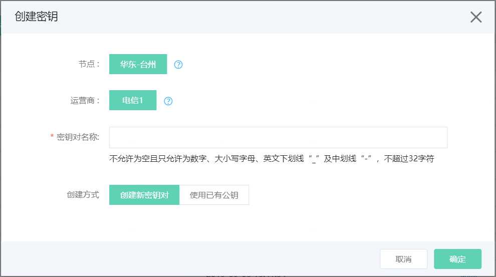

# SSH Key Pair

## Operation Steps

### Create New Key Pair

Log in Distributed Cloud Physical Server-SSH Key Pair List, Click **Create Key Pair**, select a node and an operator and enter key pair name. A new key pair can be created or existing public key can be selected for use.

Select creation method of key pair: 

1. Create a new key pair: JD Cloud will create a new key pair for you. The public key will be saved in JD Cloud, but the private key will be downloaded automatically to your local folder. You must save corresponding private key and ensure that the private key will not be transmitted throughout the Internet. JD Cloud will not save your private key. 

2. To use an existing key pair, you need to upload your local public key file to JD Cloud. Please ensure save the private key which is matched to the public key in your local folder. 

3. After being created, the public key fingerprint information can be viewed in key pair details. 

### Key Pair Deletion

Log in Distributed Cloud Physical Server-SSH Key Pair List and click **Delete** to delete SSH Key Pair. When the key pair is deleted, you can still log in the instance associated with the private key stored in a local folder. 

### Restrictions

1. Maximum 20 key pairs can be created under the same node for the same account. 
