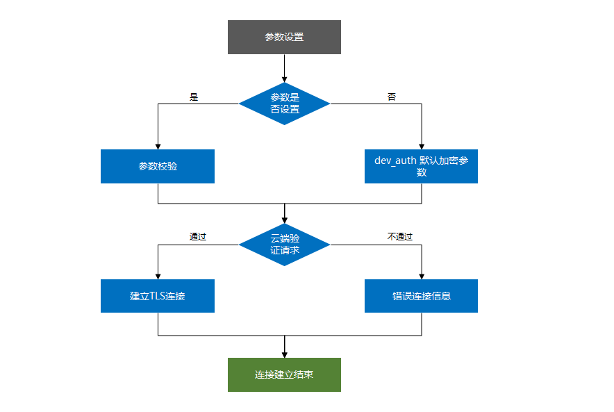

# Establish connection

## Host Configuration

JD Cloud now provides two products supporting device access, i.e., IoT Core and IoT Hub.

IoT Core: Users can create their own private instances in VPC and independently use these resources. Have independent access point.

IoT Hub: Users do not need to create any instance. With the unified access point, each user is automatically allocated with resources by IoT Hub.

In the SDK file src/utils/iot_config.h, access by to IoT Core or IoT Hub by SDK is controlled via `INDEPENDENT_MODE`. The IoT Core developers need to replace `_device_host` address in platform/linux/hal_os_linux.c with the public network domain address of IoT Core.


## Initialization Data

After getting 3-piece device from the Console and writing information in a storage system or a HAL file, a developer can establish connection by calling `iot_mqtt_construct()` from device app.

 

## Create MQTT connection instances

API: void *iot_mqtt_construct(iot_mqtt_param_t *pInitParams) 

API description: Create MQTT instances, initialize data and establish MQTT connection

Return Value: If succeeded, MOTT instances will be returned. Otherwise, NULL is returned

Parameter Description:


| **iot_mqtt_param_t****Parameter Name** | **Parameter Type**            | **Description**             |
| ------------------------------ | ----------------------| -------------------- |
| port                           | uint16_t              | MQTT Broker Port      |
| host                           | const char*            | MQTT Broker host     |
| client_id                      | const char*           | MQTT Client id       |
| username                       | const char*           | User Name for MQTT Connection    |
| password                       | const char*           | Password for MQTT Connection     |
| pub_key                        | char*                 | CA Certificate for Verifying MQTT Broker    |
| clean_session                  | uint8_t               | Clear MQTT Session or not     |
| request_timeout_ms             | uint32_t              | Timeout Setting of MQTT Message Request      |
| keepalive_interval_ms          | uint32_t              | MQTT Heartbeat Interval |
| write_buf_size                 | uint32_t              | size of write buffer |
| read_buf_size                  | uint32_t              | size of read buffer  |
| handle_event                  | iot_mqtt_event_handle_t | MQTT Incident Handling and Callback Function   |

Example Code:

```
iot_mqtt_param_t mqtt_params；

pclient = iot_mqtt_construct(&mqtt_params);
```


## Destroy MQTT connection and instance

API: Int iot_mqtt_destroy (iot_mqtt_param_t *pInitParams)

API description: Destroy Mqtt instance and release data and connection

Return Value: If succeeded, `SUCCESS_RETURN` will be returned. Otherwise, others are returned


 Example Code:

```
iot_mqtt_destroy (pInitParams);
```

## Related References

- [Quick Access in Device](../Developer-Guide-Device/DeviceEasyLink.md)
- [Device Authentication](../Developer-Guide-Device/AuthenticateDevices.md)
- [Subscribe and Publish Messages](../Developer-Guide-Device/SubPub.md)
- [Heartbeat and Reconnection](../Developer-Guide-Device/HeartBeat-Reconnection.md)
- [Relevent API](../Developer-Guide-Device/API.md)
- [Glossary](../Developer-Guide-Device/Glossary.md)
