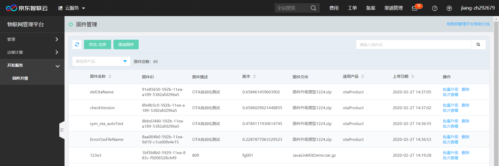
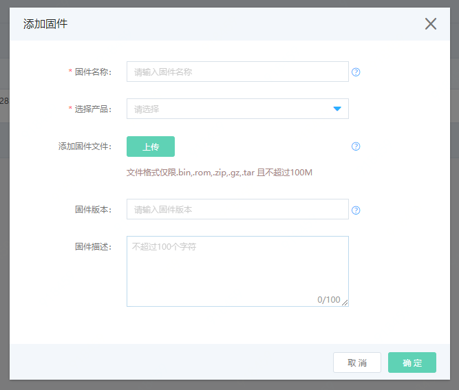
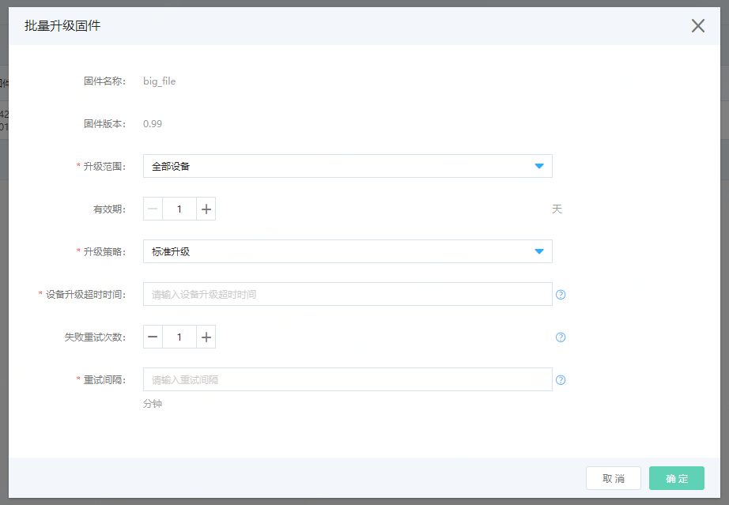
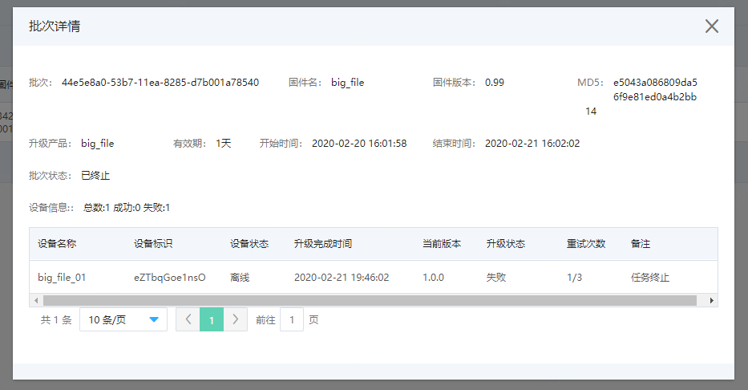

# Firmware Upgrade Service

The JD Cloud IoT platform provides firmware upgrade and management services. This document will introduce how to add firmware to IoT Core Console, how to manage firmware and push firmware in batch to a device, and batch management of firmware upgrade.

### Preconditions

1. The device end supports OTA upgrade service
2. The device end requires integration with the JD Cloud IoT device to develop SDK. For details, see: [Device End OTA Upgrade](../../Developer-Guide-Device/Device-OTA.md)

### Operation Steps

1. Log in [IoT Core Console](https://iot-console.jdcloud.com/core/)

2. Select from the navigation bar on the left **Development Service** -> **Firmware Upgrade** and go to the firmware upgrade page

   

3. Click **Add Firmware** on the top of the page, enter the firmware information in the Add Firmware dialog box and upload the firmware.

   

   Parameter Description of Add Firmware Page:

   | Parameter         | Description                                                         |
   | ------------ | ------------------------------------------------------------ |
   | Firmware Name     | Fill in your firmware name, with characters between 1~50, which shall be unique. Support Chinese characters, English letters, numbers and common symbols (underline, line-through, point and bracket), must start and end with Chinese characters, English letters or numbers. |
   | Select Product     | Select a product supported by the firmware, each firmware only corresponds to one unique product.         |
   | Add Firmware File | Upload your firmware file in formats of bin, rom, zip, gz, tar, tar.gz. Requirement for Firmware File Name: Support Chinese characters, English letters, numbers and underline and line-through, with length limited between 1~64.  **Note: 1. Each firmware size shall not exceed 100MB, and each product shall not have more than 50 pieces of firmware.                2. After the firmware is uploaded, the system will generate a MD5 value for this firmware. After downloading the firmware, the device end needs to use this MD5 value for verification.** |
   | Firmware Version     | Fill in your firmware version number, with characters between 1~100, support English letters, numbers and English symbols (underline, line-through and point). The version number is unique for the firmware under the same product |
   | Firmware Description     | Fill in your firmware description information. No more than 100 characters.                      |

   The firmware added will be displayed in the firmware list. The IoT Core will create a unique system firmware ID for each firmware of the users.

4. In the firmware list, you can create batch upgrade tasks and push firmware upgrade messages to a device by clicking **Batch Upgrade** in a firmware operation list.

   

   

   Parameter Description of Batch Upgrade Page:

   | Parameter             | Description                                                         |
   | ---------------- | ------------------------------------------------------------ |
   | Firmware Name         | Firmware name of the current batch upgrade task to be created                           |
   | Firmware Version         | Firmware version number of the current batch upgrade task to be created                         |
   | Upgrade Range         | Select the range of this upgrade message pushing:   All Devices: Push messages to all devices meeting the upgrade requirements under this product Directed Upgrade: Push messages to the designated device under this product. When the directed upgrade is selected, the device selection list will show. Please select the devices requiring upgrade according to your needs.   **Note: Inactive devices, devices with consistent firmware versions, and devices that are performing upgrade tasks will not appear in the selection list.** |
   | Period of Validity           | The period of validity of this batch upgrade task is 1 day at least and 7 days at most. Upon expiration, no upgrade messages will be pushed, including retry messages. |
   | Upgrade Policy         | Designate the processing method after a device receives a upgrade message.   Standard Upgrade: The device should immediately conduct firmware upgrade once it receives a upgrade message.   Silent Upgrade: The device should decide when to conduct firmware upgrade once it receives a upgrade message. Your device must support the silent upgrade mode in order to use this function. |
   | Device Upgrade Time-out Period | If the upgrade failed within a duration starting from the first report of upgrade progress by the device, it is recorded as time-out. You can view in the batch details that the device upgrade fails because of upgrade time-out. |
   | Number of Failure Retries     | The number of times the platform pushes the upgrade message again after the device upgrade fails. 0 represents no retry. The maximum number is 5. After the number of retries is set, you need to designate the retry interval. |
   | Retry Interval         | After the device upgrade fails, the interval between pushing upgrade messages is 1 minute at least and 4,320 minutes at most. Please set it according to the actual situation of the device. |

   After the batch upgrade task is created, the IoT Core will create a unique batch ID for each task.

5. In the firmware list, you can view the specific progress and result of this upgrade task by clicking **Batch View** in a firmware operation list.

   

   

   Parameter Description of Batch List:

   | Field     | Description                                                         |
   | -------- | ------------------------------------------------------------ |
   | Batch     | After the batch upgrade task is created, the IoT Core will create a unique batch ID for this task       |
   | Start Time | Time of creating the batch upgrade task                                       |
   | End Time | Time of ending this batch task (including manual abort, expiration of batch cycle, and completion of all devices upgrade) |
   | Total Number of Devices | Total number of devices selected for upgrade in this batch                                   |
   | Upgrade Succeeded | Number of devices in this batch with upgrade status of succeeded                               |
   | Upgrade Failed | Number of devices in this batch with upgrade status of failed                               |
   | Status     | Current status of this upgrade batch.   In Progress: After the batch upgrade task is created, the status is changed to in progress.   Completed: During the period of validity of the batch upgrade task, if the status of all devices is completed or failed, the status is completed.   Aborted: If the status of some devices is not completed or failed when the task is manually aborted or the period of validity of the task expires, the status is aborted. |
   | Operation     | Aborted: You can forcibly abort tasks in progress. After aborted, the task will not push upgrade messages to the device.  View: You can go to the batch details page by clicking **View**or **Batch ID** |

   

   Parameter Description of Batch Details Page:

   | **Field**           | **Description**                                                     |
   | ------------------ | ------------------------------------------------------------ |
   | ** Batch**           | Display the batch ID of this batch                                           |
   | **Firmware Name**         | Display the firmware name of this batch                                           |
   | **Firmware Version**       | Display the version number of the current firmware                                         |
   | **MD5**            | Display the MD5 value of the firmware file                                          |
   | **Upgrade Product**       | Display the product name corresponding to the current firmware                                   |
   | **Period of Validity**         | Display the period of validity of the current batch                                         |
   | **Start Time**       | Display the time when the batch upgrade task is created                                 |
   | **End Time**       | Display the time when the current task ends                                       |
   | **Device Information: Total Number** | Total number of devices selected for upgrade in this batch                                   |
   | **Device Information: Succeeded** | Number of devices in this batch with upgrade status of succeeded                               |
   | **Device Information: Failed** | Number of devices in this batch with upgrade status of failed                               |
   | **Device Name**       | Display the device name of the device                                           |
   | **Device Identifier**       | Display the device identifier of the device                                           |
   | **Device Status**       | Display the on-line and off-line status of the device                                         |
   | **Upgrade Completion Time**   | Display the time when the device upgrade ends                                       |
   | **Current Version**       | Display the version reported by the current device when the task is completed                           |
   | **Upgrade Status**       | Status when the device is upgraded:    To be Pushed: The platform has not yet pushed a upgrade message to the device.    Pushed: The platform has pushed a upgrade message to the device, and the device has not yet returned a message.    To be Upgraded: The device returns a message of receiving the upgrade instruction.    Upgrading: The device begins upgrade.    To be Retried: The device upgrade failed and waits for pushing again the upgrade message (you need to designate the number and interval of retries).    Succeeded: The device upgrade succeeded.    Failed: The device upgrade failed. |
   | **Number of Retries**       | Display current/maximum number of retries                                |
   | **Remark**           | Display the failure reason:    Push Failed: The message returned by the device of receiving the upgrade instruction is not received and the time-out period is 10 seconds.    Download Firmware Failed: The device fails to download firmware.    Firmware Verification Failed: The device fails to conduct MD5 verification of firmware downloaded.    Firmware Burn Failed: The device fails to burn the firmware.    Firmware Upgrade Time-out: The overall upgrade time of the device exceeds the set time-out period.    Task Aborted: The task is forcibly aborted. |

6. In the firmware list, you can delete the current firmware by clicking **Delete** in a firmware operation list. Note: If this firmware is used in an ongoing batch upgrade task, it cannot be deleted.
