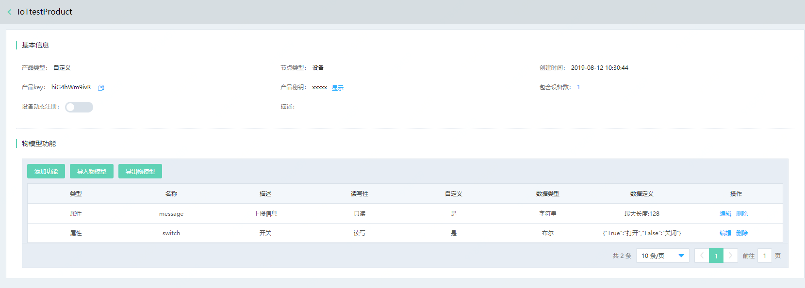

# Device Authentication

The authentication is divided into one machine one password and one type one password, the two patterns in the SDK are controlled by the `DYNAMIC_REGISTER` macro in iot_config.h After creating the product, it is authentication of one machine one password by default; after enabling device dynamic registration, it is changed to authentication of one type one password.

   

## One Machine One Password

The developer needs to record product key, identifier and device secret generated at server to the device storage system and implement the following HAL APIs to allow SDK to get the information from the storage system.

|Function Name                                               | Main Features of Function                              |
|:-------------------------------------------------   |:-------------------------------------- |
| int hal_get_identifier(char * identifier)    | Get Device Connection Identifier       |
| int hal_get_device_name(char* device_name)   | Get Device Name |            |
| int hal_get_device_secret(char * device_secret) | Get Device Key Pair       |
| int hal_get_product_key(char * product_key) | Get Product identifier of Device

SDK includes simple implementation files of these HAL APIs (hal_os_linux.c), wherein _product_key`, `_identifier`, `_device_secret` demonstrate storage to the information.

   

## One Type One Password

Cloud dynamically generates identifier, device secret bases on product key, product secert

   

After enabling DYNAMIC_REGISTER macro,

 `iot_mqtt_construct(iot_mqtt_param_t *pInitParams)` will perform the authentication of one type one password automatically; users need to implement several HAL-layer functions additionally

| Function Name                                               | Main Features of Function                              |
| ---------------------------------------------------- | -------------------------------------- |
| int hal_get_product_secret(char * product_secret) | Get product key pair that needs to be preset by users       |
| int hal_set_device_secret(char * device_secret)   | It is used for storage of SDK after getting the device key pair       |
| int hal_set_identifier(char * device_id)         | It is used for storage of SDK after getting the device identifier       |

For specific implementation, it may refer to the implementation of `platform/linux/hal_os_linux.c`.

## Related References

- [Quick Access in Device](../Developer-Guide-Device/DeviceEasyLink.md)
- [Establish Connection](../Developer-Guide-Device/EstablishConnection.md)
- [Subscribe and Publish Messages](../Developer-Guide-Device/SubPub.md)
- [Network Connection and Heart Beat](../Developer-Guide-Device/HeartBeat-Reconnection.md)
- [Relevent API](../Developer-Guide-Device/API.md)
- [Glossary](../Developer-Guide-Device/Glossary.md)
