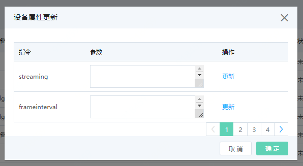

# Control enabling and disabling of Edge sub-device

Now, the IoT Edge supports two methods to control enabling and disabling of sub-device.

## Preconditions

- JD Cloud account registration is done and real-name verification is completed. If you have no accounts, please [Register](https://accounts.jdcloud.com/p/regPage?source=jdcloud%26ReturnUrl=%2f%2fuc.jdcloud.com%2fpassport%2fcomplete%3freturnUrl%3dhttp%3A%2F%2Fuc.jdcloud.com%2Fredirect%2FloginRouter%3FreturnUrl%3Dhttps%253A%252F%252Fwww.jdcloud.com%252Fhelp%252Fdetail%252F734%252FisCatalog%252F1), or make [Real-name Verification](https://uc.jdcloud.com/account/certify).
- IoT Hub service instances have been created.
- Edge nodes have been created and edge computing modules have been deployed.

## Distribute device status via the Console

1. Log in [IoT Hub Service Console](https://iot-console.jdcloud.com/iothub).

2. Find the camera device created for deploying edge computing in the Device Management Page and click **Device Attribute Update** on the right.

   

3. Enable the device: Fill in ‘on’ in the parameter of streaming and click **Update

   Disable the device: Fill in ‘off’ in the parameter of streaming and click **Update
   
4. You can view under the OSS directory created for storing edge computing results. If the camera is turned on, images and results will be uploaded continuously. If the camera is disabled, no data will be produced.

**Special tips**: During Beta, you may directly control turn-off and turn-on of device in IoT Edge-Edge Node Details.

## Control at the edge node

1. Turn on Termail of edge node

2. Search metadata service address
    ```
    docker inspect -f '{{range .NetworkSettings.Networks}}{{.IPAddress}}{{end}}' edgex-core-metadata
    ```
   Search command service address
    ```
    docker inspect -f '{{range .NetworkSettings.Networks}}{{.IPAddress}}{{end}}' edgex-core-command
    ```
3. Search internal device id and streaming command id
    ```
    curl http://${metadata_addr}:48081/api/v1/device/name/${yourdevicename}
    ```
    In which: ${metadata_addr} is the metadata service address searched from the last instruction
         ${yourdevicename} is the device name created when creating edge computing deployment.
4. Send streaming command to command service

    **Turn on device**

    ```
    curl -v -H 'Content-Type: application/json' -X PUT -d '{"streaming":"on"}'http://${cmd_addr}:48082/api/v1/device/${device_id}/command/${cmd_id}   
    ```

    *After the command is sent, the device service will receive a message, log - Run camera(${yourdevicename}) will be displayed, the camera device will start to catch images and save the same under directory $HOME/edgedata/${yourdevicename} of this machine, and then the JPEG images are uploaded to the OSS directory created.*

    **Turn off device**

    ```
    curl -v -H 'Content-Type: application/json' -X PUT -d '{"streaming":"off"}'http://${cmd_addr}:48082/api/v1/device/${device_id}/command/${cmd_id}   
    ```

    *After the command is sent, the device service will receive a message, log - Stop camera(${yourdevicename}) will be displayed and then the camera device will stop catching images.*
    
