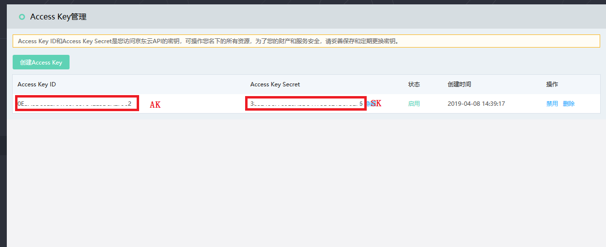
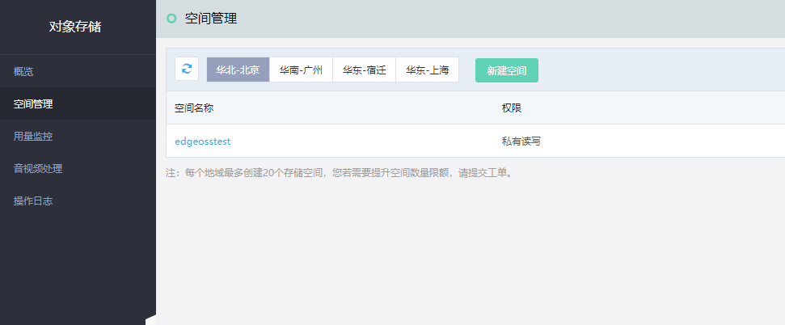

# Install Edge system

You need to install and configure the Edge system on the edge node by hand.

## Preconditions

- Upon completing the operation of creating edge node, please download configuration files and Edge system installation package.

  - If the edge node is not created, please log in [IoT Edge Console](https://iot-console.jdcloud.com/iotedge) to create the same
  - If the Edge system installation package is not downloaded or configuration information is missing, please log in **Edge Details** to download and obtain the same again.

- The Object Storage Service business is subscribed and one Bucket for storing edge computing result data is created. In case the service is not subscribed, please firstly enter the Console of [Object Storage Service](https://oss-console.jdcloud.com) to apply for subscribing the service.

  

## Operation Steps

1. Before installing the Edge system, please install docker and docker-compose.

```
sudo apt install docker
sudo apt install docker-compose
sudo apt-get install pass
```
   Add the user group docker, add the current user ${USER} to the docker user group and the current user ${USER} can be obtained with whoami.
```
sudo groupadd docker
sudo gpasswd –a $(USER) docker
```
   Note: Please reboot the system after operation.
   
2. Decompress Edge installation package to any directory (${destdir})

```
tar zxvf jdc-edge-install.tar.gz –C ${destdir}
```

3. Edit the configuration file**UserConfig.toml**

```
vim ${destdir}/sys-mgmt-agent/res/UserConfig.toml
```

   [Edge]: Please fill in configuration information saved under the created Edge page in the region:

```
[Edge]
Edgename = ''
Region = ''
HubHost = ''
ComposefileUrl = ''
```

   [UserConfig]: You need to fill in this part after getting information on your own.

```
[UserConfig]
AK = ''
SK = ''
OSSRegion = ''
OSSBucket = ''
```

   **Where:**

   - AK/SK: Pleas log in [JD Cloud Console](https://console.jdcloud.com/), click the account on the top right corner (as shown in the figure below), and click **Access Key Management

     

     Log in the Access Key Management Page,

     

     Fill AK, SK on the page in corresponding item of configuration file. ***Suggestions: For safety consideration, you may refer to [IAM](https://docs.jdcloud.com/en/iam) and configure one sub-account with minimum permission. Read and write permissions are authorized to this Bucket only. Then, fill in AK/SK of sub-account in [UserConfig].***

   - For OSS, please log in the [Object Storage Service] page and click **Space Management** on the left

     

       Click **Space Name**, enter the Space Detail and fill in contents shown in the red box below in corresponding item of the configuration file.
     

5. Log in the decompressed directory ${destdir}, execute the installation script and complete Edge system installation.

```
sudo ./install.sh
```

   

## Related References

- [Create Edge Computing Node](Create-Edgenode.md)
