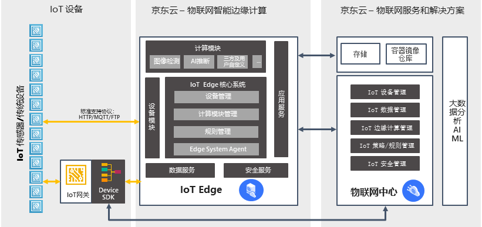

# Basic Architecture

IoT Edge comprises core functions such as core system, device module, data service, application service, security service and edge computing module.

## Business Architecture

Business architecture is shown as in the following figure:

| Name         | Description                                                         |
| ------------ | ------------------------------------------------------------ |
| Core System     | Provide basic running environment to the entire edge computing system and provide device management, module management and rule management.                         |
| Device Module     | Provide device connection, device registration and device data collection function                     |
| Data Service     | Provide local data storage service                         |
| Application Service     | Connect IoT Hub and JD Cloud services with standard protocols (MQTT and HTTP), with data uplink and data downlink functions. |
| Security Service     | Provide device connection security and local data security                        |
| Edge Computing Module | Deploy computing module on edge nodes, with one edge node deployed with several computing modules |

## Related References

- [Product Advantage](../Introduction/Benefits.md)
- [Product Function](../Introduction/Features.md)
- [Create Edge Computing Node](../Getting-Started/Create-Edgenode.md)
- [Install Edge System](../Getting-Started/Install-Edge-System.md)
