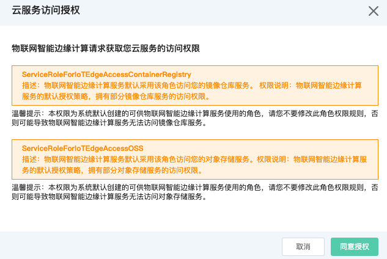
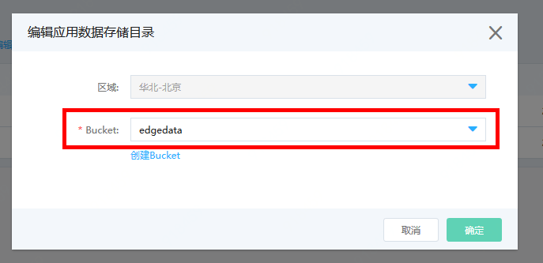
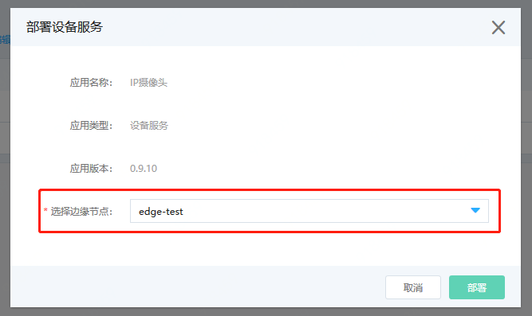
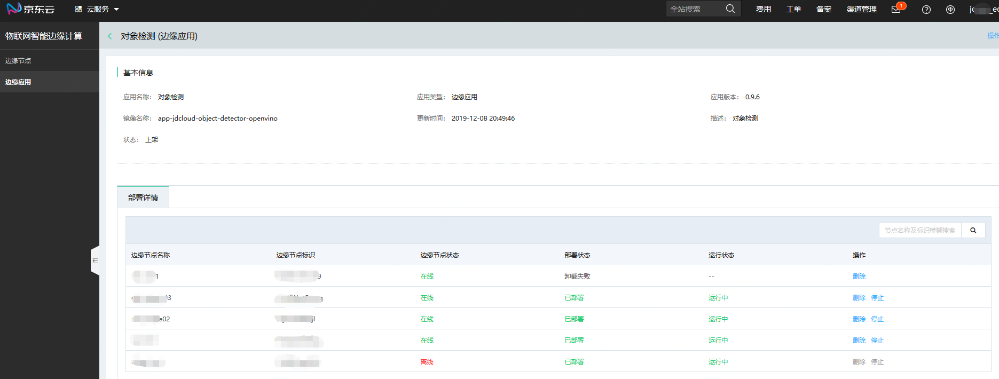
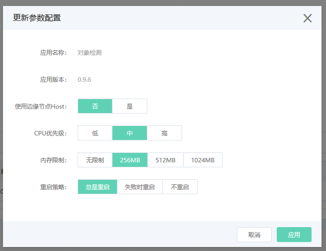
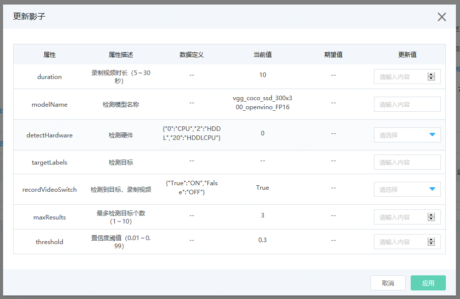
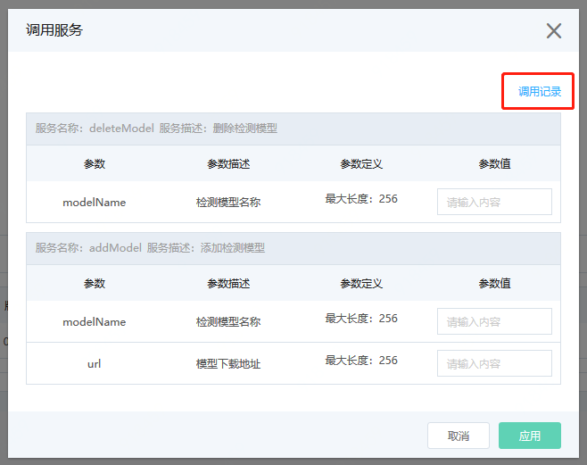

# Manage Edge Application

You can manage the edge application through the IoT Edge Console.

## Preconditions

- Installation of the Edge system has been completed, and the edge node has been kept online.
- The Object Storage Service business is subscribed and one Bucket for storing edge computing result data is created. In case of service disabled, please firstly enter the Console for [Object Storage Service](https://oss-console.jdcloud.com) to apply for enabling the service.
- **Note: When the edge node is not activated, offline or in system updating status, no operation related to the application can be performed.**

## Deploy and install edge application

1. Log in [IoT Edge Console](https://iot-console.jdcloud.com/edge).

2. Click the menu bar on the left to enter the "Edge Application" page. When you enter the "Edge Application" page for the first time, we will request the authorization to access your Container Registry and Object Storage Service from you. Please agree to the authorization, otherwise the applications cannot be normally deployed and installed. Once you agree to the authorization, please be sure to specify an Object Storage Service path for the application data.
    
    
3. In the application list page, you can see the applications that have been released and launched on the IoT Platform for the time being. Edge applications are classified into two categories: one is device service edge applications; the other is standard edge applications.

   ### Deploy device service

   Click **Deploy** button behind the device services application to open the deployment page.

    

   Select the edge node to be installed with device service, and then click **Deploy**. The edge node will receive an installation instruction, and the device service will be automatically installed.

   ### Deploy edge application
   
   Click **Deploy** button behind the edge application to open the deployment page.
   
    
   
   | Parameter             | Description                                                         |
   | ---------------- | ------------------------------------------------------------ |
   | Select Edge Node     | The edge node name of the application to be deployed and installed.                             |
   | Use edge node Host | Whether the edge application uses the Host of the edge node system in running. Default is [No]     |
   | CPU Priority Level        | When the edge application is running, the requested CPU running permission is [in] by default              |
   | Memory Restriction         | When the edge application is running, you need to configure the maximum memory according to the actual condition of your edge node device.     |
   | Restart Policy         | Restart all the time: after the application exists it will automatically restart  Restart on failure, when the application is abnormal it will restart  Do not restart: after the application is terminated, it doesn’t restart. |
   
   Select the edge node to be installed with applications according to the notification on the page, select related configurations, and then click **Deploy** after the selection. The edge node will receive an installation instruction, and the device service will be automatically installed. You can view the deployment details on the edge application details page.

## Edge Application Details

​	In the list of edge applications, click an application name to enter the details page of the application. In the details page, you can perform corresponding operations on all edge nodes where the application has been deployed.
     

### Redeploy Edge Application

​	You can redeploy the applications that failed to be deployed on the edge node. Redeployment requires the edge node to be online.

### Delete Edge Application

​	You can delete the applications that have been deployed on the edge node. When the application deployment fails, the deletion operation is to delete the current deployment records. Application deletion requires the edge node to be online.

​	The following points need to be noted when deleting the application:

	1. When deleting the device-service applications, all child devices depending on the device service under the current edge nodes need to be removed first. Otherwise, the device service cannot be deleted;
   	2. When deleting an edge application, it is necessary to ensure that the application is not specified as the message target end in all message routers under the current edge node. Otherwise, the edge application cannot be deleted.
   	3. If deletion is failed, please enter the corresponding edge node details and view the result in the service call tab.

### Start and Stop Edge Application

​	You can start and stop successfully deployed applications on any edge node. The start-stop operation requires the edge node to be online.

## Configure Edge Application

​	By entering edge node-> edge node details-> edge application, you can manage the applications deployed on the current edge node.
  

### Start and Stop Edge Application

​	You can start and stop successfully deployed applications on any edge node. The start-stop operation requires the edge node to be online.

### Delete Edge Application

​	You can delete the applications that have been successfully deployed on the current edge node. Application deletion requires the edge node to be online.

​	The following points need to be noted when deleting the application:

  	1. When deleting an edge application, it is necessary to ensure that the application is not specified as the message target end in all message routers under the current edge node. Otherwise, the edge application cannot be deleted.
   	2. If deletion is failed, please view the result in the service call tab.

### 		Parameter configuration

You can update the container running parameter configuration of the current application. When updating the parameter configuration, the edge node must be online
 

### 		Update Shadow

You can control the application by updating the shadow configuration of the edge application.
 

| Parameter              | Description                 | Enter Description                                                     |
| ----------------- | -------------------- | ------------------------------------------------------------ |
| detectHardware    | Detect hardware             | When default value of the hardware resource that the current application depends on for detection is: 0:CPU 0:CPU only uses CPU for calculation 2:HDDL only uses HDDL for calculation 20:HDDLCPU preferentially uses HDDL for calculation and CPU for auxiliary calculation |
| targetLabels      | Detection Target             | Fill in the name of the expected detection target. The maximum number of Labels is 10. Please fill in [] if it is set to null. In the case of null, the corresponding detection results will be outputted according to the maximum detection number and the confidence coefficient set. The fill-in method is ["label1","label2","label3"] Reference example ["person","cup","bicycle"]. For the default target name of the object detection application, please refer to [Label File](../../../../image/IoT/IoT-Edge/objectLabel.txt) |
| recordVideoSwitch | Detect the target, and record a video | ON/OFF. Default value is ON. The video is saved both in the local storage and the cloud OSS. **Note: The one-way camera produces video files of about 2.2GB per hour at 1280x720 resolutions. Please ensure your local hard disk has enough space. The system clears it up at 2am every day. ** |
| duration          | The video duration recorded         | Unit: second, type: integral, input range: 5~30, and the step size is 1. Default value is: 10 |
| modelName         | Detection model name         | Fill in the file name of AI model used by the object detection application, and no file extension is allowed. The maximum length of names inputted is: 256 characters. The built-in model file of object detection application is: vgg_coco_ssd_300x300_openvino_FP16 |
| maxResults        | Maximum number of objects detected     | Type: integral, input range: 1~10, step size: 1. Single frame image corresponds with the number of target results of multiple detections. Default value is 3. |
| threshold         | Threshold value of confidence coefficient           | Type: floating-point, input range: 0.01~0.99, step size: 0.01. When the object detection application detects that the confidence coefficient of the target is greater than or equal to the set value, the detection result will be outputted. Default value is: 0.9. |

### 		Call Address
If you want to use your own AI model for visual inspection, you can update your own model file to the edge node by calling the service of object detection application. You can click the calling records to view the status of the service that has been called.
 
Your model files must conform to the framework of OpenVino. If you use a model from other frameworks, please refer to [AI Mode Conversion Guide](../Operation-Guide/Trans-ModelFile.md).

Add Detection Model (addModel)

| Parameter      | Description      | Enter Description                                                     |
| --------- | ------------ | ------------------------------------------------------------ |
| modelName | Detect Model Name | The maximum length of names inputted is: 256 characters. Note: The built-in AI model name cannot be entered vgg_coco_ssd_300x300_openvino_FP16 |
| url       | Model download link | File specification: must be the detection model conforming to OpenVino framework in the format of .tar.gz. Note: the detection tag file must be provided in the package in the format of txt. |

Delete Detection Model (deleteModel)

| Parameter      | Description      | Enter Description                                                     |
| --------- | ------------ | ------------------------------------------------------------ |
| modelName | Detect Model Name | The maximum length of names inputted is: 256 characters. The build-in models of object detection application cannot be deleted. |

## Related References

- [Create Edge Computing Node](../Getting-Started/Create-Edgenode.md)
- [Install Edge System](../Getting-Started/Install-Edge-System.md) 
- [Manage Child Device](../Operation-Guide/SubDevice.md)
- [Manage Message Router](../Operation-Guide/MsgRouter.md)
