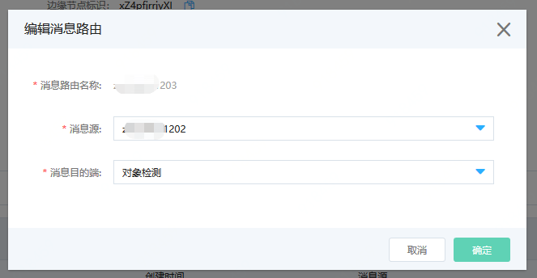

# Manage Message Router

You can manage the message router on the edge node through the Console for IoT Edge.

Message router is to configure the transmission path of messages by setting rules so that messages are routed from message source to target end in accordance with the filter conditions set by the rules. 

## Preconditions

- Installation of the Edge system has been completed, and the edge node has been kept online.
- The edge application has been successfully installed and deployed, and the self-reference pen has been successfully added.
- **Note: When the edge node is not activated, offline or in system updating status, no operation related to message router can be performed.**

## Create Message Router

1. Log in [IoT Edge Console](https://iot-console.jdcloud.com/edge).

2. Click the left menu to enter the "Edge Node" page, and click any edge node name to enter the edge node details page.

3. Enter the "Message Router" tab, and click **Create Message Router**.

    

   | Parameter         | Description                                                         |
   | ------------ | ------------------------------------------------------------ |
   | Message Router Name | Contain 1-30 characters, Support numbers, uppercase and lowercase letters, underline and line-through. Must start and end with a number or an uppercase or lowercase letter, and be unique under the edge node. |
   | Message Source       | Message Sender Currently, only child devices under the current edge node are supported as message sources. Message sources cannot be duplicated in each message router under the current edge node. |
   | Message Target End   | Message Recipient Currently, the deployed applications under the current edge node are supported as the target end. |
   | Message Router Description | 100 characters. Used to describe this message router.                            |

## Start-up Message Router

​		Click **Start** or **Stop** at the back of the message router list that has been created to start or stop the current message router.

​		1. It can be stopped when message router is started.

​		2. It can be started when message router is stopped.

## Edit Message Router

​		Click **Edit** at the back of the message router list that has been created to edit and update the message source and message Target End of the current message router.

​		

## Delete message router

​		 Click **Delete** at the back of the message router list that has been created to delete the current message router. After the deletion is successful, the message router will no longer be displayed in the list.

## Related References

- [Create Edge Computing Node](../Getting-Started/Create-Edgenode.md)
- [Install Edge System](../Getting-Started/Install-Edge-System.md) 
- [Manage Edge Application](../Operation-Guide/Edge-App.md)
- [Manage Child Device](../Operation-Guide/SubDevice.md)
