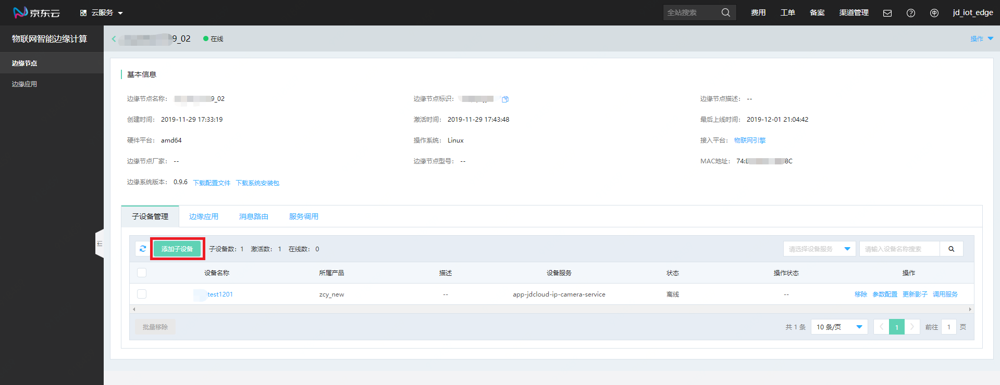
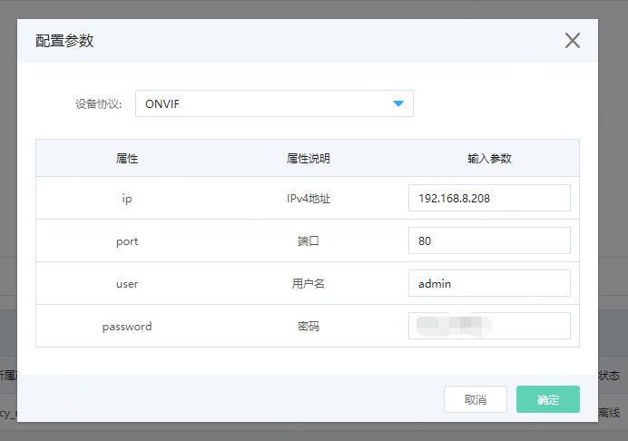

# Manage Child Device

You can manage the edge node child device through the Console for IoT Edge.

## Preconditions

- Installation of the Edge system has been completed, and the edge node has been kept online.
- The installation of corresponding device services has been completed at the edge node, and in the [IoT Core Console](https://iot-console.jdcloud.com/core), the corresponding thing model template has been used to create the device product and register the corresponding devices. In this section, the IP camera device template and device service provided by JD Cloud will be taken as an example.
- **Note: When the edge node is not activated, offline or in system updating status, no operation related to the child device can be performed.**

## Add child device

1. Log in [IoT Edge Console](https://iot-console.jdcloud.com/edge).

2. Click the left menu to enter the "Edge Node" page, click the name of the edge node to which you want to add a child device, and enter the edge node details page.

3. Enter "Child Device Management" tab,

    

   Click **Add Child Device** to add a child device.

    

   | Parameter     | Description                                                         |
   | -------- | ------------------------------------------------------------ |
   | Device Service | Select the device service that has been deployed on the edge node. If it is not deployed, please click **Deploy Device Service** on the right. |
   | Product     | Select the product to which the child device to be added belongs. When creating the product, please use the thing model template related to the device service. The current IP-Camera service supports products created by using network camera templates. |
   | Device     | Select the child device to be added, and only one can be added at a time. Devices that have been added cannot be added again. **Note: Gateway type devices cannot be added** |
   | Device Protocol | Device access protocol configuration parameters for customers to configure their device information. IP camera device service supports ONVIF protocol. |
   | ONVIF Protocol Configuration Parameter | ip: IPv4 address of the IP camera to be added port: port number of IP camera user: user name to access IP camera password: password to access IP camera |

   After clicking **OK**, the add status of child device can be viewed in the child device list at the bottom of the current page, and the child device can also be controlled.
   
   **Note: If the child device fails to be added, it will not appear in the list. Please click the service call tab to view the add results.**

## Remove Child Device

1. Enter "Child Device Management" tab, and click **Remove** button at the back of a device to remove the child device from the current edge node.

2. Click the checkbox in front of the device name to select multiple child devices or all child devices for batch removal.

   Notification:

   ​	a. The removal operation is only to release the associated relationship between the child device and the edge node instead of deleting the device in the IoT Core.

   ​	b. If the child device has been configured as a source on a message router, the child device cannot be removed.

## Parameter configuration

1. Enter the "Child Device Management" tab and click **Parameter Configuration** button behind a device to modify the device access protocol parameters.

   

## Update Shadow

1. Enter the "Child Device Management" tab and click **Update Shadow** button behind a device to update the shadow of the current child device.

   

   Currently, IP cameras provide the following shadows:

   | Parameter          | Description       | Enter Description                                                     |
   | ------------- | ---------- | ------------------------------------------------------------ |
   | streaming     | Device Startup and Shutdown   | on/off  Initial value: off                                          |
   | resolution    | Photo Resolution | Format: length x width, initial value: 1024x768. Please fill in according to the actual resolution supported by the camera. |
   | frameinterval | Frequency of Taking Photo   | Unit: ms, input range: [1000,100000], step size: 500 initial value: 2000      |

## Call Address

1. Enter the "Child Device Management" tab and click **Call Address** button behind a device to remotely call the services provided by the device.

   

   Currently, IP cameras provide RecordVideo recording service. You can call the service to realize the camera recording function. You can view the result of the service call by clicking **Call Record**. The recording results will be uploaded to the OSS directory you specified on the edge application page.
   
   | Parameter     | Description         | Enter Description                                                     |
   | -------- | ------------ | ------------------------------------------------------------ |
   | duration | Continuous Recording Time | Unit: Second, Input range [5,60], Step size: 1. **Note: The one-way camera produces video files of about 2.2GB per hour at 1280x720 resolutions. Please ensure your local hard disk has enough space. The system clears it up at 2am every day. ** |
   
   

## Related References,

- [Create Edge Computing Node](../Getting-Started/Create-Edgenode.md)
- [Install Edge System](../Getting-Started/Install-Edge-System.md)
- [Manage Edge Application](../Operation-Guide/Edge-App.md)
- [Manage Message Router](../Operation-Guide/MsgRouter.md)                          
