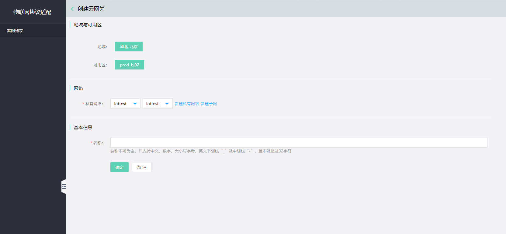

# Create instance

You can quickly create the IoT Hub Protocol Adaptor Service through the IoT Hub Protocol Adaptor Service   Console or API.

This document introduces how to create an IoT Hub Protocol Adaptor Service   instance through the Console.

## Preconditions
- JD Cloud account registration is done and real-name verification is completed. If you have no accounts, please [Register](https://accounts.jdcloud.com/p/regPage?source=jdcloud%26ReturnUrl=%2f%2fuc.jdcloud.com%2fpassport%2fcomplete%3freturnUrl%3dhttp%3A%2F%2Fuc.jdcloud.com%2Fredirect%2FloginRouter%3FreturnUrl%3Dhttps%253A%252F%252Fwww.jdcloud.com%252Fhelp%252Fdetail%252F734%252FisCatalog%252F1), or make [Real-name Verification](https://uc.jdcloud.com/account/certify).
- Please confirm that your account balance (including coupon) is not less than RMB 50.

## Operation Steps
1. Log in [IoT Hub Protocol Adaptor Service   Console](https://iot-console.jdcloud.com/iot-protocol-adaptor).
2. On the “Instance List” page, click **Create** to enter the “Create Instance” page.

    
	
3. Select instance configuration

	- Region
	
       JD Cloud’s Data Centers are distributed in many worldwide locations which are referred as the regions. IoT Hub Protocol Adaptor Service   Supports cn-north-1 currently and will support more regions subsequently.

	   Description:
	   - The cloud service products in one region are interconnected through the intranet, but the resource intranets of different accounts are completely isolated;
	   - The intranets between the cloud service products in different regions are not interconnected;
	   - When purchasing the cloud service, you are suggested to choose the region closest to your customers to reduce access latency;
	   
	- Network
	
	   IoT Hub Protocol Adaptor Service  Supports VPC deployment. Please firstly go to create Virtual Private Cloud and Subnet, if you haven’t completed network plan yet.
	   
	- Basic Information
	
	    Create a name for your service instance. Names of different instances cannot be the same.
4 Click **Confirm** to enter the “Order Confirmation” page.
6. On the “Order Confirmation” page, confirm the instance information and read the Cloud Database IoT Hub Protocol Adaptor   Service Terms. Please click **Instant Account Setup**.
7. After the payment process is completed, the page will automatically redirect to the IoT Hub Protocol Adaptor Service   “Instance List” page; after the completion of the instance creation, you can view the newly created instance of IoT Hub Protocol Adaptor Service   on the “Instance List” page.

		*Note
		During the Beta, you need not to pay for the IoT Hub Protocol Adaptor Service but need to pay for the IoT Hub Service. The above payment process will deduct the balance in your account.
