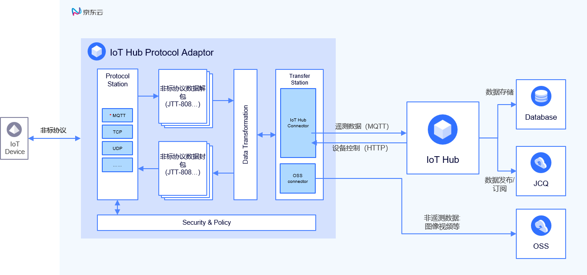

# Basic Architecture

The IoT Hub Protocol Adaptor Service consists of four main modules, namely protocol engine, data coding and decoding, data processing and data transmission.

## Business Architecture
Business architecture is shown as in the following figure:

|Name|Description|
| - | - | 
|Protocol Engine| Support to connect devices of standard protocol (AMQT, MQTT, TCP or UDP) with data format of private protocol to the IoT Hub Protocol Adaptor Service.|
|Data Coding and Decoding| Include functions of data coding and data decoding. The data decoding function can unpack the up data according to the private protocol format and send to the backend IoT Hub Service; the data coding function can pack the down control command according to the private protocol format.|
|Data Processing| Pre-process the data.|
|Data Transmission| Transmit data and connect to the IoT Hub Service.|

## Related References

- [Product Advantage](../Introduction/Benefits.md)
- [Product Function](../Introduction/Features.md)
- [Create instance](../Getting-Started/Create-Instance.md)
