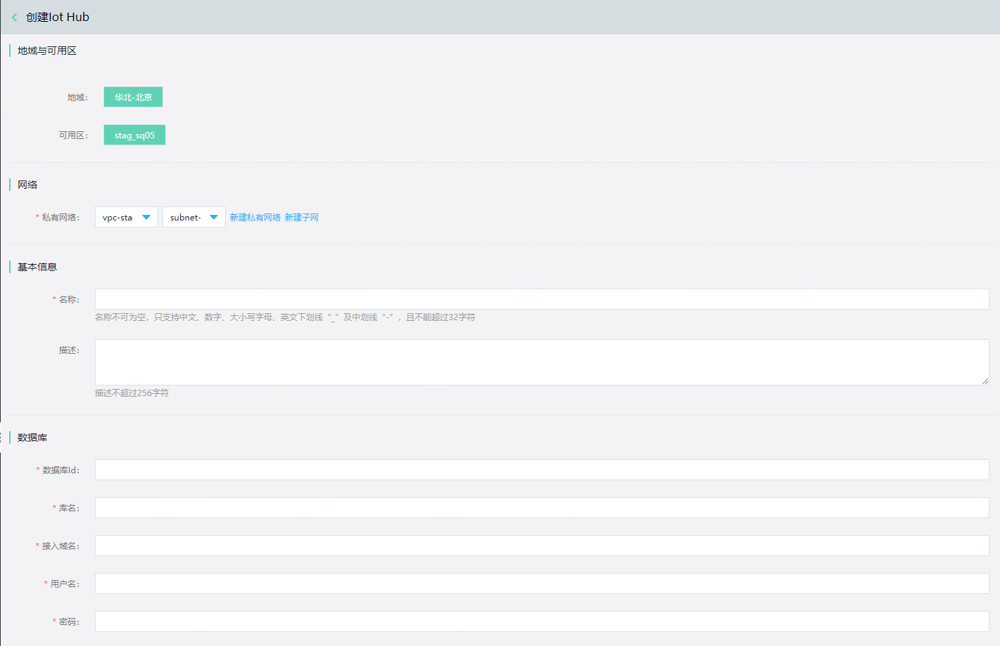

# Create instance

You can rapidly create the IoT Hub service via the Console of IoT Hub service or the API. For billing instructions of instances, please refer to [Price Overview](../Pricing/Billing-Overview.md)", "[Billing Rules](../Pricing/Billing-Rules.md)".

This Document introduces how to create an instance of IoT Hub Service through the Console.

## Preconditions

- JD Cloud account registration is done and real-name verification is completed. If you have no accounts, please [Register](https://accounts.jdcloud.com/p/regPage?source=jdcloud%26ReturnUrl=%2f%2fuc.jdcloud.com%2fpassport%2fcomplete%3freturnUrl%3dhttp%3A%2F%2Fuc.jdcloud.com%2Fredirect%2FloginRouter%3FreturnUrl%3Dhttps%253A%252F%252Fwww.jdcloud.com%252Fhelp%252Fdetail%252F734%252FisCatalog%252F1), or make [Real-name Verification](https://uc.jdcloud.com/account/certify).
- Please confirm that your account balance (including coupon) is not less than RMB 50.

## Operation Steps

1. Log in [IoT Hub Service Console](https://iot-console.jdcloud.com/iothub).

2. On the "Instance List" page, click **Create** to enter the "Create Instance" page.

   

3. Select instance configuration

   - Region

     JD Cloud’s Data Centers are distributed in many worldwide locations which are referred as the regions. The IoT Hub Service only supports cn-north-1 now. More regions will be supported subsequently.

     Description:

     - The cloud service products in one region are interconnected through the intranet, but the resource intranets of different accounts are completely isolated;
     - The intranets between the cloud service products in different regions are not interconnected;
     - When purchasing the cloud service, you are suggested to choose the region closest to your customers to reduce access latency;

   - Network

     The IoT Hub service supports deployment of Virtual Private Cloud. Please firstly go to create Virtual Private Cloud and Subnet, if you haven’t completed network plan yet.

   - Database

     The registration information about the instances of IoT Hub Service is registered with the instance storage device of database RDS; after the rule engine dumping rule is configured, the telemetry data reported by the device are stored. If you haven’t created the instances of database RDS, please go to create it firstly, and then configure the RDS instance and instance of IoT Hub service.

     

     Description:

     Database instance ID: Please enter into your RDS instance information page, find the ID item, and fill in the following ID information.

     

     Intranet domain: Please enter into your RDS instance information page, find the Intranet domain item, and fill in the following complete domain information.

     

     Base name: Enter into the base management, and fill in the base name to be used for IoT Hub.

     

     User name: Fill in the associated account name of the corresponding base.

     Password: Fill in the password of the corresponding associated account.

     Note:

     - The VPC network setting in which the instance of database RDS is located needs to be consistent with the VPC network setting of IoT Hub Service.
     - After an instance of database RDS is completely created, it is required to log in the instances of database RDS service to initialize the database. Please use the script of the Attachment [Database Initialization Script](../../../../image/IoT/IoT-Hub/iothub_latest.sql)

4. Click **Confirm** to enter the "Order Confirmation" page.

5. On the "Order Confirmation" page, confirm Instance information and read the Service Terms for Cloud Database IoT Hub Service. Click **Instant Account Setup**.

6. After the payment process is completed, the page will automatically redirect to IoT Hub Service "Instance List" page to wait for the completion of the instance creation. You can view the newly created instance of IoT Hub Service on the "Instance List" page.

## Related References

- [Billing Rules](../Pricing/Billing-Rules.md)
