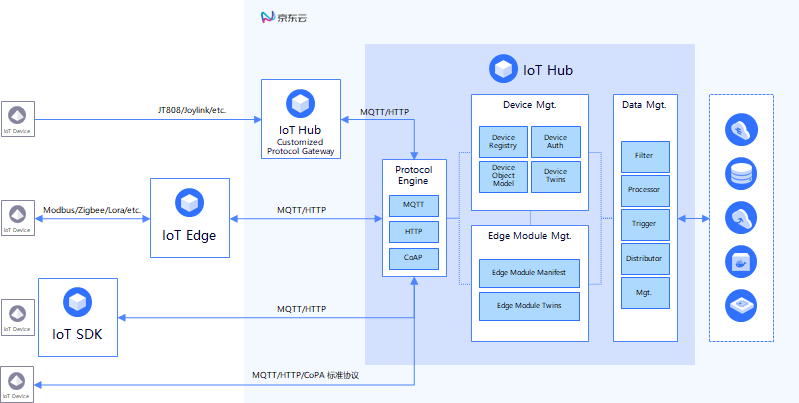

# Basic Architecture

IoT Hub consists of four main modules, i.e., protocol engine, device management, Edge module management and data management.

## Business Architecture
Business architecture is shown as in the following figure:

|Name|Description|
| - | - | 
|Protocol Engine| The use of standard protocol (MQTT, HTTP or CoAP) and device connection Hub service are supported.|
|Equipment Management| It consists of such functions as device registration, device authentication, device TSL management and device twin management.|
|Edge Module Management| consists of the management of Edge module metadata, module twin management, etc.|
|Data Management| The rule engine is embedded, so that the user can pre-process data through the rule engine, and then forward and dump them to other cloud services of JD Cloud.|

## Related References

- [Product Advantage](../Introduction/Benefits.md)
- [Product Function](../Introduction/Features.md)
- [Price Overview](../Pricing/Price-Overview.md)
- [Billing Rules](../Pricing/Billing-Rules.md)
- [Create instance](../Getting-Started/Create-Instance.md)
