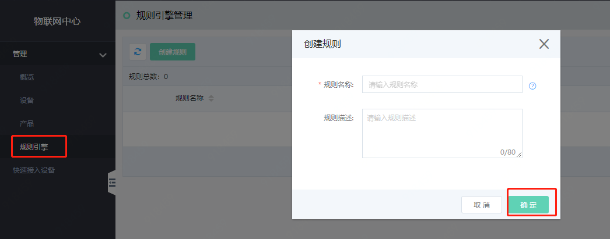
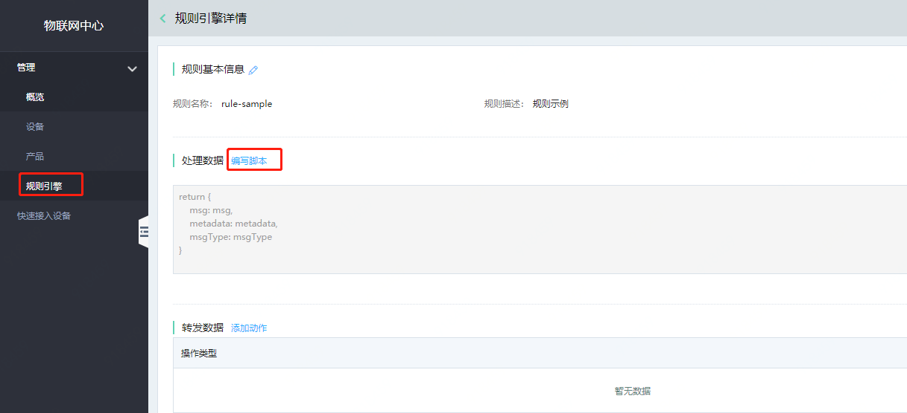
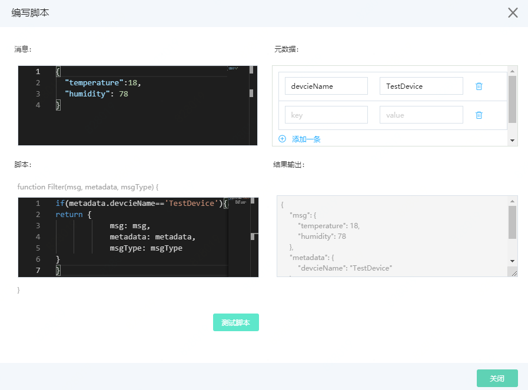
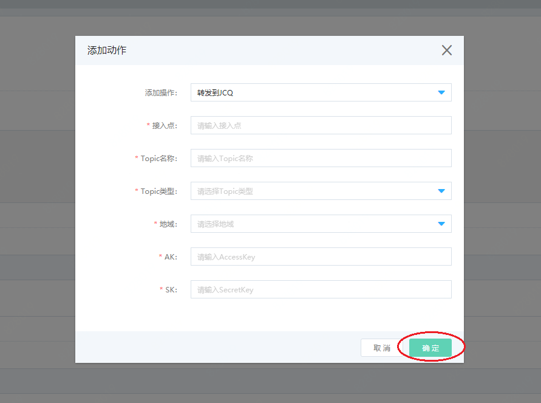
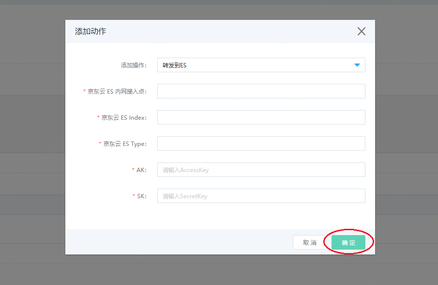

# Rule Engine

The data dumping function of rule engine will forward data message in Topic to another Topic or other JD Cloud product for storage or processing.

## Create Rules

1. Log in [IoT Hub Console](https://iot-console.jdcloud.com/hub)
2. Select **Manage** -> **Rule Engine on the left navigation bar**
3. Click **Create Rule Engine on the page top**



## Data Forward

1. Click **Rule Name** and enter the rule engine details

### 2.1 Process data/edit script

1. Click **Compile Script** on the page and compile rule logics forwarded by the processing rule engine



- The language adopted by the script is JavaScript
- All data will be processed by the script and then forwarded


Script examples are as follows:

```
function Filter(msg, metadata, msgType) {  		
   if(metadata.deviceName=='testDevice'){
      return { 							
        msg: msg,
        metadata: metadata,
        msgType: msgType
      }
    }
}									

```

| Attribute  | Description|
| ----- | ----- |
|msg| Attribute defined in the user’s product and data reported by a device|
|metadata| Static metadata<br>metadata includes:<br> metadata.deviceName refers to device name <br> metadata.identifier refers to the device Key <br> metadata.ts refers to the message reporting time  <br> metadata.version refers to the current version |
|msgType|Message Type |

After a script is compiled, please click **Test Script** to test the script

The test interface is as follows:

- The output result is the data outputted after script filtering is executed
- The user can click **Test Script**
- **Result Output** to display data filtered by the script



## 2.2 Forward Data/Add Action

- Click **Add Action** and an action popup will appear. There are three operation adding methods, respectively including forward to another Topic, forward to JCQ and forward to ES


### 2.2.1 Forward to another Topic

- Select the required product and device and enter the customized topic name. If there is no optional product, please create a product in the product page and then add a device for the product on the device page. If there is no optional device, please add a device for the product on the device page.


- Click **OK** and then you can see this MQTT operation type in the forwarding list. Meanwhile, it can be edited and deleted.

### 2.2.2 Forward to JCQ

For forward to JCQ, please complete information such as JCQ access point, Topic name, Topic type and region. You can find relevant information in Message Queue.

Get parameter information of Message Queue:
1. Log in **Message Queue** -> **Topic Management Page**
2. Click the target Topic name to enter the Topic details. If Topic is not created in the Topic management page, click the **Create** button to create one.

AK/SK information can be created/obtained on the AccessKey Management page.


Click **OK** and then you can see this JCQ action in the forwarding list. Meanwhile, it can be edited and deleted.


### 2.2.3 Forward to ES

For forward to ES, please complete information such as JD Cloud ES Intranet Access Point, JD Cloud ES Index and JD Cloud ES Type

Get parameter information of JCS for Elasticsearch:
1. Log in **JCS for Elasticsearch** -> **Cluster Management Page**,
2. Click the Elasticsearch name of a target cluster to enter the basic information page of the Elasticsearch. If Elasticsearch clusters are not created in the Elasticsearch cluster management page, click the **Create** button to create them.

AK/SK information can be created/obtained on the AccessKey Management page.


Click **OK** and then you can see this ES action in the forwarding list. Meanwhile, it can be edited and deleted.

