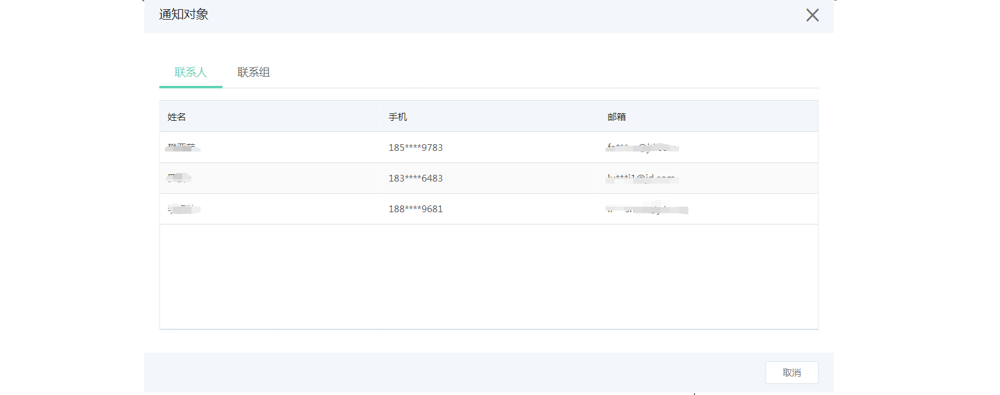

# View alarm rules  
1. Log in to the Cloud Detection Console of JD Cloud and click **Management -> Cloud Detection -> Availability Monitoring** to log in the monitoring task list page.  
  
2. Select a monitoring task, click **Alarm Rule** under the operation bar and enter the "Alarm Rule" page to view the set alarm rules and its status information.  
  
# Set alarm rules  
1. Log in to the Cloud Detection Console of JD Cloud and click **Management -> Cloud Detection -> Availability Monitoring** to log in the monitoring task list page.  
 
2. Select the monitoring task and click **Alarm Rule** under the operation bar to log in the "Alarm Rule" page.  
  
3. Click **Add New Alarm Rule** to turn on the alarm rule setting page.  
 
4. Select alarm rule names, select regions, monitoring items, statistical periods, statistical methods, calculation methods, thresholds and durations. Alarm levels and notification methods can be configured.  
5. Click **Next** to set the notification method, select the contact or the contact group to be informed and click **Next** to finish alarm configuration.

# Modify Alarm Rule  
1. Log in to the Cloud Detection Console of JD Cloud and click **Management -> Cloud Detection -> Availability Monitoring** to log in the monitoring task list page.  
 
2. Select the monitoring task and click **Alarm Rule** under the operation bar to log in the "Alarm Rule" page.  
  
3. Select the alarm rule to be modified and click **Modify** to enter the alarm rule modifying page.   
 
4. Rule names, regions, monitoring items, statistical periods, statistical methods, calculation methods, thresholds, durations and notification periods can be modified as well as alarm levels and notification methods can be configured.  
5. Click **Next** to set the notification method, change contacts or contact groups according to demands and callback alarm (URL execution action) and click **Next** to finish alarm configuration modification.

# Disable/Enable Alarm Rule  
1. Log in to the Cloud Detection Console of JD Cloud and click **Management -> Cloud Detection -> Availability Monitoring** to log in the monitoring task list page.  

2. Select the monitoring task and click **Alarm Rule** under the operation bar to log in the "Alarm Rule" page.  
  
3. Select an alarm rule to be disabled/enabled and click **Disable** or **Enable**.

# View Notification Object  
1. Log in to the Cloud Detection Console of JD Cloud and click **Management -> Cloud Detection -> Availability Monitoring** to log in the monitoring task list page.  

2. Select the monitoring task and click **Alarm Rule** under the operation bar to log in the "Alarm Rule" page.  

3. Select an alarm rule required to be viewed and click **Notification Object** to view the notification contact set for the rule.  

# Alarm History  
1. Log in to the Cloud Detection Console of JD Cloud and click **Management -> Cloud Detection -> Availability Monitoring** to log in the monitoring task list page.  

2. Select the monitoring task and click **Alarm Rule** under the operation bar to log in the "Alarm Rule" page, select the alarm rule to be viewed and click **Alarm History**.   

3. Historical alarm situations of this rule can be viewed. By default, the alarm history of the latest 3 days can be displayed and corresponding alarm history within customized period can be viewed.  

# Delete the alarm rule  
1. Log in to the Cloud Detection Console of JD Cloud and click **Management -> Cloud Detection -> Availability Monitoring** to log in the monitoring task list page.  

2. Select the monitoring task and click **Alarm Rule** under the operation bar to log in the "Alarm Rule" page.  

3. Select an alarm rule to be deleted, click **Delete** or select the check box ahead the alarm rule, and click **Delete** in batches.  
4. Click **OK** in the deletion notification tooltip and deletion can be made.
