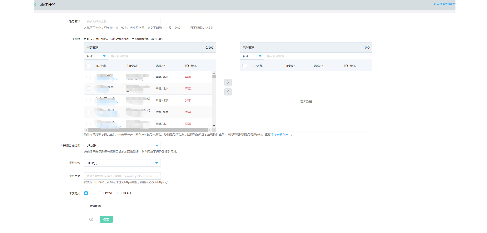
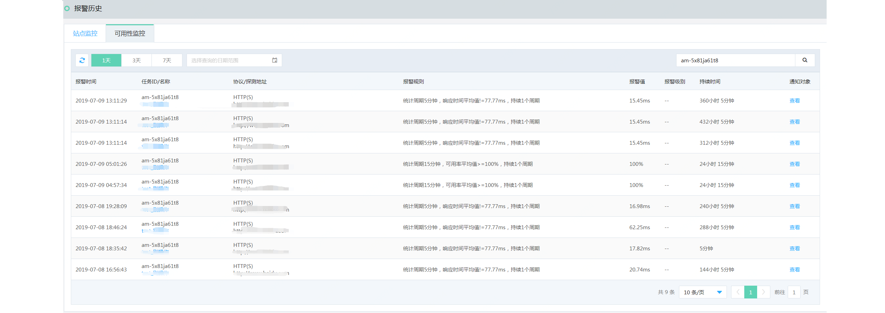

# Create Monitoring Task 
1. Log in to JD Cloud Detection Console and click **Management->Cloud Detection->Availability Monitoring** to enter the availability monitoring task list page. Click **Create Task** in the upper left corner.  

2. Set task name, select Virtual Machines serving as the detection source and set detection target. Relevant information is as follows:
- The target type supports URL/IP or RDS
- For selection of detection protocol, URL/IP supports detection of HTTP(S) and TELNET and RDS supports detection via the TELNET method only
- Set Detection Target  
a. If the detection target is of the URL/IP type and the protocol is HTTP(S), detection port number is also required when the entered IP address or domain adopts the TELNET protocol. In case of HTTP(S), the request method can be selected and at the same time, requests with HTTP request heads and Cookie information can be configured in the advanced configuration  
b. If the detection target is of the RDS type, the detection protocol is TELNET only, and the existing RDS database created can be selected as the detection target.  
Note: If the RDS is target type, the intranet domain address of the database shall be detected.
- In case of HTTP(S), configuration of HTTP request heads and Cookie information is supported. For Post request method, setting of body content and information is also supported.  

3. Click **OK** to save the monitoring task  

# Modify monitoring task  
1. Log in to JD Cloud Detection Console and click **Management->Cloud Detection->Availability Monitoring** to enter the availability monitoring task list page. Select the availability monitoring task to be modified, click **More** -> **Modify** under the operation bar to log in the availability monitoring task modification page.  

2. Monitoring task names, detection source information and detection target address can be modified (detection target type and detection protocols cannot be modified), and HTTP(S) also support changes to request method and senior configuration.  
Note: For relevant restrictions and requirements, please refer to the monitoring task creation page.  

3. After the information to be modified is changed, click **OK** to save the monitoring task.  

# Enable/Disable Task  
1. Log in to JD Cloud Detection Console and click **Management->Cloud Detection->Availability Monitoring** to enter the availability monitoring task list page.  

2. Select the monitoring task to be disabled/enabled and click **More** -> **Disable**/**Enable**.  
Note: After any task is disabled, the detection task and alarm service for the monitoring task will be stopped.  

# Alarm History  
1. Log in to JD Cloud Detection Console and click **Management->Cloud Detection->Availability Monitoring** to enter the availability monitoring task list page.  

2. Select a monitoring task where the alarm is required to be viewed and click **Alarm History**. Redirect to the All Alarm History -> Availability Monitoring page, to show alarm conditions of the latest 1 day for the monitoring task. If you need to view alarm history of other periods, please just modify the date range.  

# Delete Task  
1. Log in to the Cloud Detection Console of JD Cloud and click **Management -> Cloud Detection -> Availability Monitoring** to log in the monitoring task list page.  

2. Select the monitoring task to be deleted, click **More -> Delete** under the operation bar or select the check box ahead the task and click **Delete** in batches.  
3. Click **OK** in the deletion notification tooltip.
