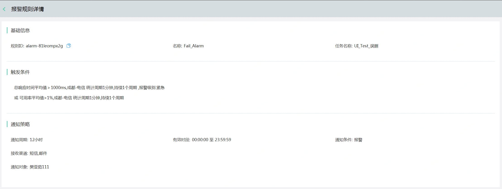

# View alarm rules  
1. Log in the Cloud Detection Console of JD Cloud & AI and click **Management -> Cloud Detection -> Site Monitoring** to log in the monitoring task list page.  
 
2. Select a monitoring task and click **Alarm Rule** under the operation bar and enter the "Alarm Rule" page to view the set alarm rule and its status information   
 

# Set alarm rules  
1. Log in the Cloud Detection Console of JD Cloud & AI and click **Management -> Cloud Detection -> Site Monitoring** to log in the monitoring task list page.  
 
2. Select a monitoring task, click **Alarm Rule** under the operation bar, enter the "Alarm Rule" page, click **Add Alarm Rule** and open the alarm rule setting page.  
 
3. Configure information as per steps below  
   1) Basic Information: Set rule name, and confirm if the configured monitoring task is correct.  
   2) Triggering Condition:  
     For detection node, select overall or designate city-operator, configure monitoring item, statistical period, statistical method, calculation method, threshold, duration, and set alarm level on demand. If you need to configure multiple triggering conditions, just click the **Add Triggering Condition** button.
 

   3) Notification Policy:  
   - Notification Period: It means the notification sending interval when any resource remains in the alarm status and is not recovered. Options include 5 minutes, 10 minutes, 15 minutes, 30 minutes, 1 hour, 3 hours, 6 hours, 12 hours and 24 hours.
   - Effective Period: Alarm SMS and emails will be sent within the specified time period and will be sent all day by default.
   - Notification Condition: Two scenarios, "Alarm" and "Recover", are provided. By default, only the alarm status is sent and notification conditions must be appointed.
   - Receiving Channel: Two types, "SMS" and "Email", are provided. By default, the two sending channels are used and please choose the channel according to your demands.  
   - Notification Object: Selection of a contact or a contact group is supported. For addition of contacts and contact groups, please click **Account Management-Contact Management** on the bottom of choice box and make configuration in the User Center.  
   - Alarm Callback: When any resource alarm is sent, JD Cloud will actively carry out callback as per URL address and POST parameters configured.  
  

4. Click **Complete Creation** on the page bottom and then the addition of alarm rule is supported. Click the **Cancel** button and then this operation is given up.  

# Modify Alarm Rule  
1. Log in the Cloud Detection Console of JD Cloud & AI and click **Management -> Cloud Detection -> Site Monitoring** to log in the monitoring task list page.  
 
2. Select a monitoring task, click **Alarm Rule** under the operation bar, enter the "Alarm Rule" page, select the alarm rule to be modified, click **Modify** and enter the Alarm Rule Modification page.  

3. You can modify the rule name, triggering condition and notification policy according to the needs (you can refer to the Create Alarm Rule page).  

# Disable/Enable Alarm Rule  
1. Log in the Cloud Detection Console of JD Cloud & AI and click **Management -> Cloud Detection -> Site Monitoring** to log in the monitoring task list page.  
2. Select a monitoring task, click **Alarm Rule** under the operation bar, log in the "Alarm Rule" page, select the alarm rule to be disabled/enabled and click **Disable**/**Enable**.  

# Details  
1. Log in the Cloud Detection Console of JD Cloud & AI and click **Management -> Cloud Detection -> Site Monitoring** to log in the monitoring task list page.  
 
2. Select the monitoring task and click **Alarm Rule** under the operation bar to log in the "Alarm Rule" page.  
  
3. Select an alarm rule required to be viewed and click **Details** to view the basic information, triggering condition and notification policy configured for this rule.  

# Alarm History   
1. Log in the Cloud Detection Console of JD Cloud & AI and click **Management -> Cloud Detection -> Site Monitoring** to log in the monitoring task list page.  
 
2. Select the monitoring task and click **Alarm Rule** under the operation bar to log in the "Alarm Rule" page  
  
3. Select an alarm rule required to be viewed and click **Alarm History** to view the historical alarm situation of the rule. By default, the alarm history of the latest 3 days can be displayed and corresponding alarm history within customized period can be viewed.
 

# Delete the alarm rule  
1. Log in the Cloud Detection Console of JD Cloud & AI and click **Management -> Cloud Detection -> Site Monitoring** to log in the monitoring task list page.  
2. Select a monitoring task, click **Alarm Rule** under the operation bar, enter the "Alarm Rule" page, select an alarm rule to be deleted, click **Delete** or check the check box ahead of corresponding rule and click **Delete** in batches.  
3. Click **OK** in the deletion notification tooltip and deletion can be made.

