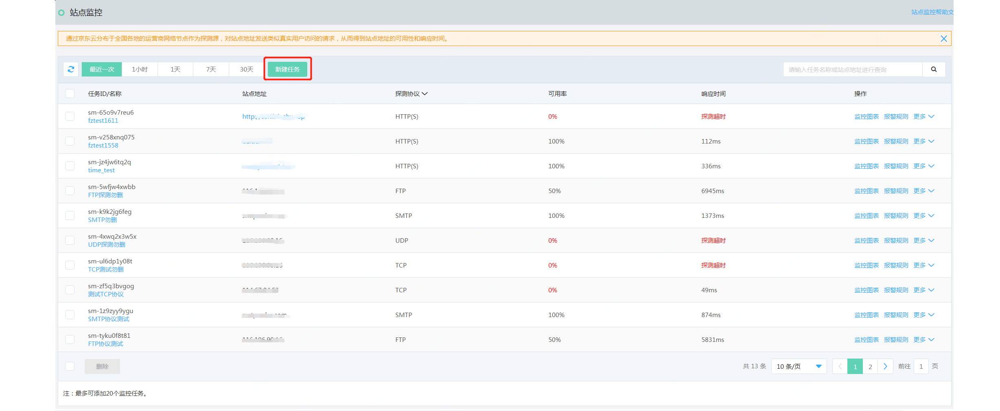
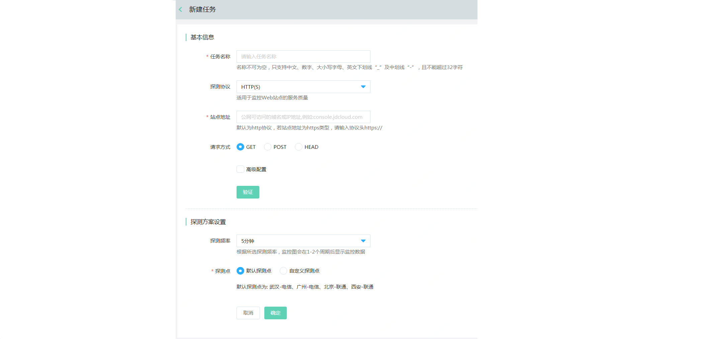
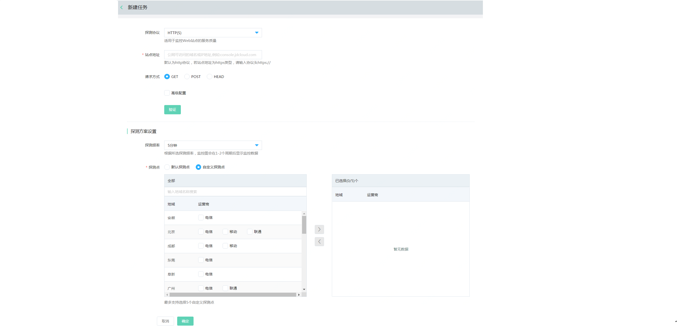
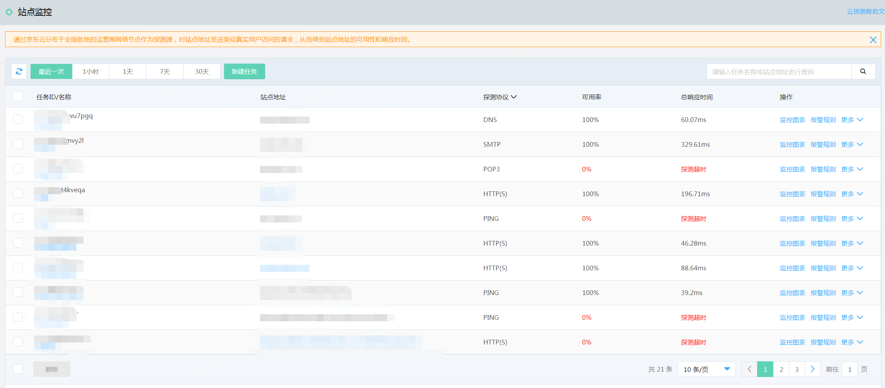
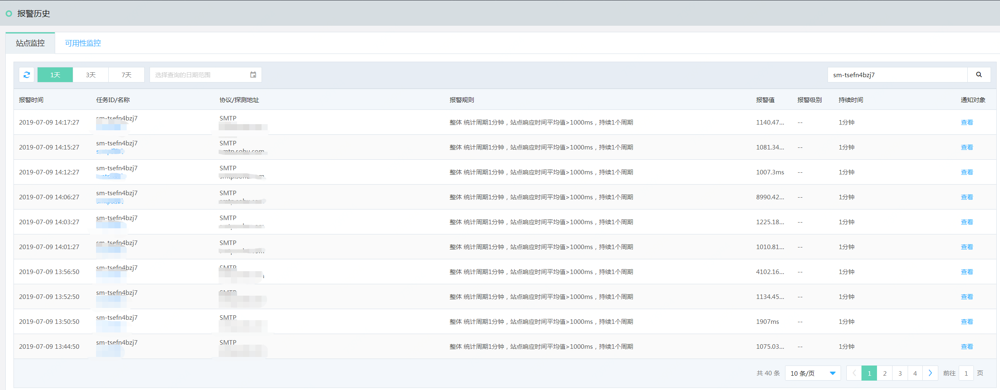

# Create Monitoring Task
1. Log in the Cloud Detection Console of JD Cloud & AI and click **Management -> Cloud Detection -> Site Monitoring** to log in the monitoring task list page. Click **Create Task** in the upper left corner.  
  
2. Add basic information
- Task name: Name of monitoring task, facilitating task identification, such as XXX website service
- Detection protocols: Support protocols such as HTTP(S), TCP, UDP, PING, FTP, DNS, SMTP and POP3. The HTTP(S), PING and DNS protocols support detection of IPv6 addresses. Application scenarios of a few protocols are as follows, which can be selected and set according to demands.  

Protocol Type |	Applicable Scenario
----| ----
HTTP(S)	| Web site monitoring service quality
TCP	| TCP port of monitoring server
UDP	| UDP ports of monitoring servers
PING|If monitoring service can be pinged
FTP	 | Suitable for providing the site monitoring of file service
DNS |Applicable for domain name resolution service of monitoring site
SMTP | Suitable for the site monitoring providing email reception service
POP3|Applicable for providing site monitoring of email service

- Site address: Enter domains accessible by public networks or IP addresses, and settings for different protocols are as follows:  

  a.HTTP(S): The request method can also be selected according to demands, the "Advanced Configuration" can be checked, and "HTTP(S) Request Head" and Cookie information can be added in the GET method; "Submission Content" can be added in the POST method, i.e., the request content of the body part; and "HTTP(S) Request Head" and "Cookie" information can be added in the HEAD method; if the returned information needs to be verified, you can configure the response contents.
  ```
  Note:  
  1. The method of matching response is "Include Match Content" by default, which means if the result returned by the request needs to include corresponding contents filled in, the detection succeeded, if not, it failed and the site availability ratio is 0; if the "Not Include Match Content", which means: if the content returned by the detection does not include the content filled in, the detection succeeded, if not, it failed and the ratio is 0.
  2. When the site address is detected, if the returned status code is not 200, then the site address can be determined as unavailability and the site availability ratio is 0.
  ```
  b.ping: The packet loss rate is added, which can define the number of packages sent by detection each time.
  
  c.TCP and UDP: It needs to fill in the port number; meanwhile, TCP request format, request contents, response format and response content can be configured in advanced configuration.  
  
  c.SMTP and POP3: The port number needs to be filled in, selection of "Use Security Link SSL" or not is supported, and necessary user name and password are required to be accessed at the same time.  
  
  d.FTP: The port number needs to be filled in. If identity verification is required by the selection, the necessary user name and password shall be filled in.
  
  e.DNS: The search type is A by default, providing options such as MX/NS/CNAME/TXT/ANY/AAAA; the DNS server can be designated, if nothing is filled in, the local DNS server of the detection point will be used. If it is an A or an AAAA record type, you can designate the IP expected to be resolved; if it is a CNAME type, you can fill in the alias expected to be resolved.
  ```
  Note: If the IP or alias expected to be resolved is filled in, the detection task will verify the result of domain name resolution. If the result includes the entered IP address or alias, the detection succeeded; if not, it failed and the availability rate is 0.
  ```
- Provide "Verification" operation and the temporary detection can be initiated once to verify if the entered information is valid or not.  

3. Set detection scheme
- Detection frequency: How often the detection is initiated once, 1 minute, 5 minutes, 10 minutes or 30 minutes.
- Detection point: Provide options including the default detection point and the customized detection point. At most 5 detection points can be selected as the customized detection points.  
  ```
  Note: If monitoring IPv6 site address or domain names, the detection node needs to select nodes supporting IPv6. The regions marked in blue are cities not supporting IPv6 address detection tasks.
  ```

4. Click **OK** and save the monitoring task.  
   


# Modify monitoring task  
1. Log in the Cloud Detection Console of JD Cloud & AI and click **Management -> Cloud Detection -> Site Monitoring** to log in the monitoring task list page.  
2. Select the task to be modified and click **Modify** to enter the task modifying page.
- The task name, site address and senior configuration in the basic information can be modified (referring to the newly created task)
- The "Detection Frequency" and "Detection Node" can be modified in the detection scheme. (Refer to Create a Task)

3. Click **OK** and save the monitoring task.

# Alarm History   
1. Log in the Cloud Detection Console of JD Cloud & AI and click **Management -> Cloud Detection -> Site Monitoring** to log in the monitoring task list page.  
 
2. Select a monitoring task where the alarm is required to be viewed, click **More -> Alarm History** under the operation bar.  
3. Redirect to the All Alarm History -> Site Monitoring page, to show alarm conditions of the latest 1 day for the monitoring task. If you need to view alarm history of other periods, please just modify the date range.  


# Delete the monitoring task 
1. Log in the Cloud Detection Console of JD Cloud & AI and click **Management -> Cloud Detection -> Site Monitoring** to log in the monitoring task list page.  
2. Select the monitoring task to be deleted, click **More -> Delete** under the operation bar or select the check box ahead the task and click **Delete** in batches.  
3. Click **OK** in the deletion notification tooltip.
