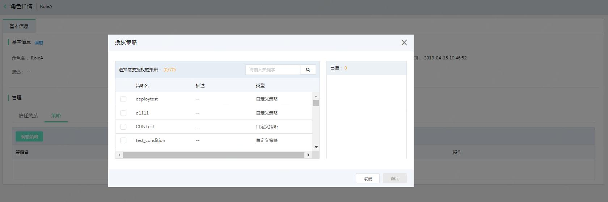

# What is a role

Role is divided into user role and service role, which is a kind of virtual identity type that has no definite identity credential and can be used only by being associated to a certain entity identity.

 - The user role takes effect only when it is played by a sub-user under the current primary account or a sub-user under a cross-account. The difference between a user role and a sub-user is use method, of which the role is required to be played by a credit entity user. After successfully playing, the entity user will get the temporary credential of the role, which can access granted resources as the identity of the role by using the temporary security token.
 - The service role is required to be played by a certain cloud service (such as Directory Service) and the service role will be on behalf of user to manage and operate your JD Cloud resources.

This document describes how to create a user role and access with the role identity.

## Create user role

Log in JD Cloud Console, enter IAM > Role Management, and click the **Create** button to fill in the information in the Create Role window:
 
  - Trust relationship: refers to what primary accounts that you allow (trust) to play the role and execute the permission the role owns, for example, you are Account A, then you can create a user role RoleA to allow Account B to play the role to access your resources.

## Grant due permission to user role

Enter the role list or role details, and associate the user role with corresponding policy to control and switch role login, and then the role can have the permission, e.g. associate RoleA with the policy you want to associate.

## Grant permission of playing role to sub-user

Log in JD Cloud Console, enter IAM > User Management and click the **Authorize** button to grant the sub-user the security token system policy (JDCloudStsAdmin), e.g. associate sub-user SubUserB under Account B with JDCloudStsAdmin permission.
 
  - In the primary account in the role trust relationship, grant the sub-user the permission of playing role.

## Log in sub-user Console to switch the role

Log in JD Cloud Console, and obtain the sub-user login link in the IAM Overview page to log in the sub-user, e.g. log in the sub-user SubUserB under Account B.
 
After login, enter the sub-user Console, click **Switch Role** in the menu at the upper-right corner to log in the role identity, e.g. enter the accountID of Account A and the role name of RoleA; after login, SubUserB will access and manage resources of primary account A by the identity and permission of RoleA.

