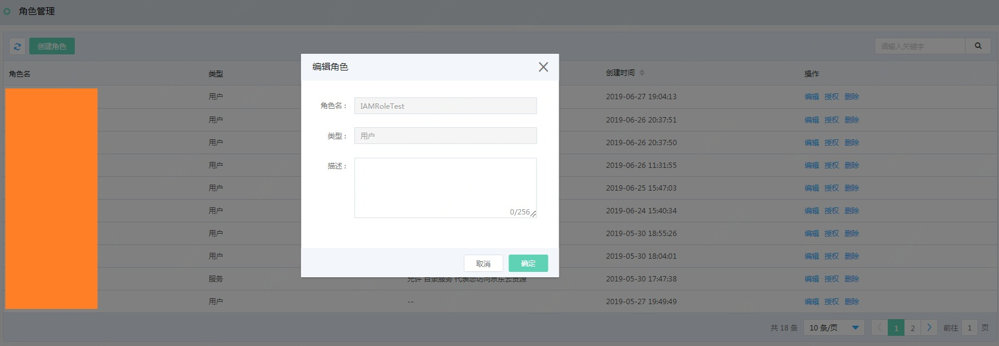
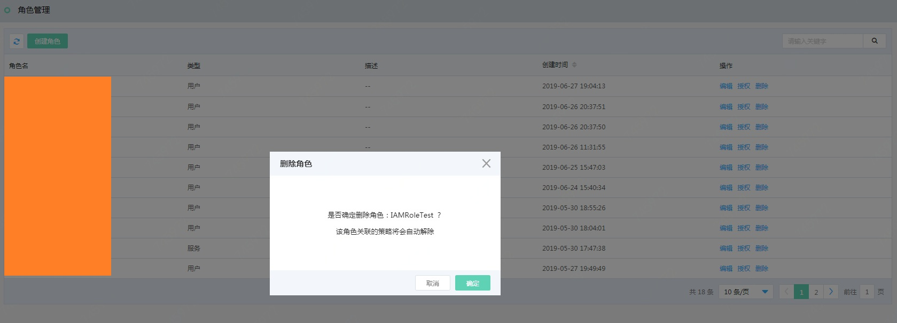
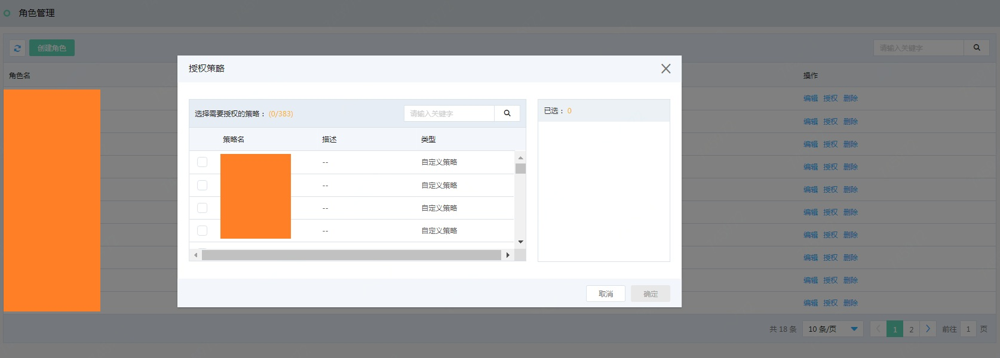

# Role
## What is a role
Role is divided into user role and service role, which is kind of virtual identity type that has no definite credential and only can be used by being associated to a certain entity identity. The difference between sub-user and role is use method, of which the role is required to be played by a credit entity user. After successfully playing, the entity user will get the temporary credential of the role, which can access granted resources as the identity of the role by using the temporary security token.

Role is mainly divided into the following two types, based on different role trust types:

- The user role can only take effect after being played by a sub-user under the primary account or a sub-user under the crossing primary account. Such role is mainly used to solve the cross-primary account access and temporary authorization scenarios.
- The service role is required to be played by a certain cloud service (such as Virtual Machines, databases) and the service role will thus manage and operate your JD Cloud resources on behalf of you.

## How to use the user role
- Create role A, choose the role trust relationship primary account B or sub-user C1, and control which users to play the role.
- Add policies for role A, and control the permission that role A can own.
- Grant the permission of the security token service (sts: assumeRole) of sub-user B1 or sub-user C1 of primary account B in trust relationship
- Role play and switching of sub-users B1 and C1

## How to use the service role
- Create role A, choose the role trust relationship as cloud service B, control which cloud services’ representing your accessing JD Cloud resources is allowed.
- Add policies for role A, and control the permission that role A can own.
- When being required to access other JD Cloud resources on behalf of the user, cloud service B plays the service role, and acquires the temporary AKSK+Token to access other JD Cloud resources.

## The trust relationship is also called principal
As for the real users or services that can play roles in JD Cloud, "Principal" element is used to designate the trust relationship of the IAM role for the trust policy in the role, and the JD Cloud account, sub-user and JD Cloud service can be designated in "principal".

- JD Cloud account:
  - "Principal": { "JDCLOUD": "jrn:iam::*accountID*:root" }
  - "Principal": { "JDCLOUD": "*accountID*" }
- Sub-user:
  - "Principal": { "JDCLOUD": "jrn:iam::*accountID*:user/user-name" }
- JD Cloud service: For the product line specifically supporting service roles, please refer to [Cloud Service Supporting IAM](https://docs.jdcloud.com/en/iam/support-services)
  - "Principal": { "Service": "*ServiceName*.jdcloud.com" }

## Play and switching of user role
- Switch from login identity to user role identity (SwitchRole):
  After the sub-user logs in the Console, it can select ** Role Switch **, under the precondition that the sub-user has been granted with the permission of playing the user role. The sub-user only can play one user role for each time. When the sub-user enters the user role identity from the login identity, the user only can use the granted permissions of the user role while the permissions associated by the sub-user login identity are shielded. If it is required to use the permission of login identity, then return to login identity from role identity.
- The entity identity play roles through program call (AssumeRole):
  if a sub-user is granted permissions for playing a certain user role, the sub-user can use AccessKey to call AssumeRole interface of STS service to get the temporary access key of the user role. The sub-user can set the expiration time of the temporary credential by itself. The access permissions of temporary credential subject to that granted by the user role, which are usually the solution to temporary authorization and crossing account access authorization.

## Basic Management of Roles
### Create user role

Log in JD Cloud Console, enter IAM > Role Management, and click the **Create** button to fill in the information in the Create Role window:
 
  - Trust relationship: refers to what primary accounts that you allow (trust) to play the role and execute the permission the role owns, for example, you are Account A, then you can create a user role RoleA to allow Account B to play the role to access your resources.

### Edit role

Access the role list, click **Edit** to quickly edit the description information of the role.

### Delete roles

Access the role list, click **Delete** to delete the role information and the association between its policies.

### Add and remove the trust relationship for roles

Click **Role Name** to log in the corresponding Role Details Page - Trust Relationship Page Tab, click **Edit Trust Relationship** to rapidly add and remove the trust relationship for roles.

### Grant policies to roles

Access the role list, click **Authorize** to quickly grant the corresponding policy to roles.

### Disassociate policies for roles

Click **Role Name** to log in the corresponding Role Details Page - Policy Page Tab, click **Remove** to disassociate the policy for the role after selecting the corresponding policy.

## The sub-user switches its role identity

### Grant permission of playing role to sub-user

Log in JD Cloud Console, enter IAM > User Management and click **Authorize** to grant the sub-user the security token system policy (JDCloudStsAdmin), e.g. associate sub-user SubUserB under Account B with JDCloudStsAdmin permission.
 
  - In the primary account in the role trust relationship, grant the sub-user the permission of playing role.

### Log in sub-user Console to switch the role

Log in JD Cloud Console, and obtain the sub-user login link in the IAM Overview page to log in the sub-user, e.g. log in the sub-user SubUserB under Account B.
 
After login, enter the sub-user Console, click **Switch Role** in the menu at the upper-right corner to log in the role identity, e.g. enter the accountID of Account A and the role name of RoleA; after login, SubUserB will access and manage resources of primary account A by the identity and permission of RoleA.

