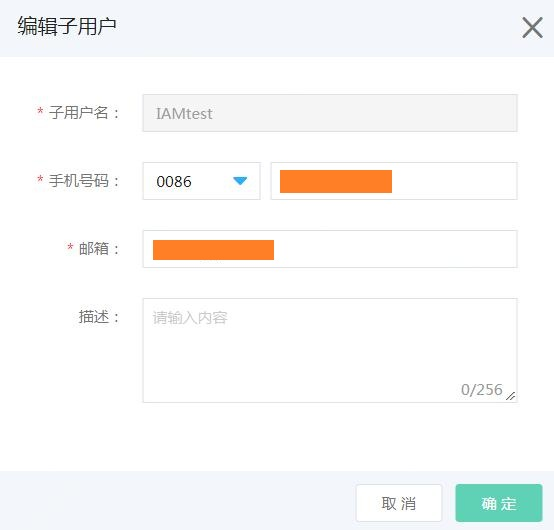
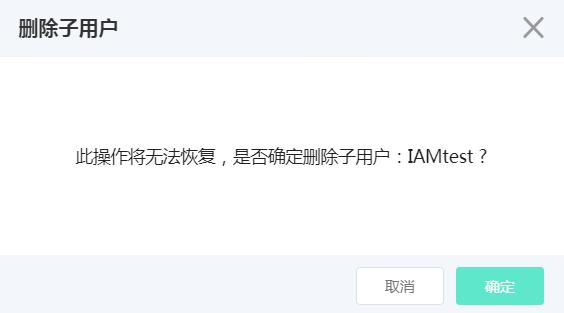
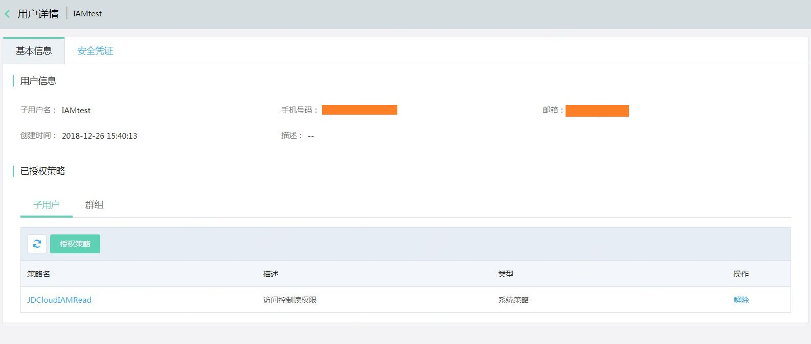

# What is a sub-user?

Sub-user is a kind of entity identity that has definite user name, password and AK/SK and it is usually corresponding to a certain definite entity, such as the enterprise technical personnel, operation and maintenance personnel.

The user name of the sub-user is created by the primary account. The sub-user is not a unique JD Cloud account, it belongs to primary account and can be seen under the space of the primary account. It only has resource use right, but ownership of resources. The sub-user has no independent metering and billing, the using charge of resources will be recorded in the bill of the primary account uniformly. The sub-user must be granted by the primary account to login console or use Open API to operate resources granted by the primary account.

This document describes how to create and manage a sub-account, and how to use the sub-user to log in the console for action.

## Create sub-user

Log in JD Cloud Console, enter Identity and Access Management > User Management, and click **Create** to fill in the sub-user information in the sub-user create window:

After the successful creation of the sub-account, you can choose to download the password of the sub-user and access the secret key information by download or email.

## Edit sub-user

Access the sub-user list, click **Edit** to quickly edit the description information, phone number and email of the sub-user.

## Delete sub-user

Access the sub-user list, click **Delete** to delete the sub-user information and the association between its group and the policy.

## Grant policy to sub-user

Access the sub-user list, click **Authorize** to quickly grant appropriate policy to the sub-user.

## Disassociate policy to sub-user

Click the sub-user name to enter the corresponding sub-user details page, select **Associate Policy**; after selecting the corresponding policy, click **Cancel** to disassociate policy for the sub-user.

## Security Credential Setting of the Sub-user

- Reset password for the sub-user
- Enable MFA for the sub-user
- It is required that the sub-user must enable MFA, instead of completing the association of MFA directly for the sub-user. The sub-user will redirect to the MFA association page the next time it logs in, and it will not enter the console until the association is successful.
- Enable operation protection for the sub-user; when the sub-user's virtual MFA is enabled, the primary account can turn on the action protection for the sub-user. Therefore, when the sub-user operates sensitive actions granted by the primary account, Virtual MFA verification is required.
- Enable access secret key for the sub-user.

 

