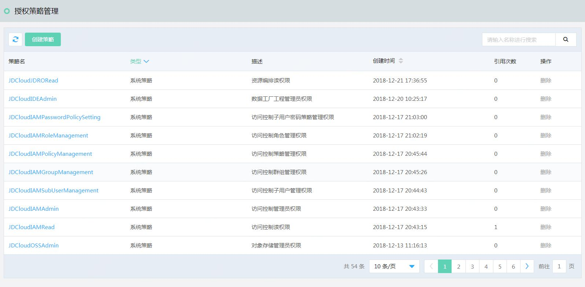
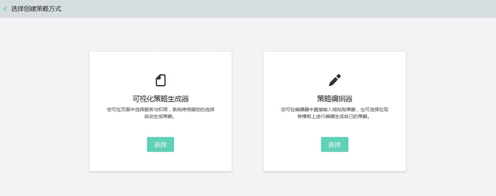
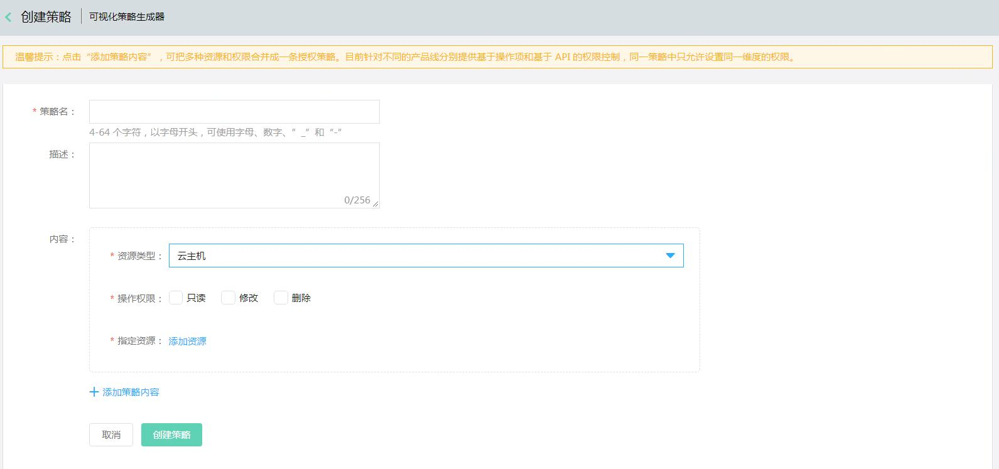
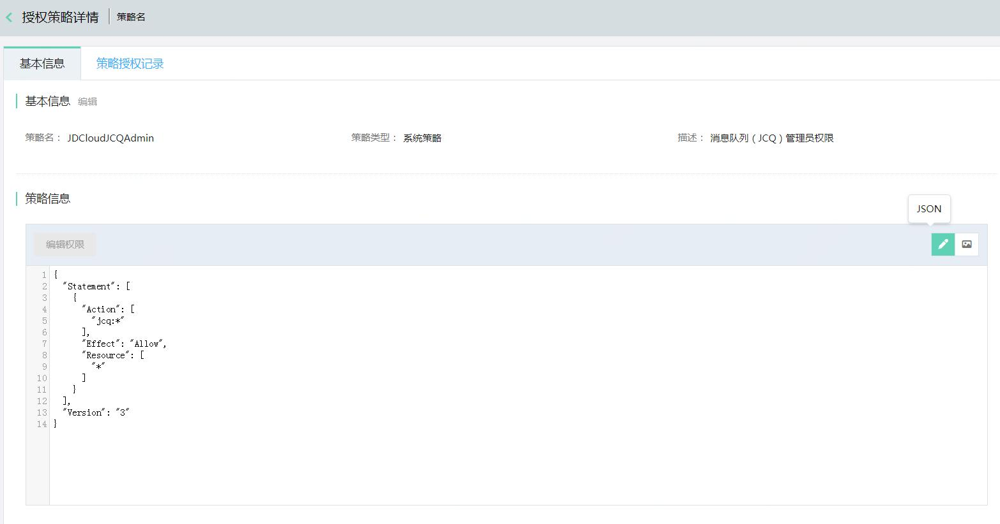

# What is a policy

Authorization policy refers to JSON document with one or multiple permissions defined, developing policies shall follow the JSON syntax specification. By granting policies to the sub-users, groups, roles to control the access permissions of JD Cloud resources for the sub-users, groups and roles. In which, the access permission owned by the sub-user are the set of authorization policies added to the sub-user and the group it belongs to.

IAM supports two types of policies: system policies preset by JD Cloud and customized policies managed by users themselves.

- The system policies preset by JD Cloud when accessing product line, which are not allowed to be modified by users.
- As for customized policies managed by users themselves, users can create policies for specific action to specific resource by means of customized policy. You can also add restricted conditions to restrict source IP, specific access time, Virtual MFA Verification, etc. Users can edit this kind of policies by themselves or delete customized policies.

  > The functions of Condition is continuously under update, coming soon

This document describes how to use policy management function in the console.

## Policy List

Log in the console and enter Identity and Access Management > Authorization Policy Management to view all system policies and customized policies.

> You may find that there suddenly adds some policy names that contain “-v3” in the policy list. It is the policy automatically created by the system for you when the product line is connected to the IAM, the policy (Policy) syntax changes after switching from v2 version to v3 version, with the purpose to make all actions in the policy created previously by you compatible and effective. For example, when you need to grant JD Cloud administrator permissions to all user types of IAM, you need to grant both JDCloudAdmin and JDCloudAdmin-v3 policy, and when you grant JD Cloud read-only permission, you need to grant both JDCloudRead and JDCloudRead-v3 policy. This action will continue until all product lines supporting v2 switch to v3 version.

## Policy Creation

On the Authorization Policy Management list page, click **Create** to obtain two ways to create a customized policy. The first is the facilitation policy generator, and the second is the JSON policy editor.

### Visual Policy Generator

The visual policy generator is designed to provide users with more friendly and convenient tools for policy creation. Users can visually select product lines, actions, resources and other information in turn. After clicking for confirmation, it will automatically generate policies in Json format for you.

- Enter the policy name and description.
- Selection of product line (Service Name). For more information, please refer to [Service Supporting IAM](https://docs.jdcloud.com/cn/iam/support-services)
- Select Action
- Select Resources
- Once a set of product lines, resources, and actions are specified, you can click **Add** until you complete the entire policy.

**V2 Version Visual Policy Creation Page**

**V3 Version Visual Policy Creation Page**

### JSON Policy Generator

In the JSON policy generator, after entering the policy name and description, you can write JSON policies directly, or you can select a policy template before editing JSON documents.

## Policy Detail

Click **Policy Name** or **Edit** to enter the policy details page.
You can view policy details by visual policies and Json policies, or you can change policy content by clicking **Edit Policy**.

In the authorization policy record, you can see all sub-users, groups, user roles, and service roles that refer to the policy.

