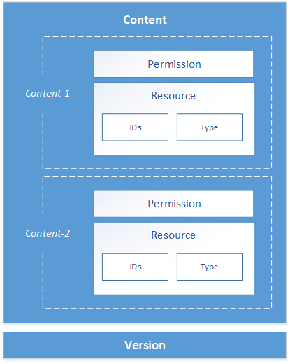

# What is Policy v2

This document describes the basic elements, syntactic structures and examples of the IAM Policy Version V2.

## Basic Element

IAM Policy contains the following basic elements: content (policy content), permission (permitted operation type), resource (resource available for actions), ids (IDs of specified resources), type (type of specified resources), and version (policy version)

- content
  The content of the Policy contains one or more sets of authorization details. Each set of authorization details specifies authorized resources and actions (permission).
- type
  It is the service name of product line. For details, please refer to [Service Supporting IAM](https://docs.jdcloud.com/en/iam/support-services)
- permission
  Support 3 types of resource actions, namely reading (R refers to Read), modification (M refers to Modify), and deletion (D refers to Delete). For example, viewing the virtual machine details is a read action, and backing up or rebooting the virtual machine is a modify action, and deleting the image is a delete operation.
  When multiple action types need to be authorized, they may be separated by a vertical line "|". For example, when only read-only actions are authorized, the permission is "R"; when the administrator permissions are authorized, the permission is "R|M|D".
 
   > Note: If a sub-account is authorized with modify permission (M) and delete permission (D), the sub-account also has read permission (R) by default.
 
- resource
  Authorized resources are specified by the resource type (type) and resource ID (ids).
- ids
  Specify one or more authorized resources IDs. ids support wildcard *, which are used for authorized objects as a type of resource rather than a scenario that specifies a resource ID.
- version
  Policy Version, v2.

## Syntactic Structure of Policy

Policy’s syntactic structure is shown below.



The syntax of the Policy shall conform to the JSON format. If the authorization policy you create does not conform to the JSON syntax, it will not be saved successfully. Many online JSON format checking tools can be used to check the format error of a policy.

## Syntax Description of Policy

```<policy> =
{
<content>,
<version>
}
```

The description of Content can contain one or more sets of Permission and Resource pairs:

```<content> = 
"content":[
{
<permission>,
<resource>
},
{
<permission>,
<resource>
}
]
```

Contents in ```<permission>``` (taking administrator permission as an example):

```
"permission" : "R|M|D"
```

Types and Ids of resources needed to be specified in ```<resource>```:

```
"resource":[
{
<ids>,
<type>
}
]
```

One or more resources (taking the specified resource ID as an example) specified in ```<ids>```:

```
"ids":[
"resource-id1",
"resource-id2"
]
```

Service name of specified product line name is ```<type>```:

```
"type":"service name"
