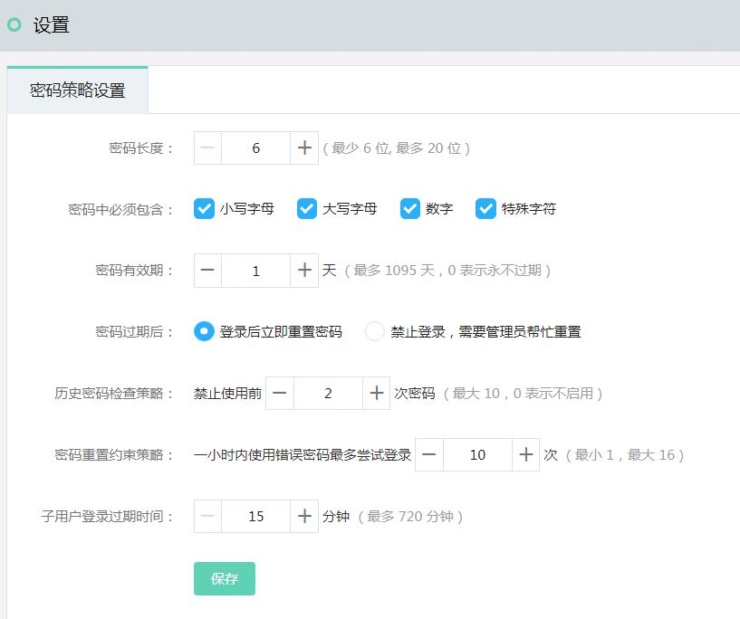

# Set

## Password Policy Setting

The setting of password policy aims to provide sub-user management of different security grades to different enterprises. You are allowed to set the dedicated password policy for all sub-users depending on enterprise security demand.

**Setting of the following items is supported by the password policy:**

- Password length: 6-20 bits are supported, *with 8 bits by default*.
- The password must contain: Upper case letters, lower case letters, numbers and special characters (- & _), *upper case letters, lower case letters and numbers are supported by default*.
- Password expiry date: 0-1,095 days are supported, 0 means no expiration and *the default value is 90 days*.
- After expiration of password: Two options are supported, i.e. the "Reset password immediately after login" and the "The login is forbidden and the administrator’s help is required". *The "Reset password immediately after login" is the default option.*
- Historic password check policy: The password can be set for 0-10 times, X means the password is inconsistent with the one set in the 0-10th times, 0 means that the verification is not enabled for this item, and *the password cannot be as the same as the ones set in the last 3 times by default*
- Password resetting restriction policy: Support the rule of inputting password for 1-16 times within an hour without being locked, *and the password can be entered for 4 times within an hour by default*
- Sub-user login expiration time: 15-720 minutes are supported and *the default value is 120 minutes*

