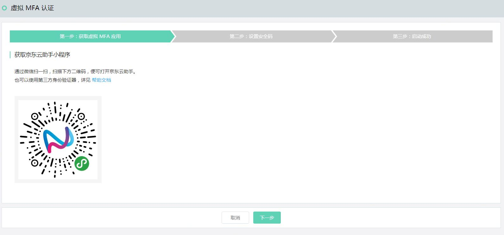
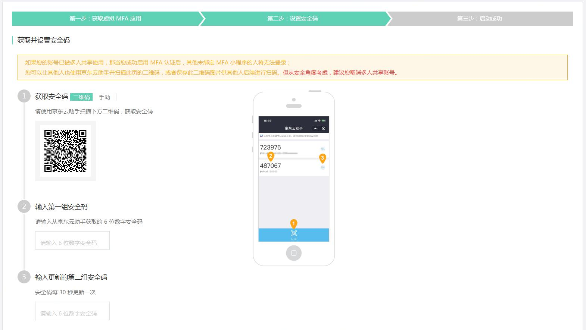
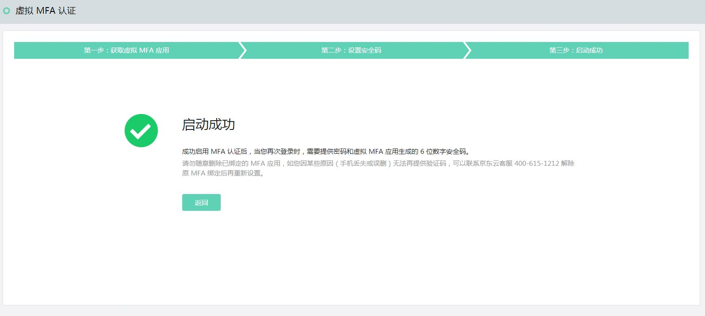

# Enable virtual MFA equipment
## Associate virtual MFA equipment to the primary account
The primary account associates virtual MFA equipment to itself as follows:

Select Account Management > Virtual MFA Equipment > Enable, and the MFA enabled page will pop up after SMS verification.

## The primary account associates virtual MFA equipment to the sub-user
The primary account associates virtual MFA equipment to the IAM subaccount as follows:

Log in the JD Cloud Console and select Management > Identity and Access Management > User Management > User Details > Security Credential, then the MFA enabled page will pop up.

The primary account can require that the sub-user must enable MFA verification. After the next login, the sub-user will redirect to the association page of the virtual MFA, and the sub-user can only do other operations after completing the association.

## The sub-user associates to virtual MFA equipment by itself
There are two entries for the subaccount to associate to virtual MFA equipment by itself, as follows:

* After logging in the subaccount, enter the overview page, click the Virtual MFA Equipment, then the MFA enabled page will pop up
* After logging in the subaccount, enter the Account Management, click the Virtual MFA Equipment, then the MFA enabled page will pop up

## Virtual MFA equipment enablement process:
Step 1: Open the virtual MFA application. For the convenience of users, we provide JD Cloud Assistant based on the WeChat applet version. In addition, we also support the Google Authenticator of IOS version and the Google Authenticator of Android version. Please refer to the Guidance for Third-party Application Installation and Usage for specific instructions.

We recommend you to use the WeChat applet JD Cloud Assistant. Please open WeChat - "Scan" to scan the QR code in the picture.

Step 2: You can add an account, open the WeChat applet JD Cloud Assistant, and scan the QR code in the picture; or you can click the Manual Input to manually add the account and key. After successful associating, JD Cloud Assistant will refresh a set of dynamic verification code every 30 seconds. Click OK after entering two consecutive sets of verification codes to complete the virtual MFA equipment associating.

Step 3: After the associating is completed, the two sets of dynamic verification codes are successfully associated. The next time you log in the console, you will need to verify the dynamic code of the MFA equipment associated to the account. At the same time, we recommend that you continue to improve the security of the account by enabling sensitive operation verification. 

# Disable virtual MFA equipment
You can choose to disable MFA verification protection when you no longer use it. After passing the safety operation verification, directly click Disable at the open entrance to enable it. It should be noted that disabling MFA will result in the dynamic verification code of the equipment associated to the account being unavailable. If you restart it, please associate new equipment and inform the person sharing the account. If you need to replace the MFA token, associate the new MFA after disassociating the old MFA.

