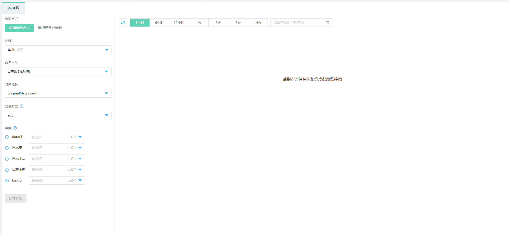

## Use Customized Metric Monitoring

Customized Metric Monitoring is a feature that provides users with the freedom to define monitoring items and alarm rules. Through this function, the user can monitor the business indicators that he/she cares about, report the collected monitoring data to the Cloud Monitor, and process the data by the Monitoring, and then alarm according to the result.

### Report Monitoring Data

### View the monitoring graph  
1. Log in JD Cloud Console and click **Management->Monitoring->Custom Metric Monitoring** to enter the Monitoring Graph Search page.  
  

2. Configure the information about region, namespace, monitoring indicator, aggregation method and indicator dimension as required. The meaning of each field can be viewed [View the Monitoring Graph](https://docs.jdcloud.com/cn/monitoring/chart-view).

3. After specifying search conditions, the monitoring data for the indicator can be viewed on the right side. The trend chart information can be viewed by switching time, and the aggregation method can be changed.  

### Configure Alarm

1. Click **Configure Alarm** button in the monitoring graph searched by following the above steps to open the **Add Alarm Rules** page.  

2. Configure the following information as required:  
- Set the basic information about rule name, region, namespace, monitoring indicator, aggregation method, and monitoring dimension, which should be consistent with the configuration in the search monitoring graph and can be adjusted as needed. 
- Configure triggering conditions, statistical periods, statistical methods, calculation methods, alarm threshold and duration period.
- Set the notification policies, notification period, effective time, notification conditions, reception channel and notification object information.

3. Click the **OK** button to finish configuration. View the alarm rules set in the alarm rule list. Once the monitoring dimension of the monitoring indicator configured by the rule reaches the alarm threshold, Monitoring will notify according to the notification policies set.
