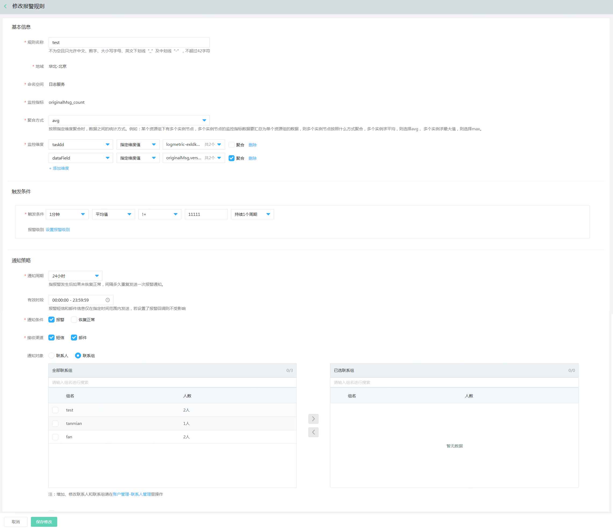
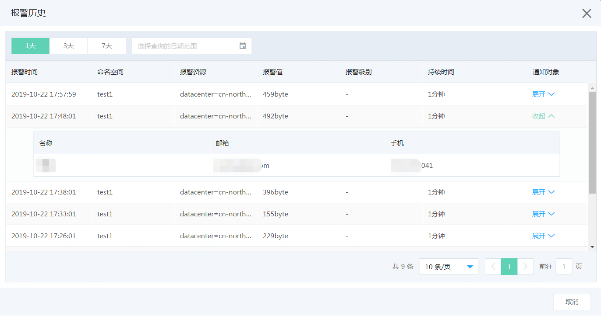

## View alarm rules
1.	 Log in JD Cloud Console, click **Management -> Monitoring -> Alarm Management -> Alarm Rules**, enter the page of List of Alarm Rules, and switch to the tab of "Custom Metric Monitoring". All alarm rules of custom metric monitoring created can be viewed.  
 
2.	 You can filter and screen them according to the namespace, rule name and rule ID.

## Modify rules
1. Log in JD Cloud Console, click **Management -> Monitoring -> Alarm Management -> Alarm Rules**, enter the page of List of Alarm Rules, and switch to the tab of "Custom Metric Monitoring".  
  
2. Select the alarm rule to be modified and click **Modify** button.  
  
3. You can modify the rule name, monitoring indicator, monitoring dimension, triggering condition and notification policy information according to the modification.

## Enable/Disable Rule
1. Log in JD Cloud Console, click **Management -> Monitoring -> Alarm Management -> Alarm Rules**, enter the page of List of Alarm Rules, and switch to the tab of "Custom Metric Monitoring".  
  
2. Select an alarm rule to be disabled/enabled and click **Disable** or **Enable** buttons. When the rule is disabled, the current rule will stop and will not monitor the indicator and dimension information under the rule; when the rule is enabled, the rule takes effect again.  

3. When enable/disable in batch multiple rules selected, please ensure all rules selected are under a non-disabling/disabling status.

## View Rule Details  
1. Log in JD Cloud Console, click **Management -> Monitoring -> Alarm Management -> Alarm Rules**, enter the page of List of Alarm Rules, and switch to the tab of "Custom Metric Monitoring".  
  
2. Select an alarm rule to be viewed and click **Details** under More Operations or click **Rule Name** in the list to open the View Details page. Basic information, alarm resource, triggering condition and notification policy information configured to the rule can be viewed.

## View alarm history  
1. Log in JD Cloud Console, click **Management -> Monitoring -> Alarm Management -> Alarm Rules**, enter the page of List of Alarm Rules, and switch to the tab of "Custom Metric Monitoring".  
  
2. Select an alarm rule to be viewed and click **Alarm History** under More Operations to open the View Alarm History page.  

3. By default, alarm histories of latest 3 days can be displayed and the time can be changed for search.

## Delete Rules  
1. Log in JD Cloud Console, click **Management -> Monitoring -> Alarm Management -> Alarm Rules**, enter the page of List of Alarm Rules, and switch to the tab of "Custom Metric Monitoring".  

2. Select an alarm rule to be deleted and click **Delete** under More Operations or select multiple rules, and click **Delete** in batch on the list bottom.
