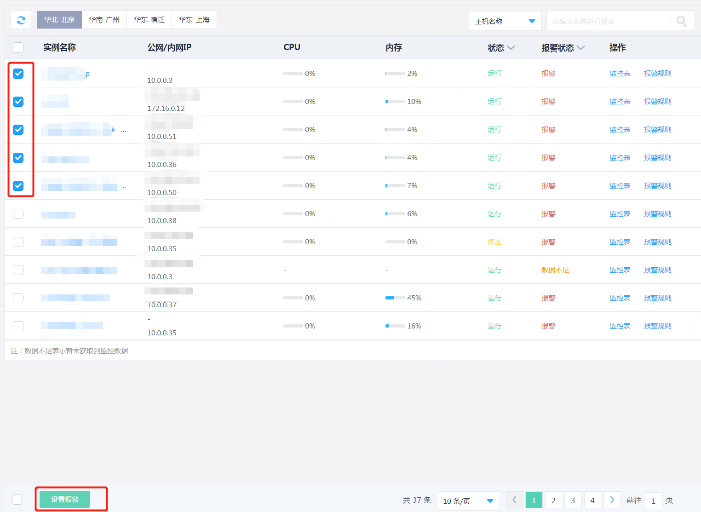
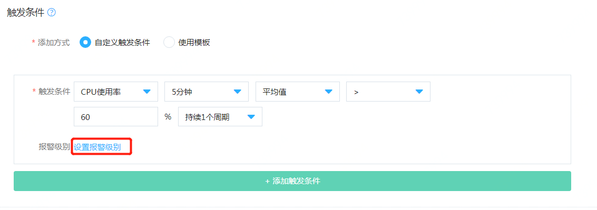
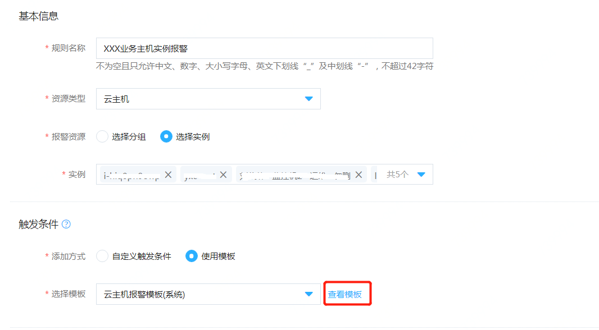

## Add Alarm in Batch
1. Log in JD Cloud Console and click **Management -> Monitoring -> Resource Monitoring**. Taking Virtual Machines of resources for example, select **Virtual Machines** from the four-level menu and enter the VM Monitoring List.  

2. Select Virtual Machines requiring alarm setting in batch, click the **Alarm Setting** button below the table and enter the page of Add Alarm Rule.  
  
  

3. Configure information as per steps below  
   1) Basic information: Set a rule name and confirm the resource type and the selected instance information.  
   2) Triggering condition: Both customized addition and association of existing template information are supported.
   - Customized addition: Select the monitoring item, statistical period, statistical method, calculation method, threshold and period, and configure alarm level based on demands at the same time.  If you need to configure multiple triggering conditions, just click the **Add Triggering Condition** button.
     
 
   - Use of template: Switch to the "Use Template" option, click the drop-down box and select a template to be used. For specific template details, click **View Template** to open the Template Details.  
  

   3) Notification policy:  
   - Notification period: It means the notification sending interval when any resource remains in the alarm status and is not recovered. Options include 5 minutes, 10 minutes, 15 minutes, 30 minutes, 1 hour, 3 hours, 6 hours, 12 hours and 24 hours.
   - Effective period: Alarm SMS and emails will be sent within the specified time period and will be sent all day by default.
   - Notification conditions: Two scenarios, "Alarm" and "Recover", are provided. By default, only the alarm status is sent and notification conditions must be appointed.
   - Receiving channel: Two types, "SMS" and "Email", are provided. By default, the two sending channels are used and please choose the channel according to your demands.  
   - Notification object: Selection of a contact or a contact group is supported. For addition of contacts and contact groups, please click **Account Management-Contact Management** on the bottom of choice box and make configuration in the User Center.  
   - Alarm callback: When any resource alarm is sent, JD Cloud will actively carry out callback as per URL address and POST parameters configured.  
  

4. Click **Complete Creation** on the page bottom and then the addition of alarm rule is supported. Click the **Cancel** button and then this operation is given up.
