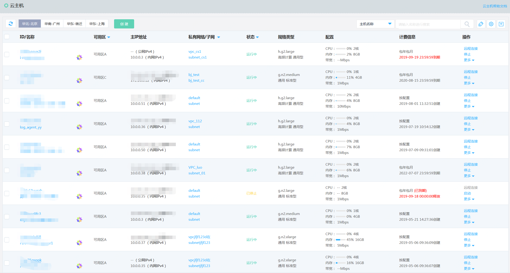
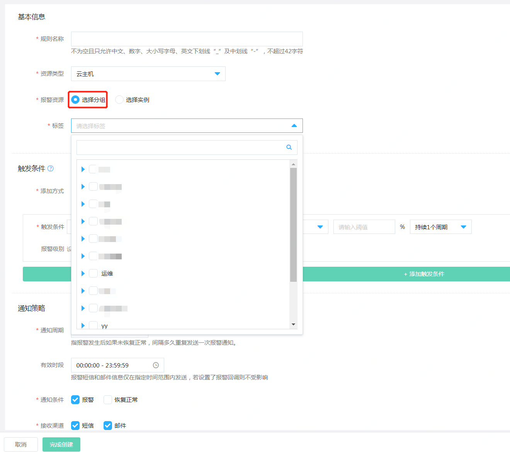

## Add Alarm Based on Tag
Tag is used for marking groups of resources. If such group is selected to be tagged when an alarm rule is created, then the alarm rule takes effect for such group. Subsequently alarms can be associated without adding rules manually when adding resources under the tag groups. Currently, the cloud products supporting tag configuration monitoring are as follows:
- Virtual Machines
- Cloud Disk Service
- Container Instance
- Pod
- Elastic IP
- JCS for Memcached
- Cloud File Service
- CDN
- Queue Service

###  Add Tag (Take Virtual Machines for Example)  
Precondition: VM Instance status needs to be "Running" or "Stopped".
1. Log in JD Cloud Console and click **Elastic Compute->Virtual Machines** on the left navigation bar and enter the page of Instance List.  

2. Select the region to be configured with tag; select the instance whose tag is to be edited in the Instance List and confirm its status is "Running" or "Stopped".  
3. Operations for single host: Click **Operation->More->Edit Tag**.  

4. In the "Edit Tag" popup, you can pull down and select the corresponding tag Key-Value and add tags directly according to the current tags or according to the fuzzy matching based on input, and click **Add** to display it in the current tag.  
5. Click [OK] to complete the tag editing according to the display situation in the current tag.

### Configure Alarm    
1. Log in JD Cloud Console, click **Management -> Monitoring->Alarm Management->Alarm Rules** and enter the page of List of Alarm Rules.  
 
2. Click **Add Alarm Rule** and enter the page of Add Alarm Rule
 
3. Basic information: Configure rule name, select "Virtual Machines" in the resource type, select "Select Group" in the alarm resource and then select the group of the tag to be configured with alarm in the tag drop-down box.  

4. The configuration of trigger condition and notification policy is the same as the "Configure Alarm Rules in Batch".
5. After the end of the above configuration, click **Complete Creation** operation. After creation succeeded, you can see the just added rule in the List of Alarm Rules.  
**Note: ** For alarm rules configured with this method, only corresponding tags shall be added to new resources subsequently, and alarms can be associated without adding rules manually.  
  
