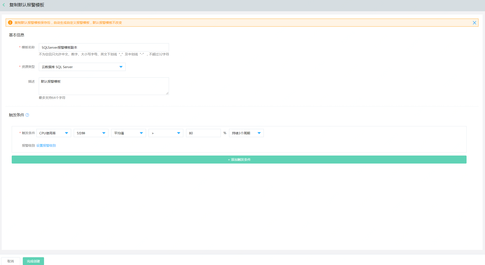
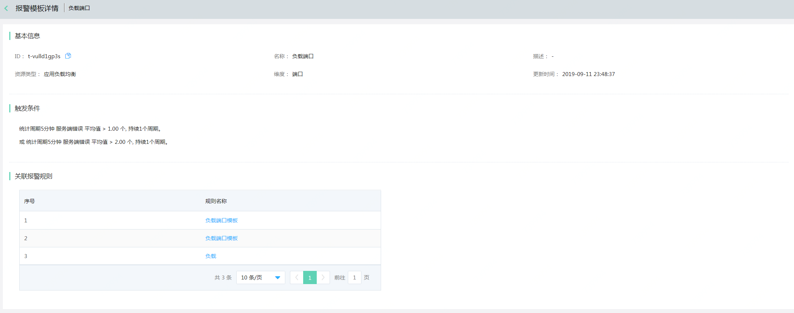
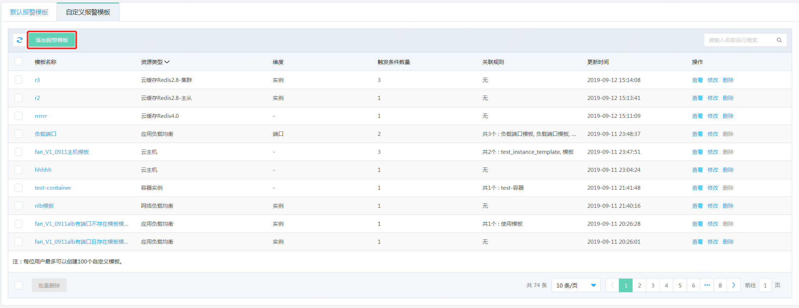
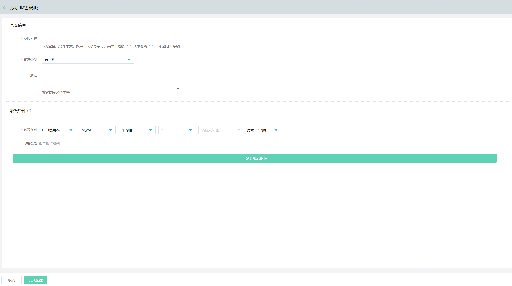
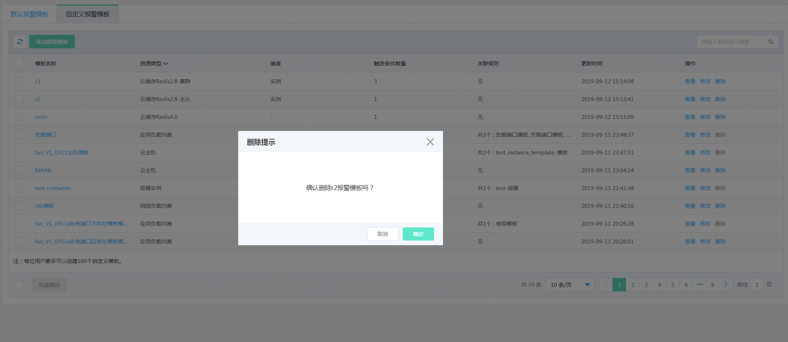
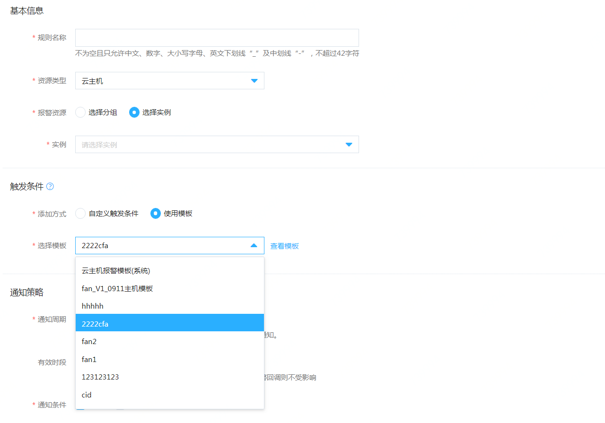

# Alarm Template
Alarm templates can help users quickly create and update alarm rules. Alarm templates are divided into default alarm template and customized alarm template. The default alarm template is the default template provided by JD Cloud Platform according to the characteristics of different cloud products, which is convenient for users who first use cloud products to quickly create alarm rules. The customized alarm template is an alarm template created by users according to their own business needs.

## The default alarm template  
### View Template
1. 	Enter JD Cloud Console-Cloud Monitoring Menu-Alarm Management-Alarm Template; click on the "Default Alarm Template" tab, then you can enter the default alarm template list page.  
  

2. Click **View** in the list, then you can view details of alarm template by default.  

### Replication Template
1. 	Enter JD Cloud Console-Cloud Monitoring Menu-Alarm Management-Alarm Template; click on the "Default Alarm Template" tab, then you can enter the default alarm template list page.  
  
2. 	Select an alarm template to be replicated, click the **Replicate** button and open the page for replicating default template.  
  
Note: If the customized template count reaches the cap, the template cannot be replicated.
3. 	You can change the template name, trigger conditions and other information on the template replication template page and click **Complete Creation**.

## The customized alarm template  
### View Template
1. Enter JD Cloud Console-Monitoring Menu-Alarm Management-Alarm Template, click the tag of **Customized Alarm Template** and enter the customized alarm template list page.  
  

2. Click **View**, then you can view the details of the customized alarm template.  

### Add Template
1. Enter JD Cloud Console-Monitoring Menu-Alarm Management-Alarm Template, click the tag of **Customized Alarm Template** and enter the customized alarm template list page.  
  

2. Click **Add Alarm Template**, complete alarm template name, select resource type, complete template description information and triggering conditions for this template, and click **Complete Creation** to save a new template created.  
  

### Delete the template
1. Enter JD Cloud Console-Monitoring Menu-Alarm Management-Alarm Template, click the tag of **Customized Alarm Template** and enter the customized alarm template list page.  
  
2. Select the template to be deleted, click **Delete** or select multiple templates and click the **Delete in Batch** button.  
  
Note: The alarm template associated with any alarm rule cannot be deleted. Deletion can be made after the associated rule is switched to another template, triggering conditions are customized or the rule is deleted.

## Use of Alarm Template  
1. Log in JD Cloud Console-Monitoring Menu-Alarm Management-Alarm Rules and enter the page of List of Alarm Rules.  

2. Click **Add Alarm Rule** to enter the page of Add Alarm Rule.  

3. Configure information required for alarm rule as per steps below.  
    1) Basic information: Configure a rule name and select resource type and alarm resource  
    2) Triggering condition: Select **Use Template** as the adding method, click the template drop-down box and select an alarm template to be associated with.  
      
    3) In the notification policy: Configure notification period, effective time, notification requirement, reception channel and notification object information.
    
4. Click **Complete Creation** on the page bottom to complete rule creation based on alarm template.

