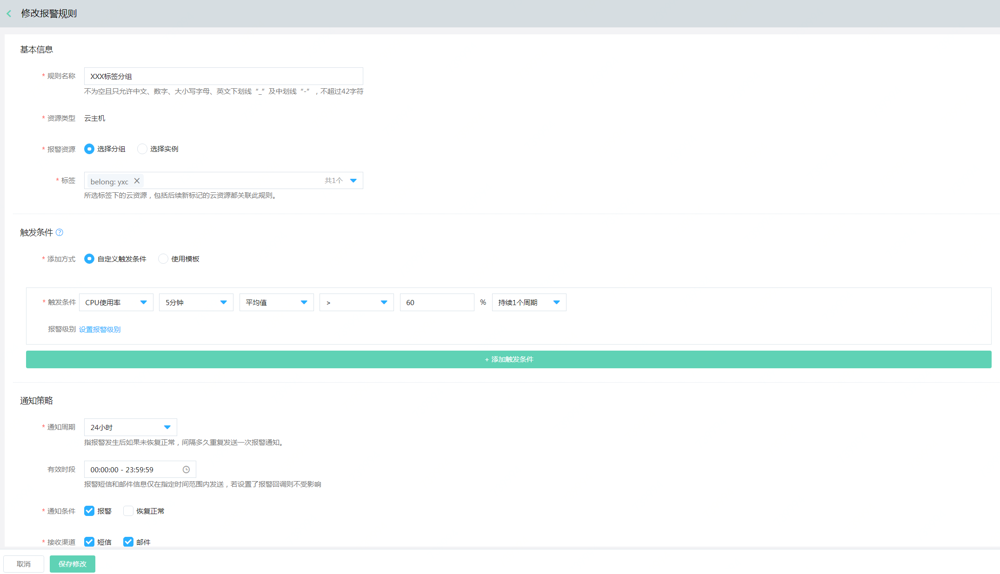
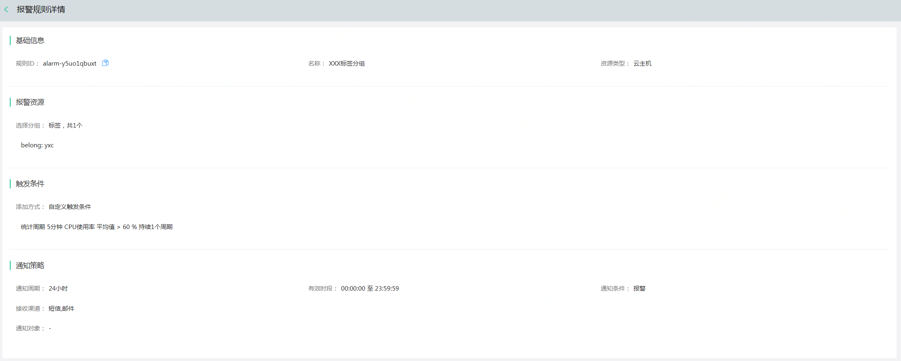
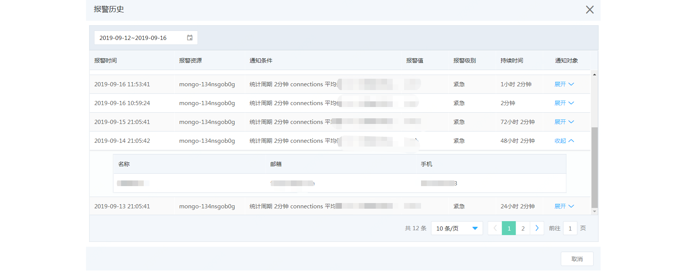

# Modify Alarm Rule
1. Log in JD Cloud Console, click **Management -> Monitoring -> Alarm Management -> Alarm Rules** and enter the page of List of Alarm Rules.  
  

2. Select an alarm rule requiring modification, click the **Modify** button under the operation bar and open the alarm rule modification page.  
  

3. All information can be modified, except the resource type. Please refer to the page of Add Alarm Rule.

# View Rule Details
1. Log in JD Cloud Console, click **Management -> Monitoring -> Alarm Management -> Alarm Rules** and enter the page of List of Alarm Rules.  
  

2. 	 Click buttons **More -> View Details** under the operation bar and enter the alarm rule details.
  

3. Basic information, alarm resource, triggering condition and notification policy information configured to this rule can be viewed.

# Enable/Disable Alarm Rule  
1. Log in JD Cloud Console, click **Management -> Monitoring -> Alarm Management -> Alarm Rules** and enter the page of List of Alarm Rules.  

2. 	Select an alarm rule to be disabled and click the **Disable** button under the operation bar or select several rules in batch and select the button of **Disable** in batch on the bottom of the record bar.  

3. 	Select an alarm rule to be enabled and click the **Enable** button under the operation bar or select several disabled rules in batch and select the button of **Enable** in batch on the bottom of the record bar.

# View alarm history  
1. Log in JD Cloud Console, click **Management -> Monitoring -> Alarm Management -> Alarm Rules** and enter the page of List of Alarm Rules.   

2. 	 Click buttons **More -> Alarm History** under the operation bar and enter the alarm history details.  
  

3.	 By default, alarm histories of latest 3 days can be displayed and the time can be changed to view alarm history of corresponding time period.

# Delete the alarm rule
1. Log in JD Cloud Console, click **Management -> Monitoring -> Alarm Management -> Alarm Rules** and enter the page of List of Alarm Rules.    
  

2. Select an alarm rule to be deleted and click the **Delete** button under the operation bar; or select several rules to be deleted in batch and click the button of **Delete** in batch on the bottom.  
  

3. Click the **OK** button in the popped confirmation tooltip.

