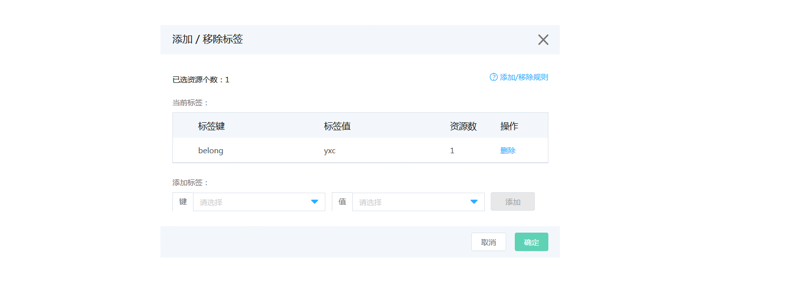

# Add Alarm Rule
## Add Alarm in Batch
1. Log in JD Cloud Console and click **Management -> Monitoring -> Resource Monitoring**. Taking Virtual Machines of resources for example, select **Virtual Machines** from the four-level menu and enter the VM Monitoring List.  

2. Select Virtual Machines requiring alarm setting in batch, click the **Alarm Setting** button below the table and enter the page of Add Alarm Rule.  
  
  

3. Configure information as per steps below  
   1) Basic information: Set a rule name and confirm the resource type and the selected instance information.  
   2) Triggering condition: Both customized addition and association of existing template information are supported.
   - Customized addition: Select the monitoring item, statistical period, statistical method, calculation method, threshold and period, and configure alarm level based on demands at the same time.  If you need to configure multiple triggering conditions, just click the **Add Triggering Condition** button.
     
 
   - Use of template: Switch to the "Use Template" option, click the drop-down box and select a template to be used. For specific template details, click **View Template** to open the Template Details.  
  

   3) Notification policy:  
   - Notification period: It means the notification sending interval when any resource remains in the alarm status and is not recovered. Options include 5 minutes, 10 minutes, 15 minutes, 30 minutes, 1 hour, 3 hours, 6 hours, 12 hours and 24 hours.
   - Effective period: Alarm SMS and emails will be sent within the specified time period and will be sent all day by default.
   - Notification conditions: Two scenarios, "Alarm" and "Recover", are provided. By default, only the alarm status is sent and notification conditions must be appointed.
   - Receiving channel: Two types, "SMS" and "Email", are provided. By default, the two sending channels are used and please choose the channel according to your demands.  
   - Notification object: Selection of a contact or a contact group is supported. For addition of contacts and contact groups, please click **Account Management-Contact Management** on the bottom of choice box and make configuration in the User Center.  
   - Alarm callback: When any resource alarm is sent, JD Cloud will actively carry out callback as per URL address and POST parameters configured.  
  

4. Click **Complete Creation** on the page bottom and then the addition of alarm rule is supported. Click the **Cancel** button and then this operation is given up.

## Appoint Resource Addition Alarm  
1. Log in JD Cloud Console and click **Management -> Monitoring -> Resource Monitoring**. Taking Virtual Machines of resources for example, select **Virtual Machines** from the four-level menu and enter the VM Monitoring List.  

2. Select the Virtual Machines requiring alarm setting, click the **Alarm Rule** button under the operation bar and enter the alarm rule list page of corresponding VM instances.  

3. Click the **Add Alarm Rule** button and enter the page of Add Alarm Rule.
 
4. Configure the rule name, triggering condition and notification policy (set the alarm rule for the same batch) and click the **Complete Creation** button.

## Add Alarm Based on Tag  
###  Add Tag (Take Virtual Machines for Example)  
Precondition: VM Instance status needs to be "Running" or "Stopped".
1. Log in JD Cloud Console and click **Elastic Compute->Virtual Machines** on the left navigation bar and enter the page of Instance List.  

2. Select the region to be configured with tag; select the instance whose tag is to be edited in the Instance List and confirm its status is "Running" or "Stopped".  
3. Operations for single host: Click **Operation->More->Edit Tag**.  

4. In the "Edit Tag" popup, you can pull down and select the corresponding tag Key-Value and add tags directly according to the current tags or according to the fuzzy matching based on input, and click **Add** to display it in the current tag.  
5. Click [OK] to complete the tag editing according to the display situation in the current tag.

### Configure Alarm    
1. Log in JD Cloud Console, click **Management -> Monitoring->Alarm Management->Alarm Rules** and enter the page of List of Alarm Rules.  
 
2. Click **Add Alarm Rule** and enter the page of Add Alarm Rule
 
3. Basic information: Configure rule name, select "Virtual Machines" in the resource type, select "Select Group" in the alarm resource and then select the group of the tag to be configured with alarm in the tag drop-down box.  

4. The configuration of trigger condition and notification policy is the same as the "Configure Alarm Rules in Batch".
5. After the end of the above configuration, click **Complete Creation** operation. After creation succeeded, you can see the just added rule in the List of Alarm Rules.  
  
