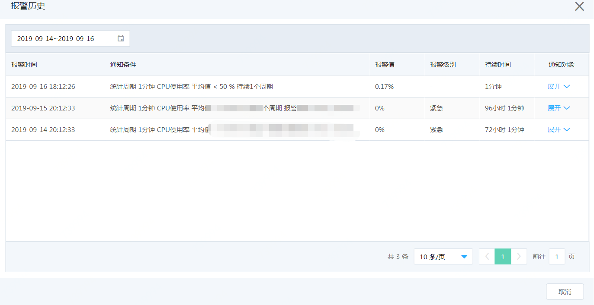

## View alarm rules
1. 	Log in JD Cloud Console and click **Management->Monitoring->Resource Monitoring**. Taking resource Virtual Machines for example, select **Virtual Machines** from the four-level menu and enter the VM Monitoring List.  
  

2. 	Select the Virtual Machines to be viewed, click **Alarm Rule** button under the operation bar and enter the alarm rule list page of corresponding VM instances.   

3. You can view the Alarm Rules associated with this resource.  
4. 	Rules not associated through tags can be disassociated. After clicking **Disassociate**, this resource will be removed from the associated rule. Rules associated based on tag can be automatically disassociated by removing the tag associated with this resource.  
5. 	After this resource is disassociated with the selected rule, there is no resource under the corresponding rule. So you can select whether to delete the rule or not.  
6. 	Click **Alarm History** and open the page of alarm history.
  

7. 	You can view the alarm history information generated by this resource based on this associated rule. Alarm histories of latest 3 days can be displayed by default and the time can be changed to view alarm history of corresponding time period.

