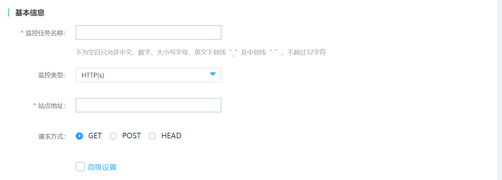
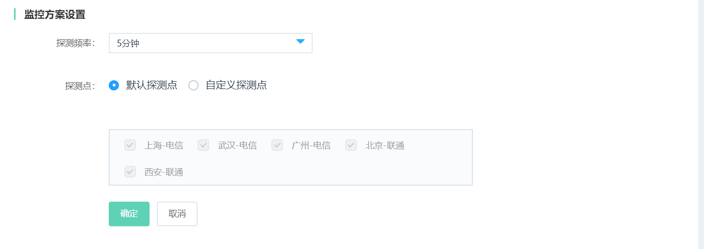

## Management of Site Monitoring Tasks
### Create Site Monitoring
1. Log in JD Cloud Monitoring Console, Click **Management->Cloud Monitor->Site Monitoring** to enter the Dashboard list page. Click **Create Monitoring Task** in the upper left corner.

2. Basic Information

(1) Name of monitoring task.

(2) Monitoring Types: monitoring protocols, support HTTP(S), Ping and TCP.

(3) Site Address: specify the address of the monitoring task detection. If the selected monitoring type is HTTP(S), when entering the site address, you need to indicate the protocol type of the site address, for example, https://www.XX.com.

(4) Advanced configuration: The monitoring type has advanced configuration when you select HTTP(S) or TCP, and has no advanced configuration when you select PING. When HTTP(S) is selected and the request mode is selected as GET or HEAD, user can fill in the HTTP request header and cookie based on his/her own demands, and when HTTP(S) is selected and the request mode is selected as POST, the user can fill in the content to be submitted, HTTP request header and cookie. At the time of selecting TCP, user can fill in the TCP request content and match the response content.

3. Monitoring Scheme Settings

(1) Detection Frequency: i.e., the detection period of the monitoring task, it was set to 5 minutes, so perform detection to the site every 5 minutes. The detection frequency cannot be higher than the statistical period in the alarm rules.

(2) Default Detection Point: the default detection point that is provided by JD Cloud to help the user quickly create monitoring tasks. Including Shanghai Telecom, Wuhan Telecom, Guangzhou Telecom, Beijing Unicom and Xi’an Unicom.

(3) Custom Detection Point: the starting point at which the detection of the site address is performed. The default detection points and the custom detection points can be selected based on requirements. Currently, up to 5 custom detection points are supported to be selected.

### Modify site monitoring tasks
1. Log in JD Cloud Monitoring Console, Click **Management->Cloud Monitor->Site Monitoring” to enter the Dashboard list page.

2. Select the task that is required to be modified, and click **Modify** in the operation. 

3. Enter the modification page to modify corresponding content. Monitoring type, site address and detection point are not supported to modify for now, and the rest of information can be modified.

### Delete the monitoring task.
1. Log in JD Cloud Monitoring Console, Click **Management->Cloud Monitor->Site Monitoring” to enter the Dashboard list page.

2. Select the task that is required to be modified, click **More** in the operation, and select **Delete**.

3. When the task is deleted, the relevant alarm rules will be deleted synchronously.
