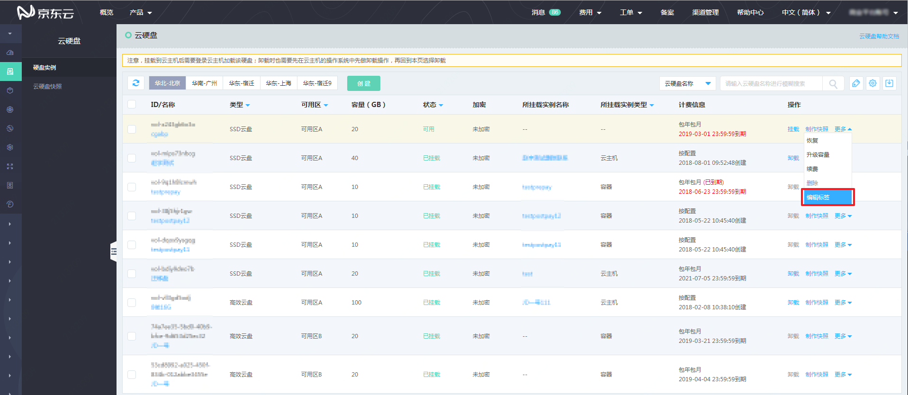
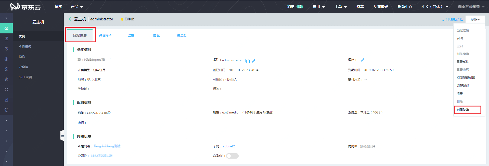
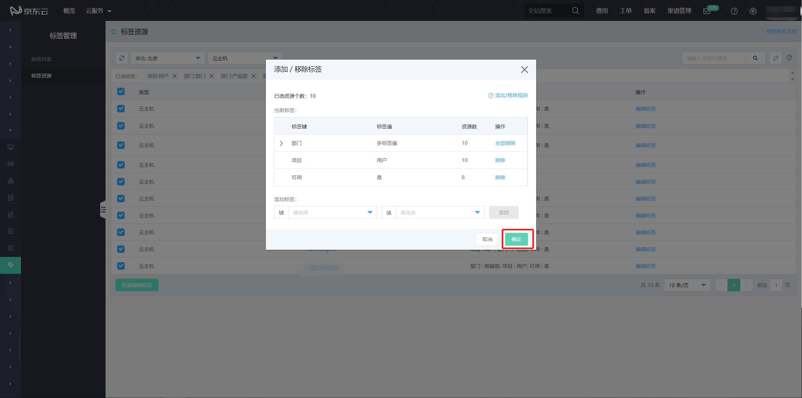
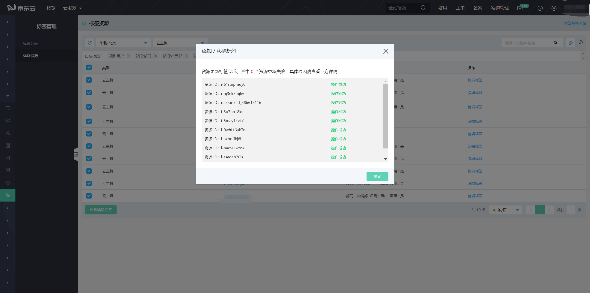

# Tag Edit

## Function Entry
You can edit tags on the list page of the product supporting tags, the resource details page or the "Management - Tag Management - Tagged Resources" page of the Console menu (hereinafter referred to as the tag Console). The tag Console only displays the resources to which tags have been associated. This article focuses on how to edit tags on the tag Console.

                                                

                                                    

                                                          
## Feature Introduction
To open the tag editing box of a resource on the current page, click **Edit Tag** on the right side of the resource on the tag Console, or click **Edit Tags in Batches** in the lower part of the page after selecting the corresponding resource.

This page displays the tags of the selected resources as a set. The "tag key" and "tag value" indicate the corresponding tag key and value. The number of resources indicates the number of resources associated for tag change. Let’s take the following figure as an example: The selected 10 resources are all associated to the tag "item: user", 2 resources are associated to the tag "department: frontend department", and 8 resources are associated to the tag "department: product department".

After you click the drop-down boxes of **Key** and **Value**, the keys and values having been associated to your resources will be displayed. Also, you can confirm addition of tag keys or values by entering new tag keys or values to be added and then pressing Enter or clicking the drop-down box.

After selecting the corresponding key or value, click **Add** to add a tag. You can also disassociate the association relationship between the corresponding tag and resource by clicking **Delete** on the right side of the tag.

After completing edition of a resource tag, click **OK** to submit the change you’ve made to the tag.

The change result will be displayed on the marking result page in the resource dimension

Tag keys and values have the following restrictions:

- One resource for one tag key can only have one tag value (for example: When resource A has the tag "department: product department", if you add the tag "department: research and development department" to the resource, the original tag will be replaced);

- Each tag contains only one key and one value, both of which cannot be null;

- The spaces at the beginning and the end of the Key and the Value will be automatically filtered, and multiple spaces in the characters will be merged into 1 space;

- Tag keys and values are case-sensitive, and tags with different cases are treated as different tags;

- The tag "Key" supports up to 127 characters while the tab Value supports up to 255 characters. It is not recommended to name a key or value too long, which is not conducive to the use and understanding of the tag. Each resource can bind up to 10 tags (A tag with different keys is accounted as one).

