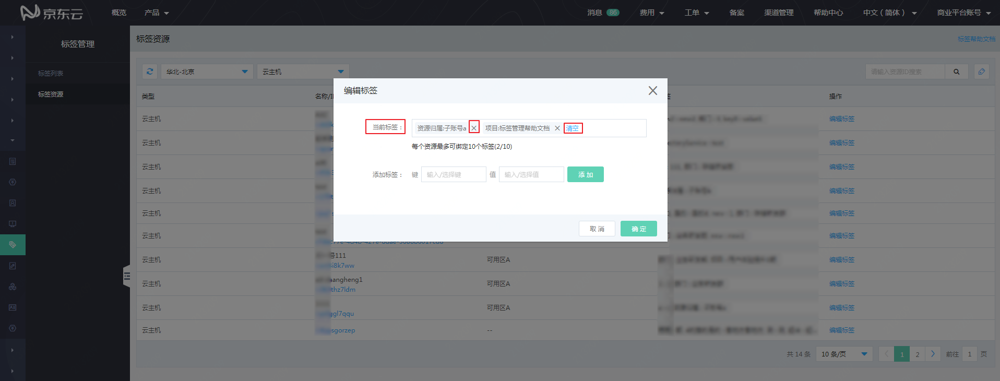
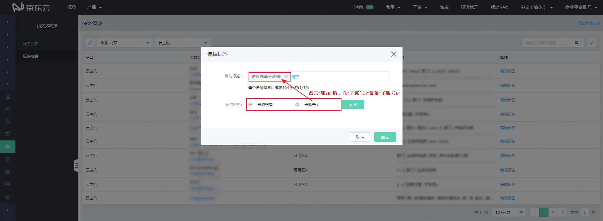

# Tag Edit

1. The resources can be bound or unbound on the list page of the product that supports the tag, the resource details page, or the “Management”à“Tag Management” à “Tagged Resource” page in the Console menu.

                                                

                                                    

                                                          

2. Click **Edit Tag** on the right side of a resource to open the tab edit box for the resource on the current page. All operations in the tag edit box will only be submitted to take effect when **OK** is clicked; otherwise, directly click **Close** in the upper right corner of the edit box or **Cancel** in the lower right corner of the edit box will not make the tag edit operation effective.

1) In the tag edit box, you can see the tags that the resource is currently bound to. Click **X** on the right side of a bound tag, you can cancel the binding relation between the tag and the resource. Click **Clear**, you can cancel the binding relations between all the tags and the resource.

2) Enter the “Key” and “Value” to be bound for the currently selected resource in the tag “Key” and tag “Value” on the right side of “Add Tag”; click **Add** to record the tag in the “Current Tags”. When the mouse clicks tag “Key” or tag “Value” in turn, you can see all tag “Keys” of the resources bound by the current user as well as the tag “Values” corresponding to these tag keys in the downward extended drop-down box. You can click directly to select the options you need. Note that the drop-down box has a downward scroll bar, and it needs to be scrolled down to search for the contents beyond 7 items.

Tag keys and values have the following restrictions:

- Each tag contains only one key and one value, both of which cannot be null;

- The spaces at the beginning and the end of the Key and the Value will be automatically filtered, and multiple spaces in the characters will be merged into 1 space;

- Tag keys and values are case-sensitive, and tags with different cases are treated as different tags;

- The tag “Key” supports up to 127 characters while the tab Value supports up to 255 characters. It is not recommended to name a key or value too long, which is not conducive to the use and understanding of the tag. Each resource can bind up to 10 tags (A tag with different keys is accounted as one).

3) Enter the existing tag “Key” in “Add Tag”, but the tag “Value” is different from that of the current tag; after clicking **Add**, it means to replace the current tag and bind the new tag.

