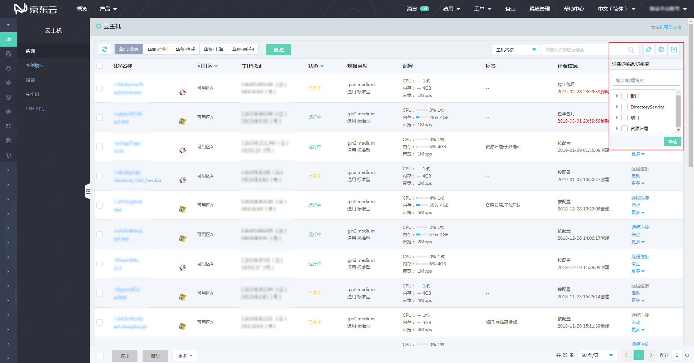
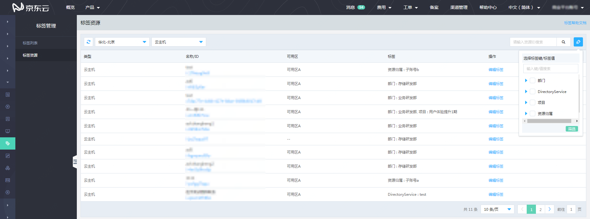
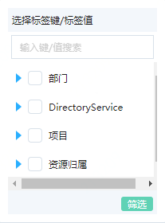
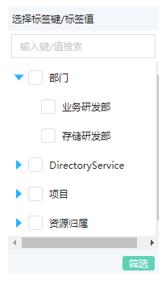
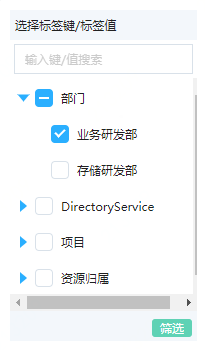
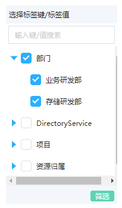
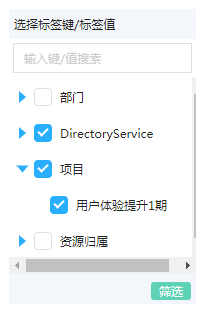

# Tag Filter

The tag can be used to filter the resource on both the Instance List page that supports the "Tag Service" products and the "Tag Management"-"Tagged Resource" page of the JD Cloud Console.

 Click **Tag Filter** in the upper right corner of the list to expand the tag filter box.

The tags that are available for filtering are listed in the filter box in the form of a tree. By default, the tab key is displayed, and the tab value corresponding to the tag key can be expanded and seen by clicking the triangle icon in front of the tag key.

Click the checkbox in front of the tab value to select the tag as the filter criteria;

Click the checkbox in front of the tab key to select all the tags under the tag key as the filter criteria;

 

It supports to select tags with multiple different tag keys at the same time.

Click **Filter** after selecting the tags, to filter the resource instance according to the selected tags. The filtering result will appear in the list. At the same time, a notification bar that contains the selected tag filter criteria will appear above the list.

By clicking **X** at the back of the filter criteria tag, you can remove the tag to re-filter the resource instance; and all the filter criteria will be cleared by clicking **Clear**.

When multiple tags are selected as filter criteria at the same time, the filter logic is as follows:

The tags with different tag keys are of "AND" relationship at the time of filtering, that is to say, it will meet the filter criteria only when the selected tags of different keys are bound at the same time;

The tags with the same tag keys but different tag values are of "OR" relationship at the time of filtering, that is to say, it will meet the filter criteria when any of the tags is bound.

For example: When the three tags of "Department: Business Research and Development Department", "Department: Storage Research and Development Department" as well as "Project: Basic Platform Project" are selected at the same time, the resource meeting the filter criteria will be:

Bind both the "Department: Business Research and Development Department" tag and the "Project: Basic Platform Project" tag at the same time, or bind both the "Department: Storage Research and Development Department" tag and the "Project: Basic Platform Project" tag at the same time.
