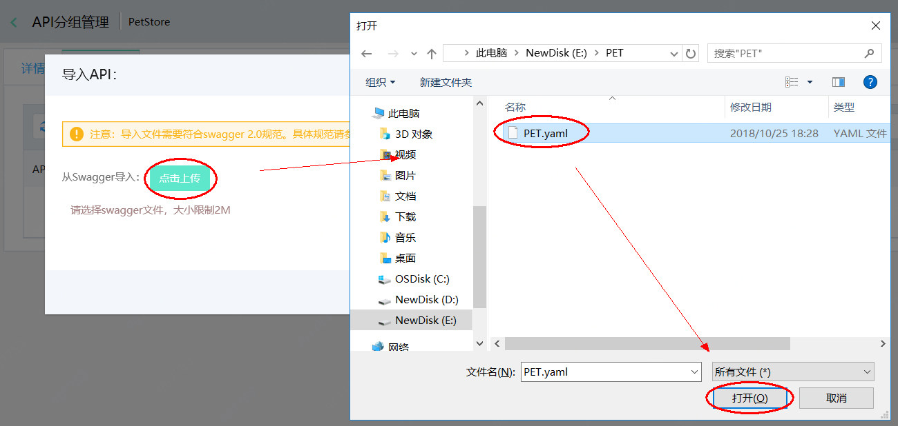
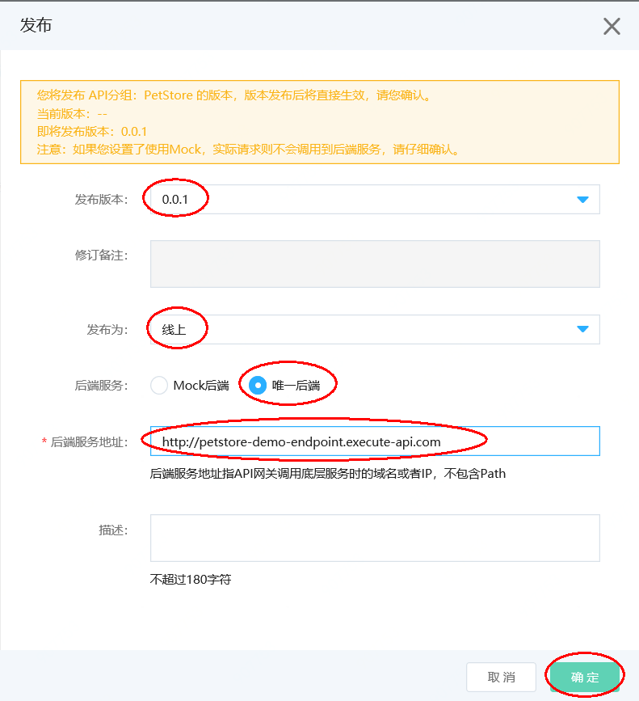
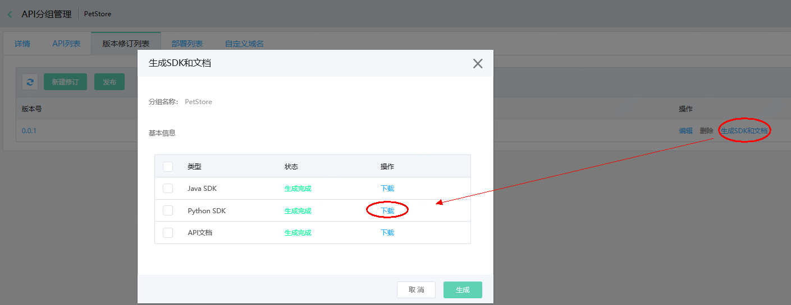
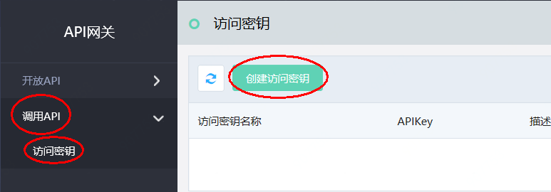
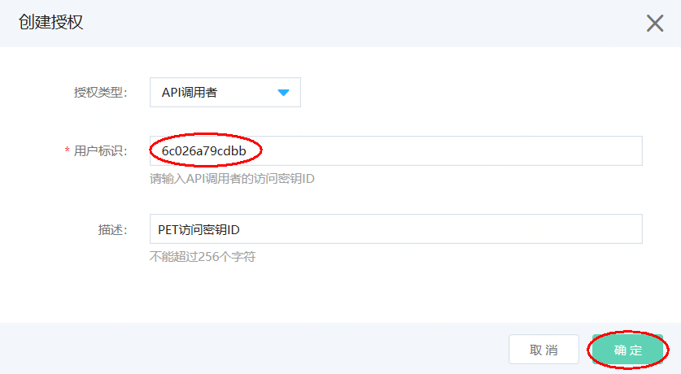
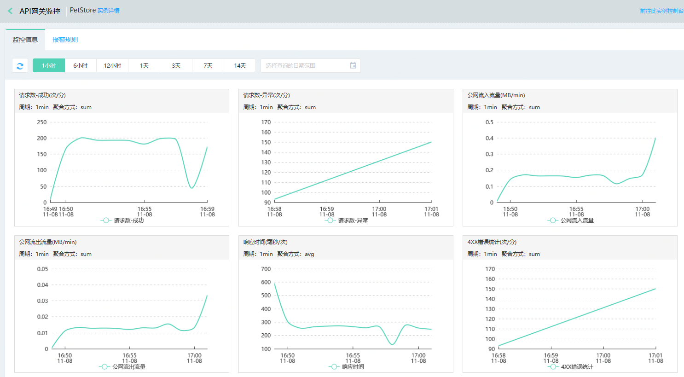

# Construct API Gateway API by Using Examples

To help you construct and test the API Gateway API by using the basic working process, you are allowed to use the API Gateway of JD Cloud console to create and test the simple API used for conducting HTTP integration with the PetStore website. The Swagger 2.0 file is pre-configured as the API definition. When the API definition is loaded to the API Gateway, you are allowed to check the basic API structure or directly deploy and test API by using the API Gateway console.

Access to the HTTP backend website http://petstore-demo-endpoint.execute-api.com/petstore/pets is supported by the example API by using the methods below.

- GET /pets/{petId}: Used for reading and accessing the pets with the petId value identifier of the URL path variable assigned to transmitting requests. The backend will find the specified pet in the PetStore. The backend service address is http://petstore-demo-endpoint.execute-api.com/petstore/pets/n, wherein n refers to the integer used for searching pet identifier.

- POST /pets: Used for making writing access to API /pets resources integrated with the backend/petstore/pets resources. Upon receiving a correct request, the backend will add the specified pet into the PetStore and return results to the calling party. The backend service address is http://petstore-demo-endpoint.execute-api.com.

## Create one API in the API Gateway Console according to the example and test such API.

The following process is the guide for creating the API in the API Gateway console according to the example and is the test steps via SDK.

### Create API Group-Create API-Release:

#### 1. 	Log in the API Gateway Console and turn on [API Group Management](https://apigateway-console.jdcloud.com/apiGroupList).

#### 2. 	Click **Create Group**.


#### 3. 	 After jumping to the created API group page, please fill in the API group information.


#### 4. When **OK** is clicked, the "Creation Succeeded" notification will be given. In such case, please select **API Management** in the pop-up window and jump to the API list interface of this group.


#### 5.	 You can deploy API via the two methods below.
- Create API: Click **Create API**, configure "Name", "Sub-path", "Parameter Query", "Request Body Format" and "Normal Return Format" and click **OK**.


- Import API: Click **Import API**, upload yaml files conforming to the swagger2.0 specification, and click **OK**. Then, API set in the yaml file will be displayed in the API list interface.




#### 6. 	Click the tag page of [Version Amendment List], click **Release**, configure the following options and click **OK**.

- Release revision: 0.0.1;
- Released as: On-line;
- Backend service: Unique backend;
- Backend service address: http://petstore-demo-endpoint.execute-api.com.




#### 7.	 When the release is conducted, click **Produce SDK and Document** to download the JavaSDK, PythonSDK and API documents.



### Create access key-create access authorization-associate groups:

#### 1.	Turn on [Access Key](https://apigateway-console.jdcloud.com/accessSecretKey), and click **Create Access Key**.



#### 2. 	 Fill in the name and description (optional) and click **OK**.


#### 3. 	 Click the key pair name, view details of the access key and copy access key ID, APIKey and APISecret.


#### 4.	Turn on [Access Authorization](https://apigateway-console.jdcloud.com/authorizationList), and click **Create Authorization**.


#### 5. 	 Fill in user identifier (access key ID of access key) and description (optional) and click **OK**.



#### 6.	 Click **Associate** to move the created PetStore group to the associated column.


Via the above steps, the operation in the API Gateway console interface is completed. Then, the calling can be made via SDK.

### Via Java SDK, call ([Download Link](../../../../image/Internet-Middleware/API-Gateway/PetStoreTest_javaSDK.zip)):

#### 1. 	Unzip the downloaded Java SDK.

#### 2. 	Switch to the PetStore directory and create an SDKTest.java file.

- accessKeyId refers to the APIKey when viewing detailed information of key pairs;
- secretAccessKey refers to the APISecret when viewing detailed information of key pairs;
- Others are called by API.

```Java
package net.jdcloud.PetStore;

import com.jdcloud.sdk.auth.CredentialsProvider;
import com.jdcloud.sdk.auth.StaticCredentialsProvider;
import com.jdcloud.sdk.http.HttpRequestConfig;
import com.jdcloud.sdk.http.Protocol;
import net.jdcloud.PetStore.client.PetStoreClient;
import net.jdcloud.PetStore.model.ApiName0Response;
import net.jdcloud.PetStore.model.ApiName0Request;
import net.jdcloud.PetStore.model.ApiName1Response;
import net.jdcloud.PetStore.model.ApiName1Request;
import net.jdcloud.PetStore.model.ReqBody;
import com.google.gson.Gson;
import java.math.BigDecimal;


public class SDKTest {
    public static void main (String[] args){
        String accessKeyId = "5A327AA1AD791A49F358A7E1325E414C"; //APIKey
        String secretAccessKey = "9FD89EF6099EB319FCD36C525B517047"; //APISecret
        CredentialsProvider credentialsProvider = new StaticCredentialsProvider(accessKeyId, secretAccessKey);
        PetStoreClient client = PetStoreClient.builder().
                credentialsProvider(credentialsProvider)
                .httpRequestConfig(new HttpRequestConfig.Builder().protocol(Protocol.HTTP).build()) //HTTPS by default
                .build();
//        ApiName0
        ApiName0Request request = new ApiName0Request();
        request.setPetId("1");
        ApiName0Response response = client.apiName0(request);
        System.out.println(new Gson().toJson(response));

//        ApiName1
        ApiName1Request request1 = new ApiName1Request();
        ReqBody reqBody1 = new ReqBody();
        reqBody1.setId(1);
        reqBody1.setPrice(new BigDecimal(3.3));
        reqBody1.setType("dog");
        request1.setReqBody(reqBody1);
        ApiName1Response response1 = client.apiName1(request1);
        System.out.println(new Gson().toJson(response1));
    }
}

```

#### 3.	 Run SDKTest.java to obtain returned results.


### Via Python SDK, call ([Download Link](../../../../image/Internet-Middleware/API-Gateway/PetStoreTest_pythonSDK.zip))::

#### 1.	Unzip the downloaded Python SDK and execute the setup.py file.

#### 2.	Switch to the PetStore directory and create a PetStoreTest.py file.

```
# coding=utf8

from jdcloud_sdk.core.credential import Credential
from jdcloud_sdk.core.config import Config
from jdcloud_sdk.core.const import SCHEME_HTTP
from PetStore.apis.create_pet_request import *
from PetStore.apis.get_pet_info_request import *
from PetStore.client.PetStore_client import PetStoreClient
from PetStore.models.body import Body


class PetStoreTest(object):

    def __init__(self, access_key, secret_key, end_point):
        self.access_key = access_key
        self.secret_key = secret_key
        self.end_point = end_point
        self.credential = Credential(self.access_key, self.secret_key)
        self.config = Config(self.end_point, scheme=SCHEME_HTTP)
        self.client = PetStoreClient(self.credential, self.config)

    def create_pet_test(self):
        req_body = Body(id=1, type="dog", price=12).to_dict()
        parameters = CreatePetParameters()
        request = CreatePetRequest(parameters=parameters, bodyParameters=req_body)
        res = self.client.send(request)
        return res

    def get_pet_info_test(self):
        parameters = GetPetInfoParameters(petId=1)
        request = GetPetInfoRequest(parameters=parameters, bodyParameters=None)
        res = self.client.send(request)
        return res


if __name__ == "__main__":
    # APIKey in Access Key Details
    APIKey = "5A327AA1AD791A49F358A7E1325E414C"
    # APISecert in Access Key Details
    APISecert = "9FD89EF6099EB319FCD36C525B517047"
    # Part Without Prefix for a Group Path in the API Group Information
    endpoint = "xv3xbwah945y.cn-north-1.jdcloud-api.net"

    pet_store = PetStoreTest(APIKey, APISecert, endpoint)
    print pet_store.create_pet_test().content
    print pet_store.get_pet_info_test().content

```

#### 3.	 Run PetStoreTest.py to obtain returned results.

### You are allowed to obtain your API calling conditions in real time via the [API Gateway Monitoring](http://cms-console-north-2a-backup.jdcloud.com/monitor/apigateway), including: success number, traffic, response time, request exception and other information as well as exception condition alarm setting.


