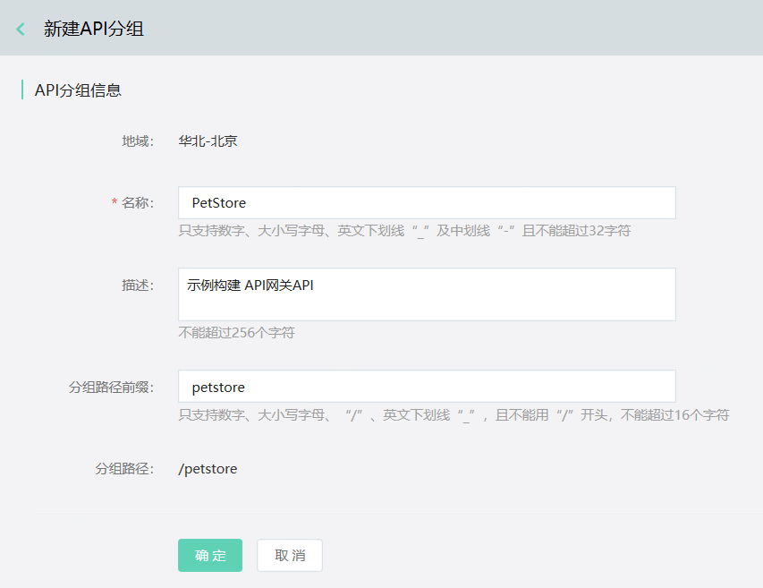
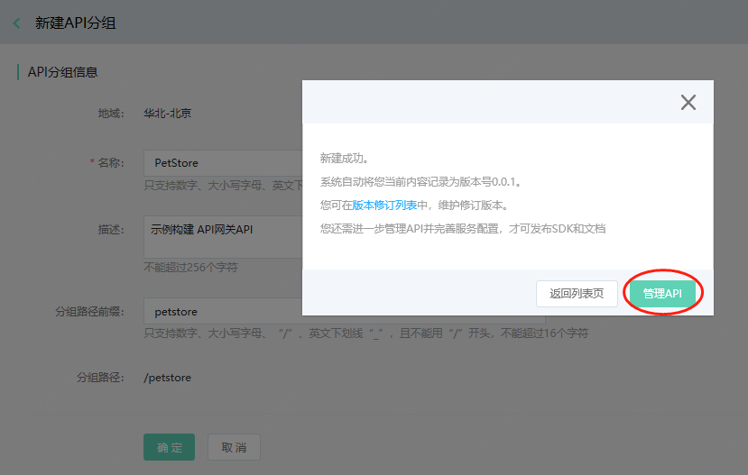
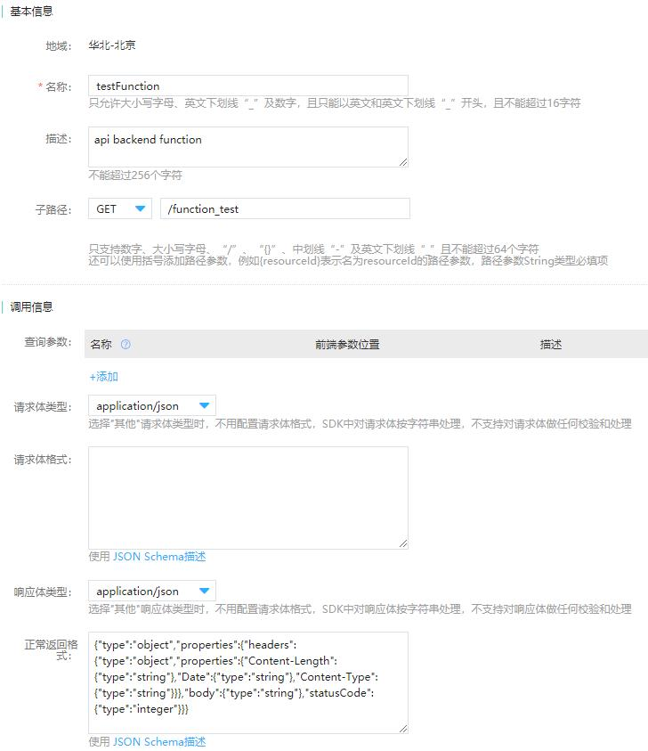
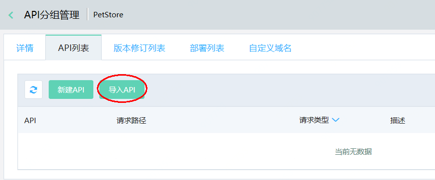
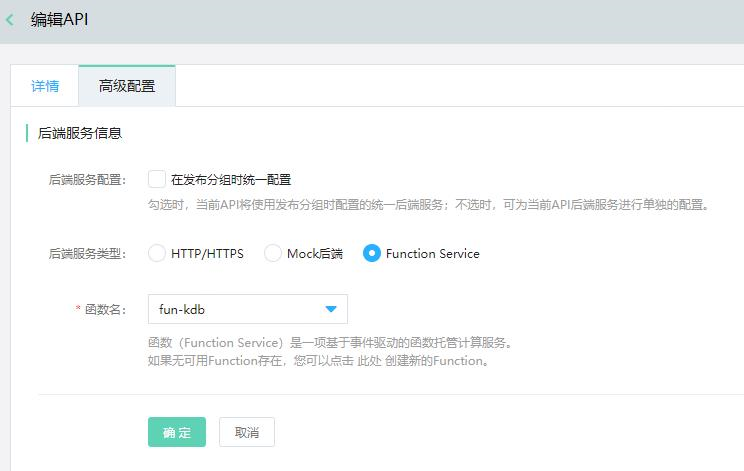
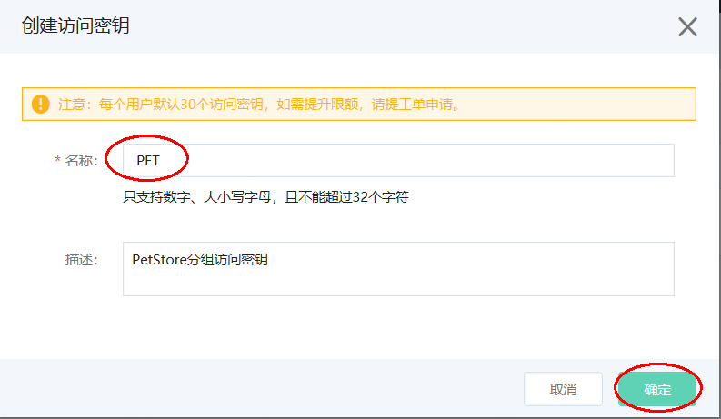
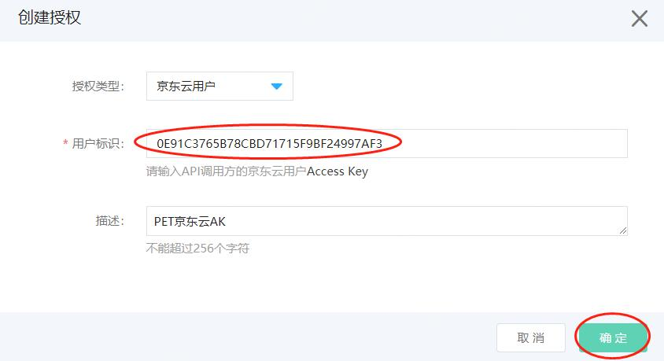

# Construct API Gateway API by Using Examples

To help you construct and test the API Gateway API by using the basic working process, you are allowed to use the API Gateway of JD Cloud console to create and test the simple API used for conducting HTTP integration with the PetStore website. The Swagger 2.0 file is pre-configured as the API definition. When the API definition is loaded to the API Gateway, you are allowed to check the basic API structure or directly deploy and test API by using the API Gateway console.

Access to the HTTP backend website http://petstore-demo-endpoint.execute-api.com/petstore/pets is supported by the example API by using the methods below.

- GET /pets/{petId}: Used for reading and accessing the pets with the petId value identifier of the URL path variable assigned to transmitting requests. The backend will find the specified pet in the PetStore. The backend service address is http://petstore-demo-endpoint.execute-api.com/petstore/pets/n, wherein n refers to the integer used for searching pet identifier.

- POST /pets: Used for making writing access to API /pets resources integrated with the backend/petstore/pets resources. Upon receiving a correct request, the backend will add the specified pet into the PetStore and return results to the calling party. The backend service address is http://petstore-demo-endpoint.execute-api.com.

## Create one API in the API Gateway Console according to the example and test such API.

The following process is the guide for creating the API in the API Gateway console and specifies the test steps via SDK.

### Create API Group-Create API-Release:

#### 1.	Log in the API Gateway Console and turn on [API Group Management](https://apigateway-console.jdcloud.com/apiGroupList).

#### 2.	Click **Create Group**.


#### 3.	After jumping to the created API group page, please fill in the API group information.



#### 4. When **OK** is clicked, the "Creation Succeeded" notification will be given. In such case, please select **API Management** in the pop-up window and jump to the API list interface of this group.



#### 5.	You can deploy API via the two methods below.

- Create API: Click **Create API**, configure "Name", "Sub-path", "Parameter Query", "Request Body Format" and "Normal Return Format" and click **OK**.




- Import API: Click **Import API**, upload yaml files conforming to the swagger2.0 specification, and click **OK**. Then, API set in the yaml file will be displayed in the API list interface. ([Yaml File Download Link](../../../../image/Internet-Middleware/API-Gateway/PetStoreTest_Yaml.zip))




#### 6.	Click the tag page of [Version Amendment List], click **Release**, configure the following options and click **OK**.




- Backend service configuration: If the option of unified configuration at the time of releasing groups is checked, the current API will adopt the unified backend service configured at the time of releasing groups.
- If the option of unified configuration at the time of releasing groups is not checked, the independent configuration will be made to the current API backend service, with the service type as follows:

    - HTTP/HTTPS: The backend address of the HTTP/HTTPS type can be configured to this API;
    - Mock backend: The Mock backend provided by the API Gateway can be configured to this API;
    - Function Service: the Function Service is an event-driven function escrow computing service. If the Function is unavailable, please access [Function Service](https://function-console.jdcloud.com) to create a new function.

#### 7. 	Click the tag page of [Version Amendment List], click **Release**, configure the following options and click **OK**.

- Release revision: 0.0.1;
- Released as: On-line;
- Backend service: Unique backend;
- Backend service address: http://petstore-demo-endpoint.execute-api.com.


#### 8.	 When the release is conducted, click **Produce SDK and Document** to download the JavaSDK, PythonSDK and API documents.


### Obtain key pairs-create access authorization-associate groups:

#### You can obtain key pairs via the two methods below:

- Create access authorization via API caller

  - Turn on [Access Key](https://apigateway-console.jdcloud.com/accessSecretKey), and click **Create Access Key**.

    

  - Fill in the name and description (optional) and click **OK**.

    

  - Click the key pair name, view details of the access key and copy access key ID, APIKey and APISecret.

    

  - Turn on [Access Authorization](https://apigateway-console.jdcloud.com/authorizationList), and click **Create Authorization**.

    

  - Fill in user identifier (access key ID of access key) and description (optional) and click **OK**.

    
    
- Create access authorization via the method of JD Cloud user

  - Turn on the [AccessKey Management](https://uc.jdcloud.com/account/accesskey), click **Create Access Key**, and obtain Access Key ID and Access Key Secret after the cellphone verification.

    

  - Turn on [Access Authorization](https://apigateway-console.jdcloud.com/authorizationList), and click **Create Authorization**.

    

  - Select the JD Cloud user as the authorization type, fill in the user identifier (Access Key ID) and the description (optional) and click **OK**.

    

#### Click **Associate** to move the created PetStore group to the associated column.


Via the above steps, the operation in the API Gateway console interface is completed. Then, the calling can be made via SDK.

### Via Java SDK to call

#### 1.	Unzip the downloaded Java SDK.

#### 2.	Switch to the PetStore directory and edit Demo.java file. ([Item Download Link](../../../../image/Internet-Middleware/API-Gateway/PetStoreTest_javaSDK_jdcloud.zip))

- accessKeyId refers to the APIKey when viewing detailed information of key pairs;
- secretAccessKey refers to the APISecret when viewing detailed information of key pairs;
- Others are called by API.

```Java
package net.jdcloud.PetStore;

import com.jdcloud.sdk.auth.CredentialsProvider;
import com.jdcloud.sdk.auth.StaticCredentialsProvider;
import com.jdcloud.sdk.client.Environment;
import com.jdcloud.sdk.http.HttpRequestConfig;
import com.jdcloud.sdk.http.Protocol;
import net.jdcloud.PetStore.client.PetStoreClient;
import net.jdcloud.PetStore.model.*;

import java.math.BigDecimal;

/**
 * Demo
 */
public class Demo {

    private static String accessKeyId = "";
    private static String secretKey = "";
    private static CredentialsProvider credentialsProvider = new StaticCredentialsProvider(accessKeyId, secretKey);
    private static PetStoreClient client = PetStoreClient.builder()
            .credentialsProvider(credentialsProvider)
            .httpRequestConfig(new HttpRequestConfig.Builder().connectionTimeout(10000).protocol(Protocol.HTTPS).build())
//                .environment(new Environment.Builder().endpoint("xue0ivjzhif3-test.cn-north-1.jdcloud-api.net").build()) // Test Environment Address
//                .environment(new Environment.Builder().endpoint("xue0ivjzhif3-preview.cn-north-1.jdcloud-api.net").build()) // Pre-release Environment Address
                .environment(new Environment.Builder().endpoint("xue0ivjzhif3.cn-north-1.jdcloud-api.net").build()) // On-line Environment Address
            .build();

    public static void main (String[] args){
//        TestFunction
        TestFunctionRequest testFunctionRequest = new TestFunctionRequest();
        TestFunctionResponse testFunctionResponse = client.testFunction(testFunctionRequest);
        System.out.println(testFunctionResponse.getResult());

//        CreatePet
        GetPetInfoRequest getPetInfoRequest = new GetPetInfoRequest();
        getPetInfoRequest.setPetId(1);
        GetPetInfoResponse getPetInfoResponse = client.getPetInfo(getPetInfoRequest);
        System.out.println(getPetInfoResponse.getResult());

//        GetPetInfo
        CreatePetRequest createPetRequest = new CreatePetRequest();
        net.jdcloud.PetStore.model.createpet.Body createpetBody = new net.jdcloud.PetStore.model.createpet.Body();
        createpetBody.setId(1);
        createpetBody.setPrice(BigDecimal.valueOf(12.3));
        createpetBody.setType("cat");
        createPetRequest.setBody(createpetBody);
        CreatePetResponse createPetResponse = client.createPet(createPetRequest);
        System.out.println(createPetResponse.getResult());

    }
}


```

#### 3.	 Run SDKTest.java to obtain returned results.


### Via Python SDK to call

#### 1.	Unzip the downloaded Python SDK and execute the setup.py file.

#### 2.	Switch to the PetStore directory and create a PetStoreTest.py file. ([Item Download Link](../../../../image/Internet-Middleware/API-Gateway/PetStoreTest_pythonSDK_jdcloud.zip))

```
# coding=utf-8

from jdcloud_apim_sdk.core.credential import Credential
from jdcloud_apim_sdk.core.config import Config
from jdcloud_apim_sdk.core.const import SCHEME_HTTPS, SCHEME_HTTP
from client.PetStore_client import *
from apis.get_pet_info_request import *
from apis.create_pet_request import *
from apis.test_function_request import *


if __name__ == "__main__":
    access_key = ''
    secret_key = ''
    credential = Credential(access_key, secret_key)
    # config = Config('xueki79b37y4-test.cn-north-1.jdcloud-api.net', scheme=SCHEME_HTTPS) # Test Environment Address
    # config = Config('xueki79b37y4-preview.cn-north-1.jdcloud-api.net', scheme=SCHEME_HTTPS) # Pre-release Environment Address
    config = Config('xueki79b37y4.cn-north-1.jdcloud-api.net', scheme=SCHEME_HTTPS)  # On-line Environment Address
    client = PetStoreClient(credential, config)

    parameters = dict()
    body = ''
    header = dict()

    get_pet_info_request = GetPetInfoRequest(parameters= {"petId": 1}, body=body, header=header)
    GetPetInfo_response = client.send(get_pet_info_request)
    print(GetPetInfo_response)

    create_pet_request = CreatePetRequest(parameters=parameters, body={"id":1, "price": 12, "type": "cat"}, header=header)
    CreatePet_response = client.send(create_pet_request)
    print(CreatePet_response)

    test_function_request = TestFunctionRequest(parameters=parameters, body=body, header=header)
    TestFunction_response = client.send(test_function_request)
    print(TestFunction_response)

```

#### 3.	Run PetStoreTest.py to obtain returned results.


### You are allowed to obtain your API calling conditions in real time via the [API Gateway Monitoring](http://cms-console-north-2a-backup.jdcloud.com/monitor/apigateway), including: success number, traffic, response time, request exception and other information as well as exception condition alarm setting.


